# Victor AI 智能面试模拟平台

<p align="center">
  <b>面向求职训练、面试复盘与企业题库沉淀的 AI 智能面试系统</b>
</p>

<p align="center">
  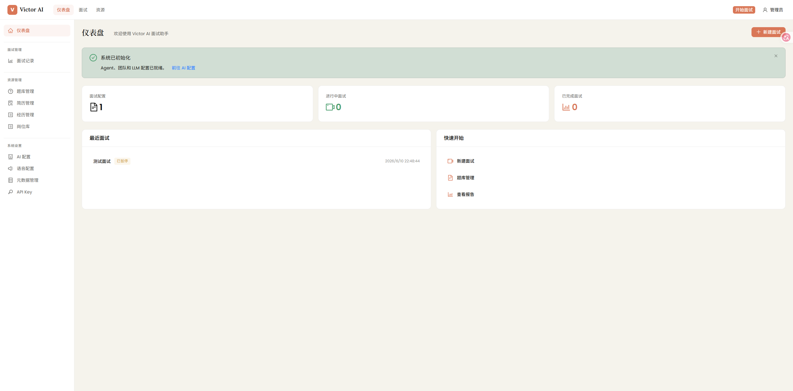
</p>

## 项目简介

Victor AI 是一套前后端一体化的智能面试模拟平台，围绕「面试配置 → 资源准备 → 实时面试 → 面试记录 → 复盘提升」构建完整闭环。系统支持岗位、题库、简历、项目经验等面试资源管理，并在面试间中提供文本作答、代码附件和绘图附件等多种答题方式，为候选人提供更接近真实场景的面试训练体验。

## 核心能力

- **面试配置流程**：按步骤选择岗位、简历、项目经验、题型与面试策略，快速生成模拟面试方案。
- **面试配置管理**：维护不同岗位、难度、题型与面试策略，支撑多场景模拟面试。
- **题库与资源沉淀**：统一管理面试题、简历、项目经验和岗位信息，形成可复用的面试知识库。
- **智能面试流程**：基于 Multi-Agent 的面试官、评估者等角色协同，结合实时对话推进面试。
- **面试记录**：沉淀历史面试过程与结果，辅助候选人复盘表现、定位短板。
- **多格式任务回答**：面试任务支持代码附件和绘图附件，适配编程题、架构题、流程图等表达场景。

## 系统截图

### 面试配置流程

<table>
  <tr>
    <td align="center"><b>面试配置步骤一</b></td>
    <td align="center"><b>面试配置步骤二</b></td>
  </tr>
  <tr>
    <td>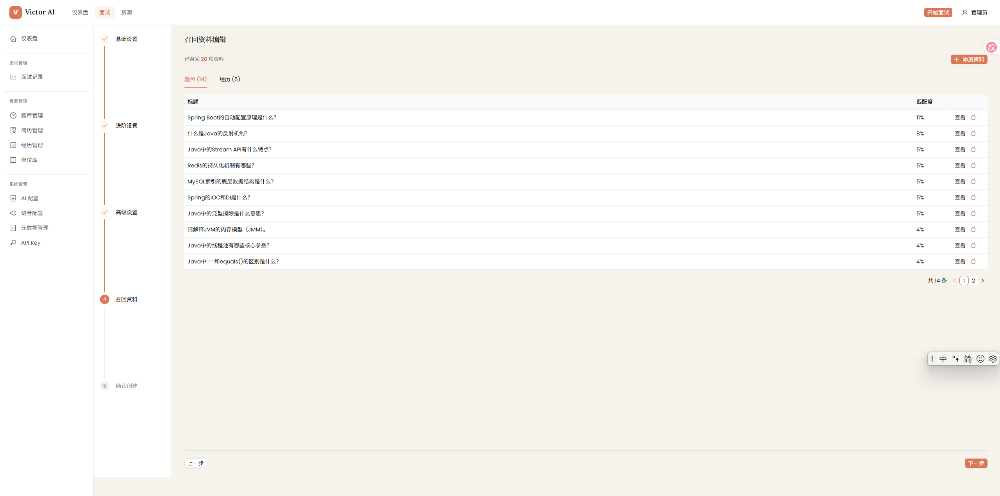</td>
    <td>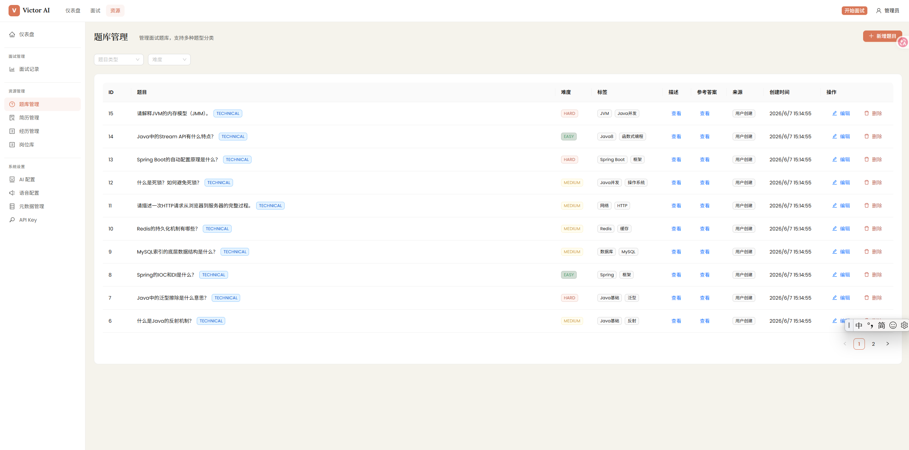</td>
  </tr>
</table>

### 面试资源库

<table>
  <tr>
    <td align="center"><b>题库管理</b></td>
    <td align="center"><b>简历管理</b></td>
  </tr>
  <tr>
    <td>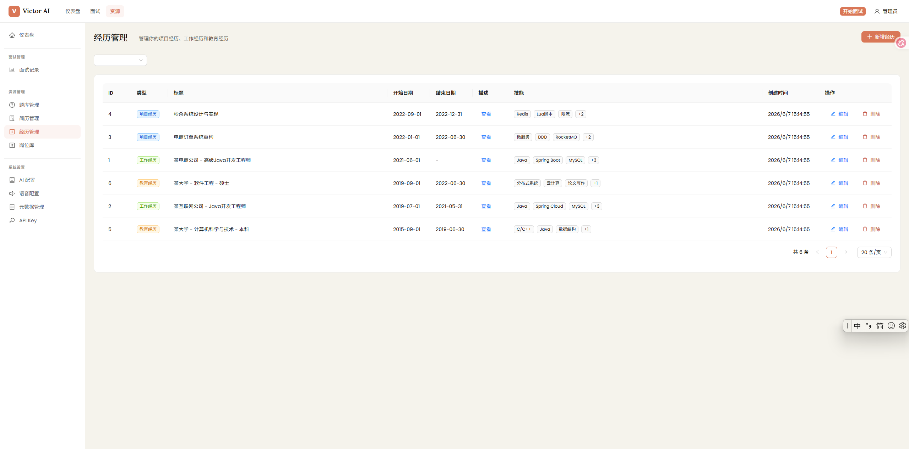</td>
    <td>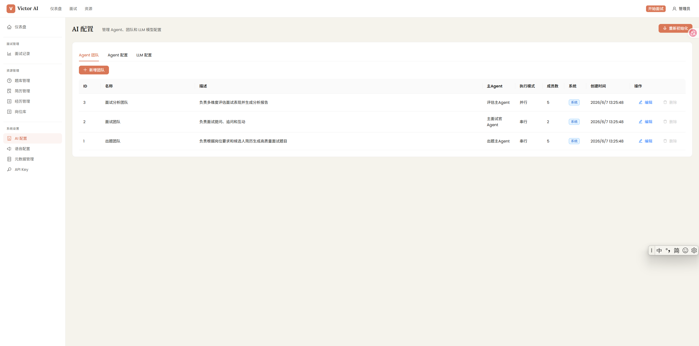</td>
  </tr>
  <tr>
    <td align="center"><b>项目经验库</b></td>
    <td align="center"><b>岗位管理</b></td>
  </tr>
  <tr>
    <td>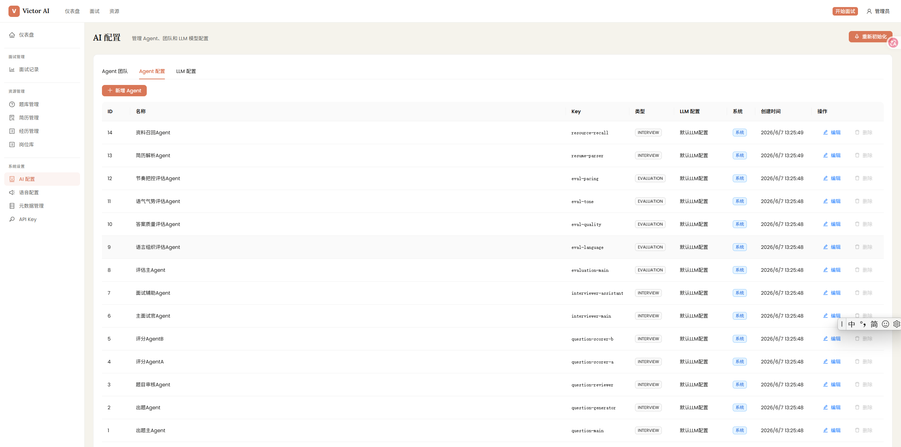</td>
    <td>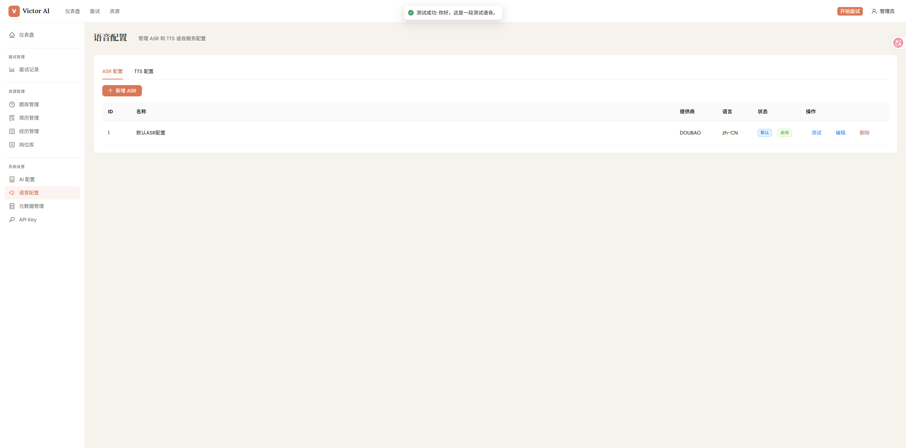</td>
  </tr>
</table>

### 面试记录与面试间

<table>
  <tr>
    <td align="center"><b>面试记录</b></td>
    <td align="center"><b>面试间</b></td>
  </tr>
  <tr>
    <td>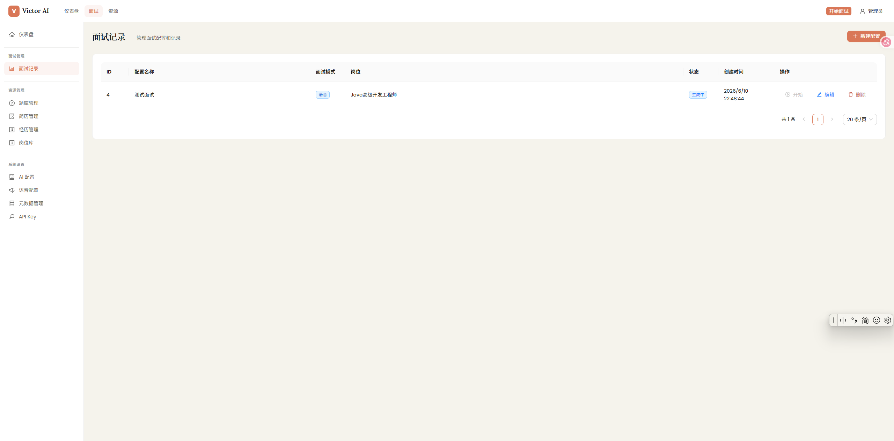</td>
    <td>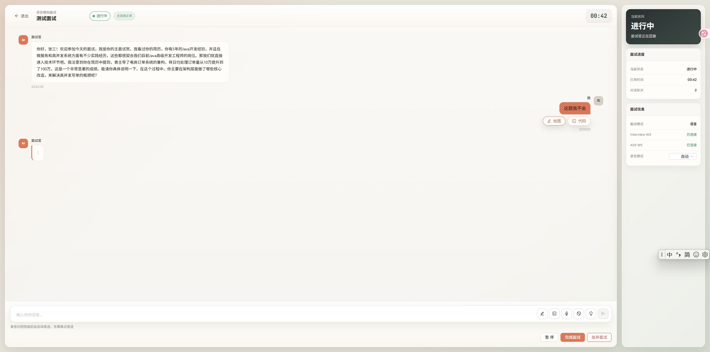</td>
  </tr>
  <tr>
    <td align="center"><b>代码附件</b></td>
    <td align="center"><b>绘图附件</b></td>
  </tr>
  <tr>
    <td>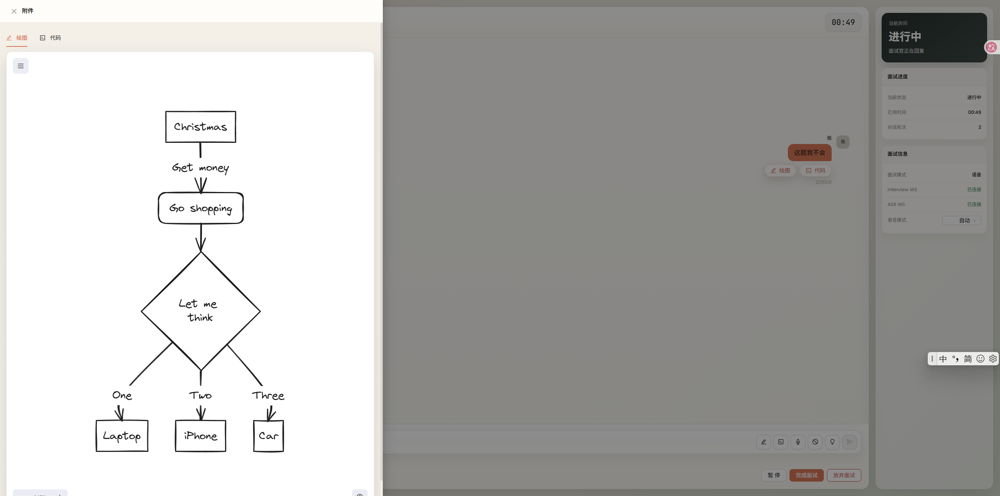</td>
    <td>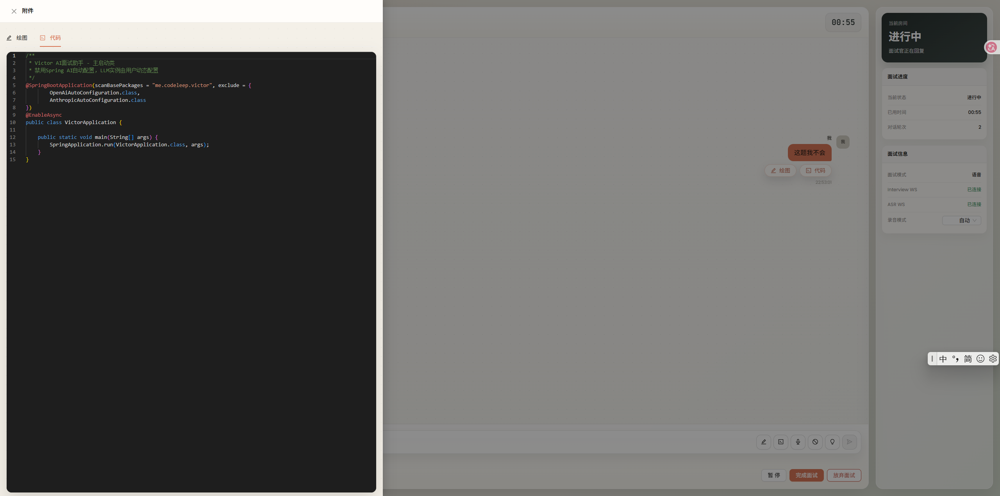</td>
  </tr>
</table>

## 技术栈

| 层级 | 技术选型 |
| --- | --- |
| 前端 | React 18、TypeScript 5、Vite 5、Ant Design 5、Zustand、Monaco Editor、Excalidraw |
| 后端 | Java 21、Spring Boot 3.3、Spring AI、MyBatis-Plus、JWT、WebSocket |
| 数据与检索 | PostgreSQL、pgvector、Redis |
| 文档解析 | Apache Tika |
| 部署 | Docker、Docker Compose、Nginx |

## 项目结构

```text
Victor/
├── backend/                     # Spring Boot 后端工程
│   ├── victor-common/           # 通用常量、枚举、异常与工具
│   ├── victor-infra/            # Agent 框架、外部服务客户端与基础设施
│   ├── victor-core/             # 面试、资源、报告等核心业务
│   └── victor-web/              # REST API、WebSocket 与应用入口
├── frontend/                    # React + TypeScript 前端工程
│   └── src/
│       ├── views/               # 页面：工作台、面试、资源、报告、设置
│       ├── components/          # 公共组件
│       ├── layouts/             # 页面布局
│       ├── stores/              # Zustand 状态管理
│       ├── utils/               # 请求、音频、WebSocket 等工具
│       └── types/               # TypeScript 类型定义
├── docker/                      # Docker 镜像、Nginx 与启动脚本
├── docs/                        # 项目文档与系统截图
└── docker-compose.yml           # 一键启动配置
```

## 快速开始

### 环境要求

- Node.js 18+
- JDK 21+
- Maven 3.8+
- Docker 与 Docker Compose
- PostgreSQL 16 / pgvector（本地开发可使用 Docker Compose 提供的数据库）

### Docker 一键启动

```bash
docker compose up -d
```

默认访问地址：`http://localhost`

首次启动后可调用初始化接口：

```bash
curl -X POST http://localhost/api/v1/system/init
```

### 本地开发

启动数据库：

```bash
docker compose up postgres -d
```

启动后端：

```bash
cd backend
mvn clean package -DskipTests
java -jar victor-web/target/victor-web-1.0-SNAPSHOT.jar
```

启动前端：

```bash
cd frontend
npm install
npm run dev
```

## 环境变量

| 变量 | 说明 | 默认值 |
| --- | --- | --- |
| `DB_NAME` | 数据库名称 | `victor` |
| `DB_PASSWORD` | 数据库密码 | `postgres` |
| `JWT_SECRET` | JWT 签名密钥 | `victor-ai-default-jwt-secret-key-must-be-at-least-256-bits-long` |
| `JWT_EXPIRATION` | Token 有效期，单位毫秒 | `86400000` |

## API 模块

| 模块 | 路径 | 说明 |
| --- | --- | --- |
| 认证 | `/api/v1/auth/**` | 登录、注册与身份认证 |
| 用户 | `/api/v1/users/**` | 用户信息管理 |
| 岗位 | `/api/v1/jobs/**` | 岗位信息维护 |
| 题库 | `/api/v1/questions/**` | 面试题维护与查询 |
| 简历 | `/api/v1/resumes/**` | 简历上传、解析与管理 |
| 经验 | `/api/v1/experiences/**` | 项目经验管理 |
| Agent | `/api/v1/agents/**` | Agent 与模型配置 |
| 面试配置 | `/api/v1/interview-configs/**` | 面试方案配置 |
| 面试会话 | `/api/v1/interview-sessions/**` | 面试流程与会话管理 |
| 报告 | `/api/v1/reports/**` | 面试报告生成、查询与导出 |
| 语音 | `/api/v1/voice/**` | ASR / TTS 服务配置 |
| WebSocket | `/ws` | 实时面试通信 |

## Multi-Agent 设计

系统后端在 `victor-infra` 中封装 Agent 能力，并在核心业务中组合面试流程：

- **Agent**：独立角色与模型配置，承载面试官、评估者等职责。
- **Agent Team**：支持多 Agent 协同与任务交接，提升面试过程的结构化程度。
- **Tool**：为 Agent 提供题库、简历、经验等业务资源检索能力。
- **Guardrail**：约束输入输出边界，保障面试内容质量与安全性。
- **Tracing**：记录执行链路，便于排查问题和优化提示词策略。

## License

MIT