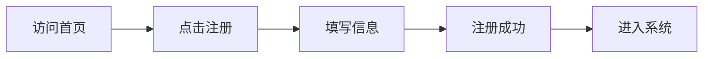
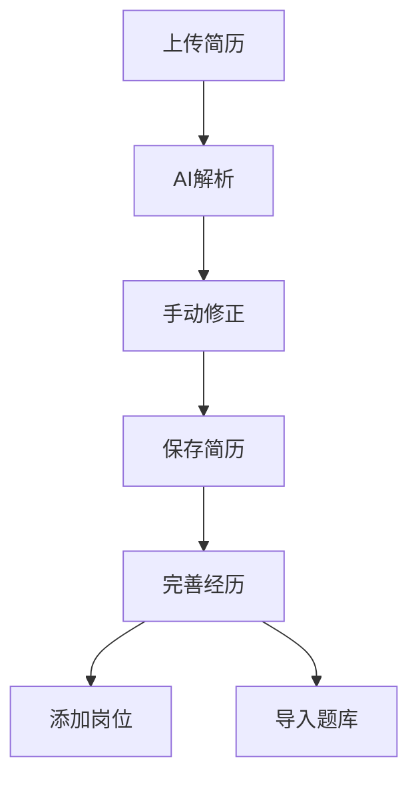
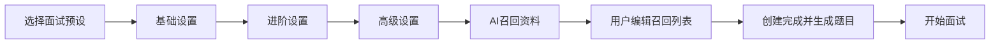
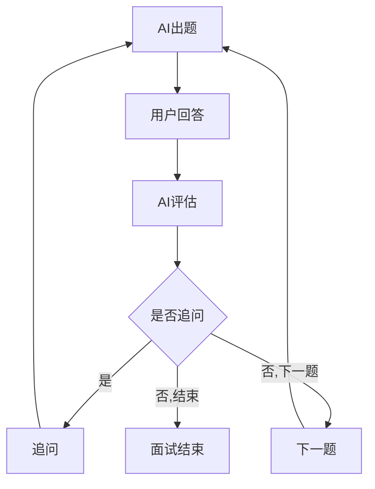
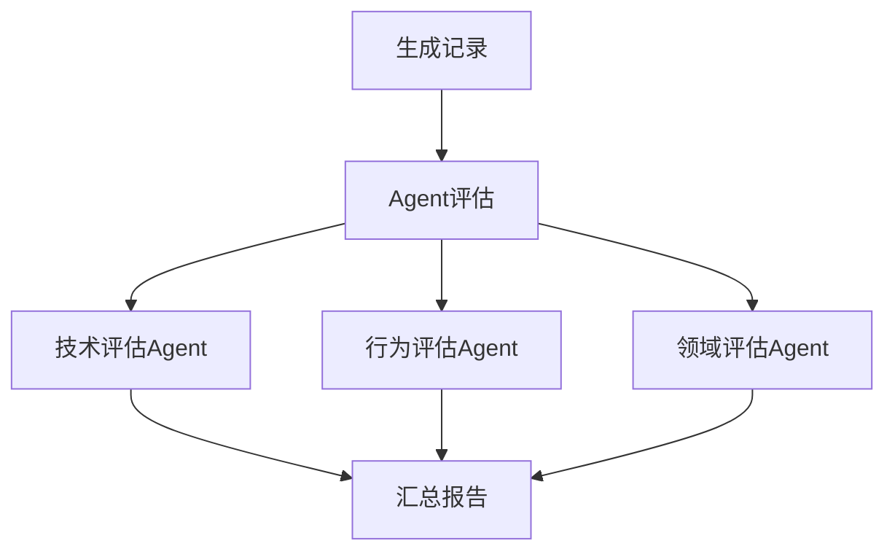
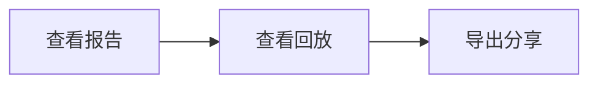

# Victor AI 面试助手 - 用户流程与场景

## 1. 用户角色

| 角色 | 描述 |
|-----|------|
| 用户 | 注册登录后的求职者，使用系统进行面试练习 |
| 游客 | 未登录用户，可浏览部分公开内容 |

---

## 2. 核心用户流程

### 2.1 注册登录流程

**流程说明**：
1. 用户访问系统首页
2. 点击注册，填写用户名、邮箱、密码
3. 系统校验信息，创建账号
4. 注册成功，自动登录，进入系统

---

### 2.2 资料准备流程

**流程说明**：
1. 用户上传简历文件（PDF/Word/Markdown）
2. 用户手动触发AI解析
3. 查看解析结果，手动修正错误
4. 保存简历，系统自动存储结构化数据
5. 用户手动触发生成向量嵌入
6. 用户继续完善经历库（项目/工作/教育经历）
7. 用户添加目标岗位，可手动创建或通过开放接口导入
8. 用户导入题库，可手动添加或开放接口导入

---

### 2.3 面试配置流程

**流程说明**：
1. 用户选择面试预设（技术面/行为面/综合面等），预设只用于快速填充配置
2. 进行基础设置：
   - 选择面试模式（语音/文字）
   - 选择目标岗位
   - 关联简历
3. 进行进阶设置（可选）：
   - 配置面试轮次和每轮重点
   - 配置各维度难度
   - 设置时长预设
   - 开启/关闭提示功能
4. 进行高级设置（可选）：
   - 选择Agent团队
   - 配置模型实例
   - 配置追问深度
   - 自定义评分标准
   - 配置召回策略
5. 召回数据编辑：
   - Agent自动召回相关资料
   - 用户审阅召回结果列表
   - 用户删除不需要的资料
   - 用户手动添加资料库中的其他资料
   - 用户确认最终召回列表
   - 用户点击创建完成，AI异步生成题目并冻结
6. 题目生成完成后，开始面试

---

### 2.4 面试执行流程

**流程说明**：
1. AI根据面试配置生成第一道题目
2. 用户回答（语音/文字）：
   - 语音模式：说话 → ASR转文字 → 实时字幕显示
   - 可随时提交文字补充
   - 可上传图片（代码截图、架构图）
   - 可打开代码编辑器写代码
   - 可打开绘图工具画架构图
3. AI评估回答质量：
   - 判断是否需要追问
   - 判断是否进入下一题
   - 判断是否结束面试
4. 如需追问，AI生成追问问题，回到步骤2
5. 如需下一题，AI生成新题目，回到步骤2
6. 面试结束，触发评估流程

---

### 2.5 面试评估流程

**流程说明**：
1. 系统整理面试记录（文字、语音、图片）
2. 分发给各评估Agent并行评估：
   - 技术评估Agent：评估技术能力、代码质量
   - 行为评估Agent：评估沟通能力、软技能
   - 领域专家Agent：评估特定领域知识深度
3. 综合评估Agent汇总各维度评分
4. 生成面试报告

---

### 2.6 报告查看与导出流程

**流程说明**：
1. 用户查看面试报告：
   - 查看总体评分
   - 查看各维度评分
   - 查看优劣势分析
   - 查看改进建议
   - 查看参考答案
2. 用户查看面试回放：
   - 按时间轴浏览对话
   - 点击播放语音
   - 查看上传的图片/代码/架构图
3. 用户导出报告：
   - 导出为PDF
   - 导出为图片
   - 分享给他人

---

## 3. 用户场景

### 3.1 场景一：技术岗位面试准备

**用户画像**：
- 张三，3年Java开发经验
- 准备跳槽，目标岗位：高级Java工程师

**操作流程**：
1. 张三注册登录系统
2. 上传简历，AI解析后手动修正
3. 手动触发向量嵌入
4. 添加目标岗位：高级Java工程师，填写JD
5. 选择"Java高级工程师面试预设"
7. 选择语音面试模式
8. 开始面试：
   - AI提问Java并发相关问题
   - 张三语音回答，实时字幕显示
   - AI追问线程池参数配置细节
   - 张三打开代码编辑器写了一段线程池使用示例
   - AI评估回答，给出追问
   - 面试持续45分钟，AI提醒时间，张三确认继续
9. 面试结束，查看报告：
   - 技术能力：78分
   - 项目经验：85分
   - 沟通表达：70分
   - 改进建议：加强并发编程底层原理理解
10. 导出PDF报告，分享给朋友

---

### 3.2 场景二：行为面试练习

**用户画像**：
- 李四，应届毕业生
- 准备校招，目标岗位：产品经理

**操作流程**：
1. 李四注册登录系统
2. 手动填写简历（无文件上传）
3. 添加项目经历：校内创业项目、实习经历
4. 添加目标岗位：产品经理
5. 选择"行为面试预设"
6. 选择文字面试模式
7. 开始面试：
   - AI提问："请介绍一下你最有成就感的项目"
   - 李四文字回答
   - AI追问："你在这个项目中遇到的最大困难是什么？"
   - 李四回答
   - AI根据STAR法则评估回答结构
8. 面试结束，查看报告：
   - 沟通表达：82分
   - 逻辑思维：75分
   - 问题解决：80分
   - 改进建议：回答时注意使用STAR结构
9. 李四根据建议继续练习

---

### 3.3 场景三：系统架构面试准备

**用户画像**：
- 王五，5年后端经验
- 准备晋升面试，目标岗位：架构师

**操作流程**：
1. 王五上传简历和知识库文档
2. 配置高级设置：
   - 创建自定义Agent团队：系统设计Agent、性能优化Agent
   - 配置模型实例：使用Claude进行深度推理
3. 选择语音面试模式
4. 开始面试：
   - AI提问："请设计一个高并发秒杀系统"
   - 王五语音回答整体架构
   - AI追问数据库设计细节
   - 王五打开Excalidraw画架构图
   - 王五上传架构图图片
   - AI根据架构图继续追问
5. 面试结束，查看报告：
   - 系统设计：88分
   - 技术深度：85分
   - 架构思维：90分
   - 改进建议：考虑引入消息队列削峰

---

### 3.4 场景四：开放接口导入题库

**用户画像**：
- 赵六，准备面试字节跳动
- 需要练习字节跳动历年面试题

**操作流程**：
1. 赵六进入开放接入管理
2. 创建一个用于题目导入的API Key
3. 点击创建开放API Key
4. 外部采集程序自行配置目标网站和采集规则
5. 外部采集程序运行并抓取面试题数据
6. 数据通过开放导入接口写入系统题库
7. 赵六在题库中查看导入的题目
8. 赵六创建面试，选择导入的题目进行练习

---

### 3.5 场景五：面试中途暂停

**用户画像**：
- 钱七，在职准备跳槽
- 面试过程中需要处理工作事务

**操作流程**：
1. 钱七正在进行面试
2. 突然接到工作电话，需要处理紧急事务
3. 钱七点击"暂停面试"
4. 系统保存当前面试状态
5. 1小时后，钱七回到系统
6. 点击"继续面试"
7. AI提示："我们继续上次的面试，你刚才正在回答..."
8. 钱七继续回答，面试继续

---

## 4. 异常流程

### 4.1 简历解析失败

**场景**：用户上传的简历格式不规范，AI解析失败

**处理流程**：
1. 系统提示"解析失败，请检查文件格式"
2. 提供手动填写入口
3. 用户手动填写简历内容
4. 保存简历

### 4.2 语音服务异常

**场景**：面试过程中ASR/TTS服务异常

**处理流程**：
1. 系统检测到服务异常
2. 提示用户"语音服务异常，是否切换到文字模式"
3. 用户确认切换
4. 继续文字面试
5. 记录异常日志

### 4.3 模型调用超时

**场景**：LLM模型调用超时

**处理流程**：
1. 系统检测到超时
2. 自动重试（最多3次）
3. 重试失败则提示用户"模型服务繁忙，请稍后重试"
4. 保存当前面试状态

---

## 5. 用户权限矩阵

| 功能 | 游客 | 已登录用户 |
|-----|-----|----------|
| 浏览首页 | ✓ | ✓ |
| 注册/登录 | ✓ | - |
| 查看系统预设 | ✓ | ✓ |
| 创建简历 | - | ✓ |
| 开始面试 | - | ✓ |
| 查看面试记录 | - | ✓（仅自己的） |
| 导出报告 | - | ✓（仅自己的） |
| 创建开放API Key | - | ✓ |
| 创建Agent | - | ✓ |
| 复制面试配置 | - | ✓ |
