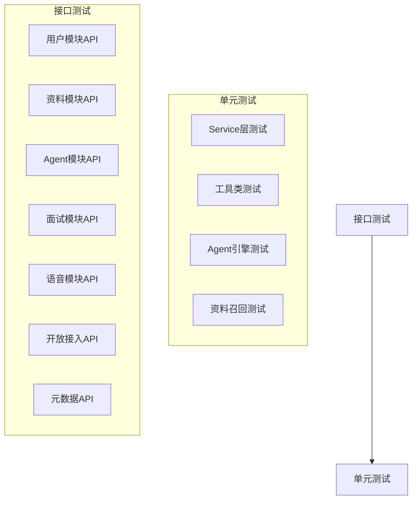

# Victor AI 面试助手 - 测试方案

## 1. 测试策略

### 1.1 测试分层

测试采用两层结构：单元测试 + 接口测试。



### 1.2 测试工具

| 类型 | 工具 | 用途 |
|-----|------|------|
| 单元测试 | JUnit 5 + Mockito | Service层、工具类、核心逻辑测试 |
| 接口测试 | Spring Boot Test + MockMvc | REST API接口测试 |
| 覆盖率 | JaCoCo | 代码覆盖率统计 |

### 1.3 测试数据库

测试使用独立数据库，与源数据库共用同一PostgreSQL实例，库名加 `_test` 后缀。

**规则：**
- 源数据库：`victor_ai` → 测试数据库：`victor_ai_test`
- 表结构与源数据库完全一致，使用相同的DDL脚本初始化
- 每次测试前清空数据（使用 `@Transactional` + `@Rollback` 或 `TRUNCATE`）
- 测试数据通过 `@Sql` 注解或测试基类的 `@BeforeEach` 方法准备

**配置方式：**

```yaml
# application-test.yml
spring:
  datasource:
    url: jdbc:postgresql://localhost:5432/victor_ai_test
    username: ${DB_USERNAME:victor}
    password: ${DB_PASSWORD:victor123}
```

---

## 2. 单元测试

### 2.1 用户服务测试

**测试目标**：验证用户注册、登录、信息修改等核心逻辑。

| 用例ID | 测试场景 | 输入数据 | 预期输出 | 断言条件 |
|-------|---------|---------|---------|---------|
| UT-USER-001 | 注册成功 | 有效用户名、邮箱、密码 | 创建用户 | 用户记录存在，密码已哈希 |
| UT-USER-002 | 注册-用户名重复 | 已存在的用户名 | 抛出异常 | BusinessException，错误码409 |
| UT-USER-003 | 注册-邮箱格式错误 | 无效邮箱 | 抛出异常 | 参数校验失败 |
| UT-USER-004 | 登录成功 | 正确的用户名密码 | 返回Token | Token不为空，可解析出userId |
| UT-USER-005 | 登录-密码错误 | 错误密码 | 抛出异常 | 错误码401 |
| UT-USER-006 | 登录-账号锁定 | 连续5次失败后 | 抛出异常 | 错误码403，提示锁定 |
| UT-USER-007 | 修改密码 | 正确旧密码+新密码 | 修改成功 | 新密码可登录 |
| UT-USER-008 | 修改密码-旧密码错误 | 错误旧密码 | 抛出异常 | 错误码400 |

**测试方法**：Mockito模拟Repository层，验证Service层业务逻辑。

### 2.2 资料服务测试

**测试目标**：验证题目、岗位、简历、经历的CRUD和审核逻辑。

| 用例ID | 测试场景 | 输入数据 | 预期输出 | 断言条件 |
|-------|---------|---------|---------|---------|
| UT-RES-001 | 创建题目 | 有效题目数据 | 创建成功 | 返回题目ID，字段正确 |
| UT-RES-002 | 创建岗位 | 有效岗位数据 | 创建成功 | 返回岗位ID |
| UT-RES-003 | 上传简历 | 文件数据 | 创建成功 | status=PENDING |
| UT-RES-004 | 解析简历 | 已上传简历ID | 解析成功 | parsed_content不为空 |
| UT-RES-005 | 创建经历 | 有效经历数据 | 创建成功 | 返回经历ID |
| UT-RES-006 | 审核-批准 | PENDING_REVIEW状态资料 | 状态变更 | ingest_status=ACTIVE |
| UT-RES-007 | 审核-拒绝 | PENDING_REVIEW状态资料 | 状态变更 | ingest_status=REJECTED |
| UT-RES-008 | 开放API导入 | 通过API Key导入数据 | 创建成功 | source_type=OPEN_API |

**测试方法**：Mockito模拟Repository，验证业务逻辑和状态转换。

### 2.3 Agent服务测试

**测试目标**：验证Agent配置、团队管理、LLM调用逻辑。

| 用例ID | 测试场景 | 输入数据 | 预期输出 | 断言条件 |
|-------|---------|---------|---------|---------|
| UT-AGT-001 | 创建Agent | 有效Agent配置 | 创建成功 | 返回Agent ID |
| UT-AGT-002 | 创建Agent团队 | 有效团队配置 | 创建成功 | 返回团队ID |
| UT-AGT-003 | 系统Agent不可删除 | 系统Agent ID | 抛出异常 | 错误码403 |
| UT-AGT-004 | 绑定LLM配置 | Agent ID + LLM配置 | 绑定成功 | llm_config_id已设置 |
| UT-AGT-005 | Agent执行-单次 | Agent + 输入文本 | 返回结果 | 内容不为空 |
| UT-AGT-006 | Agent执行-流式 | Agent + 输入文本 | Flux流 | 流中有数据 |
| UT-AGT-007 | 团队并行执行 | 团队 + 输入 | 多个结果 | 结果数量=成员数量 |
| UT-AGT-008 | 团队串行执行 | 团队 + 输入 | 有序结果 | 结果按priority排序 |

### 2.4 面试引擎测试

**测试目标**：验证面试配置、会话管理、题目生成、评估逻辑。

| 用例ID | 测试场景 | 输入数据 | 预期输出 | 断言条件 |
|-------|---------|---------|---------|---------|
| UT-INT-001 | 创建面试配置 | 有效配置数据 | 创建成功 | status=DRAFT |
| UT-INT-002 | 配置状态流转-DRAFT→GENERATING | 确认召回列表 | 状态变更 | status=GENERATING |
| UT-INT-003 | 配置状态流转-GENERATING→READY | 题目生成成功 | 状态变更 | status=READY |
| UT-INT-004 | 配置状态流转-GENERATING→GENERATE_FAILED | 生成失败 | 状态变更 | generate_error不为空 |
| UT-INT-005 | 创建面试会话 | READY配置ID | 创建成功 | status=IN_PROGRESS |
| UT-INT-006 | 会话状态流转-暂停 | 暂停命令 | 状态变更 | status=PAUSED |
| UT-INT-007 | 会话状态流转-恢复 | 恢复命令 | 状态变更 | status=IN_PROGRESS |
| UT-INT-008 | 会话状态流转-完成 | 结束命令 | 状态变更 | status=COMPLETED |
| UT-INT-009 | 生成面试题 | 配置+岗位+简历 | 题目列表 | 题目不为空，不重复 |
| UT-INT-010 | 评估回答 | 题目+用户回答 | 评估结果 | 有分数和评语 |
| UT-INT-011 | 生成追问 | 题目+回答 | 追问文本 | 追问不为空 |
| UT-INT-012 | 生成面试报告 | 完整会话记录 | 报告生成 | overall_score不为空 |

### 2.5 资料召回测试

**测试目标**：验证基于简历和岗位的关键词提取和资料检索逻辑。

| 用例ID | 测试场景 | 输入数据 | 预期输出 | 断言条件 |
|-------|---------|---------|---------|---------|
| UT-RC-001 | 从简历提取关键词 | 简历parsed_content | 关键词列表 | 包含技能词 |
| UT-RC-002 | 从岗位提取关键词 | 岗位required_skills+description | 关键词列表 | 包含技能和领域词 |
| UT-RC-003 | 按关键词检索题库 | 关键词列表 | 匹配题目 | 标签匹配 |
| UT-RC-004 | 按关键词检索经历 | 关键词列表 | 匹配经历 | skills匹配 |
| UT-RC-005 | 召回结果排序 | 混合召回结果 | 有序列表 | 按匹配度排序 |
| UT-RC-006 | 召回数量控制 | 设置max_recall_count | 限制数量 | 不超过上限 |

### 2.6 语音服务测试

**测试目标**：验证ASR/TTS配置管理和服务调用。

| 用例ID | 测试场景 | 输入数据 | 预期输出 | 断言条件 |
|-------|---------|---------|---------|---------|
| UT-VOICE-001 | 创建ASR配置 | 有效配置 | 创建成功 | 返回配置ID |
| UT-VOICE-002 | 创建TTS配置 | 有效配置 | 创建成功 | 返回配置ID |
| UT-VOICE-003 | 设置默认配置 | 配置ID | 设置成功 | is_default=true，其他为false |
| UT-VOICE-004 | ASR调用 | 音频数据 | 识别结果 | text不为空 |
| UT-VOICE-005 | TTS调用 | 文本数据 | 音频数据 | 字节数组不为空 |

### 2.7 开放接入测试

**测试目标**：验证API Key管理、数据导入、审核逻辑。

| 用例ID | 测试场景 | 输入数据 | 预期输出 | 断言条件 |
|-------|---------|---------|---------|---------|
| UT-OA-001 | 创建API Key | 有效配置 | 创建成功 | api_key不为空 |
| UT-OA-002 | 验证API Key | 有效Key | 验证通过 | 返回user_id |
| UT-OA-003 | 验证API Key-已禁用 | 禁用Key | 验证失败 | 抛出异常 |
| UT-OA-004 | 验证API Key-已过期 | 过期Key | 验证失败 | 抛出异常 |
| UT-OA-005 | 导入数据-ACTIVE | default_ingest_status=ACTIVE | 导入成功 | ingest_status=ACTIVE |
| UT-OA-006 | 导入数据-PENDING_REVIEW | default_ingest_status=PENDING_REVIEW | 导入成功 | ingest_status=PENDING_REVIEW |
| UT-OA-007 | scopes权限检查 | 无权限的Key调用接口 | 拒绝访问 | 抛出403异常 |

---

## 3. 接口测试

接口测试使用 Spring Boot Test + MockMvc，验证所有REST API的请求参数、响应格式、状态码和业务逻辑。

### 3.1 用户模块 API

#### 3.1.1 注册登录

| 用例ID | 接口 | 测试场景 | 请求数据 | 预期状态码 | 预期响应 |
|-------|------|---------|---------|----------|---------|
| API-AUTH-001 | POST /api/v1/auth/register | 注册成功 | 有效用户名、邮箱、密码 | 201 | 用户信息+Token |
| API-AUTH-002 | POST /api/v1/auth/register | 用户名重复 | 已存在用户名 | 409 | 错误信息 |
| API-AUTH-003 | POST /api/v1/auth/register | 邮箱格式错误 | 无效邮箱 | 400 | 字段校验错误 |
| API-AUTH-004 | POST /api/v1/auth/register | 密码强度不够 | 短密码 | 400 | 字段校验错误 |
| API-AUTH-005 | POST /api/v1/auth/login | 登录成功 | 正确用户名密码 | 200 | Token+expiresIn |
| API-AUTH-006 | POST /api/v1/auth/login | 密码错误 | 错误密码 | 401 | 错误信息 |
| API-AUTH-007 | POST /api/v1/auth/login | 用户不存在 | 不存在用户名 | 401 | 错误信息 |

#### 3.1.2 用户信息

| 用例ID | 接口 | 测试场景 | 请求数据 | 预期状态码 | 预期响应 |
|-------|------|---------|---------|----------|---------|
| API-USER-001 | GET /api/v1/users/me | 获取当前用户 | 有效Token | 200 | 用户详细信息 |
| API-USER-002 | GET /api/v1/users/me | 无Token | 无Authorization | 401 | 认证失败 |
| API-USER-003 | PUT /api/v1/users/me | 修改昵称 | nickname | 200 | 更新成功 |
| API-USER-004 | PUT /api/v1/users/me/password | 修改密码 | 旧密码+新密码 | 200 | 修改成功 |
| API-USER-005 | PUT /api/v1/users/me/password | 旧密码错误 | 错误旧密码 | 400 | 错误信息 |

### 3.2 资料模块 API

#### 3.2.1 题库管理

| 用例ID | 接口 | 测试场景 | 请求数据 | 预期状态码 | 预期响应 |
|-------|------|---------|---------|----------|---------|
| API-Q-001 | POST /api/v1/questions | 创建题目 | 有效题目数据 | 201 | 题目信息+ID |
| API-Q-002 | POST /api/v1/questions | 缺少必填字段 | 缺少title | 400 | 字段校验错误 |
| API-Q-003 | GET /api/v1/questions | 查询题目列表 | page+size | 200 | 分页题目列表 |
| API-Q-004 | GET /api/v1/questions | 按类型筛选 | type=TECHNICAL | 200 | 筛选结果 |
| API-Q-005 | GET /api/v1/questions | 按难度筛选 | difficulty=HARD | 200 | 筛选结果 |
| API-Q-006 | GET /api/v1/questions/{id} | 获取题目详情 | 有效ID | 200 | 题目完整信息 |
| API-Q-007 | GET /api/v1/questions/{id} | 题目不存在 | 不存在ID | 404 | 资源不存在 |
| API-Q-008 | PUT /api/v1/questions/{id} | 更新题目 | 更新字段 | 200 | 更新成功 |
| API-Q-009 | DELETE /api/v1/questions/{id} | 删除题目 | 有效ID | 200 | 删除成功 |
| API-Q-010 | POST /api/v1/questions/{id}/approve | 批准题目 | PENDING_REVIEW题目 | 200 | 状态变更 |
| API-Q-011 | POST /api/v1/questions/{id}/reject | 拒绝题目 | PENDING_REVIEW题目 | 200 | 状态变更 |

#### 3.2.2 岗位管理

| 用例ID | 接口 | 测试场景 | 请求数据 | 预期状态码 | 预期响应 |
|-------|------|---------|---------|----------|---------|
| API-J-001 | POST /api/v1/jobs | 创建岗位 | 有效岗位数据 | 201 | 岗位信息+ID |
| API-J-002 | GET /api/v1/jobs | 查询岗位列表 | page+size | 200 | 分页岗位列表 |
| API-J-003 | GET /api/v1/jobs/{id} | 获取岗位详情 | 有效ID | 200 | 岗位完整信息 |
| API-J-004 | PUT /api/v1/jobs/{id} | 更新岗位 | 更新字段 | 200 | 更新成功 |
| API-J-005 | DELETE /api/v1/jobs/{id} | 删除岗位 | 有效ID | 200 | 删除成功 |
| API-J-006 | POST /api/v1/jobs/{id}/approve | 批准岗位 | PENDING_REVIEW岗位 | 200 | 状态变更 |
| API-J-007 | POST /api/v1/jobs/{id}/reject | 拒绝岗位 | PENDING_REVIEW岗位 | 200 | 状态变更 |

#### 3.2.3 简历管理

| 用例ID | 接口 | 测试场景 | 请求数据 | 预期状态码 | 预期响应 |
|-------|------|---------|---------|----------|---------|
| API-R-001 | POST /api/v1/resumes/upload | 上传简历 | PDF文件 | 201 | 简历信息+ID |
| API-R-002 | POST /api/v1/resumes/{id}/parse | 解析简历 | 有效ID | 200 | 解析成功 |
| API-R-003 | POST /api/v1/resumes/{id}/embed | 触发向量化 | 有效ID | 200 | 嵌入成功 |
| API-R-004 | GET /api/v1/resumes | 查询简历列表 | page+size | 200 | 分页简历列表 |
| API-R-005 | GET /api/v1/resumes/{id} | 获取简历详情 | 有效ID | 200 | 简历完整信息 |
| API-R-006 | PUT /api/v1/resumes/{id} | 更新简历 | 更新字段 | 200 | 更新成功 |
| API-R-007 | DELETE /api/v1/resumes/{id} | 删除简历 | 有效ID | 200 | 删除成功 |

#### 3.2.4 经历管理

| 用例ID | 接口 | 测试场景 | 请求数据 | 预期状态码 | 预期响应 |
|-------|------|---------|---------|----------|---------|
| API-E-001 | POST /api/v1/experiences | 创建经历 | 有效经历数据 | 201 | 经历信息+ID |
| API-E-002 | GET /api/v1/experiences | 查询经历列表 | userId | 200 | 经历列表 |
| API-E-003 | GET /api/v1/experiences/{id} | 获取经历详情 | 有效ID | 200 | 经历完整信息 |
| API-E-004 | PUT /api/v1/experiences/{id} | 更新经历 | 更新字段 | 200 | 更新成功 |
| API-E-005 | DELETE /api/v1/experiences/{id} | 删除经历 | 有效ID | 200 | 删除成功 |

### 3.3 Agent模块 API

#### 3.3.1 Agent管理

| 用例ID | 接口 | 测试场景 | 请求数据 | 预期状态码 | 预期响应 |
|-------|------|---------|---------|----------|---------|
| API-AGT-001 | POST /api/v1/agents | 创建Agent | 有效Agent数据 | 201 | Agent信息+ID |
| API-AGT-002 | GET /api/v1/agents | 查询Agent列表 | enabled | 200 | Agent列表 |
| API-AGT-003 | GET /api/v1/agents/{id} | 获取Agent详情 | 有效ID | 200 | Agent完整配置 |
| API-AGT-004 | PUT /api/v1/agents/{id} | 更新Agent | 更新字段 | 200 | 更新成功 |
| API-AGT-005 | DELETE /api/v1/agents/{id} | 删除Agent | 有效ID | 200 | 删除成功 |
| API-AGT-006 | DELETE /api/v1/agents/{id} | 删除系统Agent | 系统Agent ID | 403 | 无权限 |
| API-AGT-007 | POST /api/v1/agents/{id}/enable | 启用Agent | 禁用Agent ID | 200 | 启用成功 |
| API-AGT-008 | POST /api/v1/agents/{id}/disable | 禁用Agent | 启用Agent ID | 200 | 禁用成功 |

#### 3.3.2 Agent团队管理

| 用例ID | 接口 | 测试场景 | 请求数据 | 预期状态码 | 预期响应 |
|-------|------|---------|---------|----------|---------|
| API-TEAM-001 | POST /api/v1/agent-teams | 创建团队 | 有效团队数据 | 201 | 团队信息+ID |
| API-TEAM-002 | GET /api/v1/agent-teams | 查询团队列表 | - | 200 | 团队列表 |
| API-TEAM-003 | GET /api/v1/agent-teams/{id} | 获取团队详情 | 有效ID | 200 | 团队完整配置 |
| API-TEAM-004 | PUT /api/v1/agent-teams/{id} | 更新团队 | 更新字段 | 200 | 更新成功 |
| API-TEAM-005 | DELETE /api/v1/agent-teams/{id} | 删除团队 | 有效ID | 200 | 删除成功 |

#### 3.3.3 LLM配置

| 用例ID | 接口 | 测试场景 | 请求数据 | 预期状态码 | 预期响应 |
|-------|------|---------|---------|----------|---------|
| API-LLM-001 | POST /api/v1/agents/{id}/llm-config | 配置Agent模型 | 有效LLM配置 | 201 | 配置信息 |
| API-LLM-002 | GET /api/v1/agents/{id}/llm-config | 获取模型配置 | Agent ID | 200 | LLM配置信息 |

### 3.4 面试模块 API

#### 3.4.1 面试配置

| 用例ID | 接口 | 测试场景 | 请求数据 | 预期状态码 | 预期响应 |
|-------|------|---------|---------|----------|---------|
| API-IC-001 | POST /api/v1/interview-configs | 创建面试配置 | 有效配置数据 | 201 | 配置信息+ID |
| API-IC-002 | GET /api/v1/interview-configs | 查询配置列表 | page+size | 200 | 分页配置列表 |
| API-IC-003 | GET /api/v1/interview-configs/{id} | 获取配置详情 | 有效ID | 200 | 配置完整信息 |
| API-IC-004 | PUT /api/v1/interview-configs/{id} | 更新配置 | 更新字段 | 200 | 更新成功 |
| API-IC-005 | DELETE /api/v1/interview-configs/{id} | 删除配置 | 有效ID | 200 | 删除成功 |
| API-IC-006 | POST /api/v1/interview-configs/{id}/publish | 发布配置 | DRAFT配置 | 200 | 状态变更 |
| API-IC-007 | POST /api/v1/interview-configs/{id}/archive | 归档配置 | 已发布配置 | 200 | 状态变更 |

#### 3.4.2 面试会话

| 用例ID | 接口 | 测试场景 | 请求数据 | 预期状态码 | 预期响应 |
|-------|------|---------|---------|----------|---------|
| API-IS-001 | POST /api/v1/interview-sessions | 创建会话 | 有效配置ID | 201 | 会话信息+ID |
| API-IS-002 | POST /api/v1/interview-sessions/{id}/start | 开始面试 | 会话ID | 200 | 第一个问题 |
| API-IS-003 | GET /api/v1/interview-sessions | 查询会话列表 | page+size | 200 | 分页会话列表 |
| API-IS-004 | GET /api/v1/interview-sessions/{id} | 获取会话详情 | 有效ID | 200 | 会话完整信息 |
| API-IS-005 | POST /api/v1/interview-sessions/{id}/answer | 提交回答 | 回答内容 | 200 | 追问/下一题/结束 |
| API-IS-006 | POST /api/v1/interview-sessions/{id}/skip | 跳过问题 | 会话ID | 200 | 下一题 |
| API-IS-007 | POST /api/v1/interview-sessions/{id}/pause | 暂停面试 | 会话ID | 200 | 状态变更 |
| API-IS-008 | POST /api/v1/interview-sessions/{id}/resume | 恢复面试 | 会话ID | 200 | 状态变更 |
| API-IS-009 | POST /api/v1/interview-sessions/{id}/cancel | 取消面试 | 会话ID | 200 | 状态变更 |
| API-IS-010 | GET /api/v1/interview-sessions/{id}/report | 获取报告 | 会话ID | 200 | 面试报告 |
| API-IS-011 | GET /api/v1/interview-sessions/{id}/history | 获取历史 | 会话ID | 200 | 对话历史 |

### 3.5 语音模块 API

#### 3.5.1 ASR配置

| 用例ID | 接口 | 测试场景 | 请求数据 | 预期状态码 | 预期响应 |
|-------|------|---------|---------|----------|---------|
| API-ASR-001 | POST /api/v1/voice/asr-configs | 创建ASR配置 | 有效配置 | 201 | 配置信息+ID |
| API-ASR-002 | GET /api/v1/voice/asr-configs | 查询ASR配置列表 | - | 200 | 配置列表 |
| API-ASR-003 | GET /api/v1/voice/asr-configs/{id} | 获取ASR配置详情 | 有效ID | 200 | 配置详情 |
| API-ASR-004 | PUT /api/v1/voice/asr-configs/{id} | 更新ASR配置 | 更新字段 | 200 | 更新成功 |
| API-ASR-005 | DELETE /api/v1/voice/asr-configs/{id} | 删除ASR配置 | 有效ID | 200 | 删除成功 |
| API-ASR-006 | POST /api/v1/voice/asr-configs/{id}/set-default | 设为默认 | 配置ID | 200 | 设置成功 |

#### 3.5.2 TTS配置

| 用例ID | 接口 | 测试场景 | 请求数据 | 预期状态码 | 预期响应 |
|-------|------|---------|---------|----------|---------|
| API-TTS-001 | POST /api/v1/voice/tts-configs | 创建TTS配置 | 有效配置 | 201 | 配置信息+ID |
| API-TTS-002 | GET /api/v1/voice/tts-configs | 查询TTS配置列表 | - | 200 | 配置列表 |
| API-TTS-003 | GET /api/v1/voice/tts-configs/{id} | 获取TTS配置详情 | 有效ID | 200 | 配置详情 |
| API-TTS-004 | PUT /api/v1/voice/tts-configs/{id} | 更新TTS配置 | 更新字段 | 200 | 更新成功 |
| API-TTS-005 | DELETE /api/v1/voice/tts-configs/{id} | 删除TTS配置 | 有效ID | 200 | 删除成功 |
| API-TTS-006 | POST /api/v1/voice/tts-configs/{id}/set-default | 设为默认 | 配置ID | 200 | 设置成功 |

#### 3.5.3 语音服务

| 用例ID | 接口 | 测试场景 | 请求数据 | 预期状态码 | 预期响应 |
|-------|------|---------|---------|----------|---------|
| API-VOICE-001 | POST /api/v1/voice/asr | 语音转文字 | 音频文件 | 200 | 识别文本 |
| API-VOICE-002 | POST /api/v1/voice/tts | 文字转语音 | 文本内容 | 200 | 音频URL |

### 3.6 开放接入 API

#### 3.6.1 API Key管理

| 用例ID | 接口 | 测试场景 | 请求数据 | 预期状态码 | 预期响应 |
|-------|------|---------|---------|----------|---------|
| API-OAK-001 | POST /api/v1/open-api/keys | 创建API Key | 有效配置 | 201 | Key信息+明文Key |
| API-OAK-002 | GET /api/v1/open-api/keys | 查询Key列表 | - | 200 | Key列表（无明文） |
| API-OAK-003 | GET /api/v1/open-api/keys/{id} | 获取Key详情 | 有效ID | 200 | Key详情 |
| API-OAK-004 | PUT /api/v1/open-api/keys/{id} | 更新Key配置 | 更新字段 | 200 | 更新成功 |
| API-OAK-005 | POST /api/v1/open-api/keys/{id}/disable | 禁用Key | 有效ID | 200 | 禁用成功 |
| API-OAK-006 | POST /api/v1/open-api/keys/{id}/enable | 启用Key | 有效ID | 200 | 启用成功 |
| API-OAK-007 | DELETE /api/v1/open-api/keys/{id} | 删除Key | 有效ID | 200 | 删除成功 |

#### 3.6.2 数据导入

| 用例ID | 接口 | 测试场景 | 请求数据 | 预期状态码 | 预期响应 |
|-------|------|---------|---------|----------|---------|
| API-IMP-001 | POST /api/v1/open-api/questions | 导入题目 | 有效题目+API Key | 201 | 导入成功 |
| API-IMP-002 | POST /api/v1/open-api/jobs | 导入岗位 | 有效岗位+API Key | 201 | 导入成功 |
| API-IMP-003 | POST /api/v1/open-api/resumes | 导入简历 | 有效简历+API Key | 201 | 导入成功 |
| API-IMP-004 | POST /api/v1/open-api/experiences | 导入经历 | 有效经历+API Key | 201 | 导入成功 |
| API-IMP-005 | POST /api/v1/open-api/questions | 无效API Key | 无效Key | 401 | 认证失败 |
| API-IMP-006 | POST /api/v1/open-api/questions | 无权限Key | 无scope的Key | 403 | 无权限 |
| API-IMP-007 | POST /api/v1/open-api/batch-import | 批量导入 | 多条数据 | 201 | 批量结果 |

#### 3.6.3 数据审核

| 用例ID | 接口 | 测试场景 | 请求数据 | 预期状态码 | 预期响应 |
|-------|------|---------|---------|----------|---------|
| API-REV-001 | GET /api/v1/open-api/pending-reviews | 查询待审核 | type=question | 200 | 待审核列表 |
| API-REV-002 | POST /api/v1/open-api/reviews/{id}/approve | 批准资料 | 有效ID | 200 | 状态变更 |
| API-REV-003 | POST /api/v1/open-api/reviews/{id}/reject | 拒绝资料 | 有效ID | 200 | 状态变更 |
| API-REV-004 | POST /api/v1/open-api/batch-review | 批量审核 | IDs+action | 200 | 批量结果 |

### 3.7 元数据 API

| 用例ID | 接口 | 测试场景 | 请求数据 | 预期状态码 | 预期响应 |
|-------|------|---------|---------|----------|---------|
| API-META-001 | POST /api/v1/metadata | 创建元数据 | 有效数据 | 201 | 元数据信息 |
| API-META-002 | GET /api/v1/metadata | 查询元数据列表 | type | 200 | 元数据列表 |
| API-META-003 | GET /api/v1/metadata/tree | 获取元数据树 | type | 200 | 树形结构 |
| API-META-004 | GET /api/v1/metadata/{id} | 获取元数据详情 | 有效ID | 200 | 元数据详情 |
| API-META-005 | PUT /api/v1/metadata/{id} | 更新元数据 | 更新字段 | 200 | 更新成功 |
| API-META-006 | DELETE /api/v1/metadata/{id} | 删除元数据 | 有效ID | 200 | 删除成功 |

---

## 4. 测试配置

### 4.1 测试基类

所有接口测试继承统一的测试基类，基类负责：
- 配置测试数据库连接（`victor_ai_test`）
- 初始化测试数据（用户、Token等）
- 提供MockMvc实例和认证Header辅助方法

```java
@SpringBootTest
@AutoConfigureMockMvc
@Transactional
@Rollback
@ActiveProfiles("test")
public abstract class BaseApiTest {

    @Autowired
    protected MockMvc mockMvc;

    @Autowired
    protected ObjectMapper objectMapper;

    protected String userToken; // 测试用户Token

    @BeforeEach
    void setUp() {
        // 创建测试用户并获取Token
    }

    protected MockHttpServletRequestBuilder withAuth(MockHttpServletRequestBuilder builder) {
        return builder.header("Authorization", "Bearer " + userToken);
    }
}
```

### 4.2 测试数据管理

**策略：**
- 每个测试方法使用 `@Transactional` + `@Rollback`，测试完成后自动回滚，不影响其他测试
- 公共测试数据（如系统Agent、元数据）通过 `@Sql` 在测试类级别初始化
- 测试数据使用 `src/test/resources/sql/` 下的SQL脚本管理

### 4.3 测试数据库初始化

测试数据库DDL与源数据库完全一致，使用同一套建表脚本。

**初始化方式：**
1. 测试Profile配置指向 `victor_ai_test` 数据库
2. 使用 Flyway 或 Spring Boot 自动建表（`spring.jpa.hibernate.ddl-auto=create`）
3. 系统默认数据（Agent、元数据）通过 `data.sql` 或 `@Sql` 注解插入

---

## 5. 性能测试

### 5.1 测试场景

| 场景ID | 测试场景 | 并发数 | 持续时间 | 预期指标 |
|-------|---------|-------|---------|---------|
| PT-001 | 用户登录 | 100 | 1分钟 | TPS > 100，P99 < 500ms |
| PT-002 | 面试并发 | 50 | 5分钟 | WebSocket连接稳定，延迟 < 1s |
| PT-003 | 简历上传解析 | 20 | 2分钟 | 解析成功率 > 95%，耗时 < 30s |
| PT-004 | 报告生成 | 20 | 2分钟 | 生成成功率 > 99%，耗时 < 10s |

### 5.2 测试方法

使用JMeter构建测试计划，模拟并发用户访问，监控TPS、响应时间、错误率等指标。

---

## 6. 持续集成

使用GitHub Actions实现自动化测试：

**触发条件**：
- push到main或develop分支
- pull request到main分支

**测试流程**：
1. 检出代码
2. 设置JDK 21环境
3. 启动PostgreSQL和Redis测试容器（库名 `victor_ai_test`）
4. 运行单元测试和接口测试
5. 生成JaCoCo覆盖率报告
6. 上传覆盖率到Codecov
