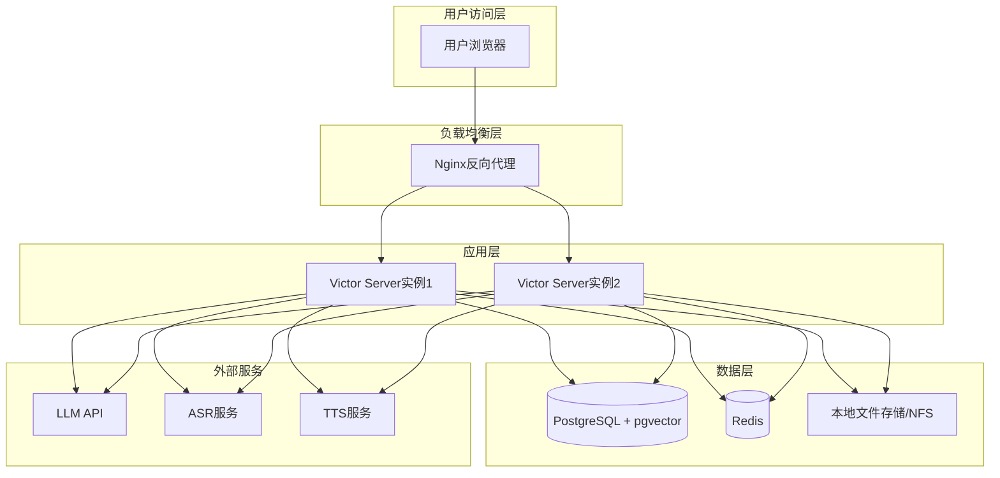

# Victor AI 面试助手 - 部署方案

## 1. 部署架构

### 1.1 部署架构图



### 1.2 部署模式

| 模式 | 适用场景 | 组件 |
|-----|---------|------|
| 单机部署 | 个人使用、测试环境 | Docker Compose一键部署 |
| 分布式部署 | 生产环境、多用户 | K8s集群部署 |

---

## 2. 单机部署（Docker Compose）

### 2.1 环境要求

| 组件 | 最低要求 | 推荐配置 |
|-----|---------|---------|
| CPU | 2核 | 4核+ |
| 内存 | 4GB | 8GB+ |
| 磁盘 | 50GB | 100GB+ SSD |
| Docker | 24.x | 最新版 |
| Docker Compose | 2.x | 最新版 |

### 2.2 目录结构

部署目录建议结构：

```
/opt/victor-ai/
├── docker-compose.yml          # Docker Compose配置文件
├── .env                        # 环境变量配置
├── config/
│   ├── nginx.conf              # Nginx配置
│   └── application-prod.yml    # 生产环境配置
├── data/
│   ├── postgres/               # PostgreSQL数据
│   ├── redis/                  # Redis数据
│   └── files/                  # 文件存储
└── logs/
    ├── app/                    # 应用日志
    └── nginx/                  # Nginx日志
```

### 2.3 环境变量配置

**必需的环境变量：**

- **数据库配置**：POSTGRES_DB（数据库名）、POSTGRES_USER（用户名）、POSTGRES_PASSWORD（密码）
- **Redis配置**：REDIS_PASSWORD（Redis密码）
- **JWT配置**：JWT_SECRET（JWT密钥，至少256位）
- **文件存储**：FILE_STORAGE_PATH（文件存储路径）
- **日志级别**：LOG_LEVEL（INFO/DEBUG/WARN/ERROR）
- **时区**：TZ（如Asia/Shanghai）

**配置示例**：创建`.env`文件，填写上述变量的值。注意保护敏感信息，设置文件权限为600。

### 2.4 Docker Compose配置要点

**核心服务说明：**

1. **PostgreSQL服务**：
   - 使用pgvector/pgvector:pg16镜像
   - 挂载数据卷到./data/postgres
   - 配置健康检查确保数据库就绪
   - 暴露5432端口（可选，生产环境建议仅内部网络访问）

2. **Redis服务**：
   - 使用redis:7-alpine镜像
   - 启用AOF持久化
   - 挂载数据卷到./data/redis
   - 配置健康检查

3. **Victor Server服务**：
   - 依赖PostgreSQL和Redis健康检查通过
   - 配置所有必需的环境变量（数据库连接、Redis连接、JWT密钥等）
   - 挂载文件存储卷到/data/victor/files
   - 挂载日志目录便于查看
   - 暴露8080端口

4. **Victor Web服务**：
   - 依赖Victor Server服务
   - 挂载Nginx配置文件
   - 挂载Nginx日志目录
   - 暴露80端口

**网络配置**：所有服务加入victor-network桥接网络，实现内部通信。

### 2.5 Nginx配置要点

**关键配置项：**

1. **上游服务器**：配置backend upstream指向victor-server:8080

2. **前端静态资源**：location / 指向/usr/share/nginx/html，配置try_files支持SPA路由

3. **API代理**：location /api/ 代理到backend，配置请求头转发（Host、X-Real-IP、X-Forwarded-For等）

4. **WebSocket代理**：location /ws/ 代理到backend，必须配置Upgrade和Connection头支持WebSocket升级，超时时间设置为3600秒

5. **静态文件**：location /audio/ 和 /images/ 配置缓存头，提高加载速度

6. **健康检查**：location /health 返回200状态码，用于容器健康检查

7. **客户端限制**：client_max_body_size设置为50M，支持大文件上传

### 2.6 部署命令

**部署步骤：**

1. **创建目录**：执行 `mkdir -p /opt/victor-ai/{config,data,logs}`

2. **复制配置文件**：将docker-compose.yml、.env、nginx.conf复制到对应目录

3. **设置权限**：执行 `chmod 600 /opt/victor-ai/.env` 保护敏感信息

4. **启动服务**：进入/opt/victor-ai目录，执行 `docker-compose up -d`

5. **查看日志**：执行 `docker-compose logs -f` 查看实时日志

6. **查看状态**：执行 `docker-compose ps` 查看所有容器状态

**常用运维命令：**

- 停止服务：`docker-compose down`
- 重启服务：`docker-compose restart`
- 更新服务：修改配置后执行 `docker-compose up -d`
- 查看资源使用：`docker stats`

---

## 3. 生产环境部署（Kubernetes）

### 3.1 资源配额建议

| 组件 | CPU请求 | CPU限制 | 内存请求 | 内存限制 |
|-----|--------|--------|---------|---------|
| victor-server | 500m | 2000m | 1Gi | 4Gi |
| victor-web | 100m | 500m | 128Mi | 256Mi |
| postgres | 500m | 2000m | 1Gi | 4Gi |
| redis | 200m | 1000m | 256Mi | 1Gi |

### 3.2 Kubernetes资源配置

**命名空间**：创建独立的victor-ai命名空间隔离资源。

**ConfigMap**：存储非敏感配置，如数据库主机地址、端口、日志级别、时区等。

**Secret**：存储敏感信息，如数据库密码、Redis密码、JWT密钥等，使用base64编码。

**Deployment配置要点：**

1. **Victor Server Deployment**：
   - replicas设置为2或更多，实现高可用
   - 从ConfigMap和Secret注入环境变量
   - 配置resources requests和limits
   - 配置livenessProbe和readinessProbe健康检查（使用/actuator/health端点）
   - 挂载PersistentVolumeClaim用于文件存储

2. **Victor Web Deployment**：
   - replicas设置为2或更多
   - 配置资源限制
   - 配置健康检查

**Service配置**：

- Victor Server Service：ClusterIP类型，暴露8080端口
- Victor Web Service：ClusterIP类型，暴露80端口

**Ingress配置**：

- 使用nginx ingress controller
- 配置域名（如victor.example.com）
- 配置/api和/ws路径代理到Victor Server Service
- 配置/路径代理到Victor Web Service
- 配置proxy-body-size为50m
- 配置proxy-read-timeout和proxy-send-timeout为3600秒支持长连接

**PersistentVolumeClaim**：为文件存储创建PVC，建议使用SSD存储类。

### 3.3 部署流程

1. 创建命名空间：`kubectl apply -f k8s/namespace.yaml`

2. 创建ConfigMap和Secret：`kubectl apply -f k8s/configmap.yaml` 和 `kubectl apply -f k8s/secret.yaml`

3. 创建PVC：`kubectl apply -f k8s/pvc.yaml`

4. 创建Deployment和Service：`kubectl apply -f k8s/deployment-server.yaml` 和 `kubectl apply -f k8s/deployment-web.yaml`

5. 创建Ingress：`kubectl apply -f k8s/ingress.yaml`

6. 验证部署：`kubectl get all -n victor-ai`

---

## 4. 数据库初始化

### 4.1 初始化脚本说明

数据库初始化分为两个阶段：

**DDL脚本（建表）**：
- 创建pgvector扩展
- 创建所有业务表（用户表、资料表、面试表、Agent表、语音配置表、开放API Key表、元数据表等）
- 创建索引和外键约束
- 使用CREATE TABLE IF NOT EXISTS保证幂等性

**DML脚本（初始数据）**：
- 插入系统默认Agent（出题Agent、追问Agent、技术评估Agent、行为评估Agent等）
- 插入系统默认Agent团队（面试团队、评估团队）
- 使用INSERT ... ON CONFLICT DO NOTHING保证幂等性

### 4.2 系统默认Agent列表

| key | 名称 | 类型 | 说明 |
|-----|------|------|------|
| interview-question | 出题Agent | INTERVIEW | 负责生成面试题目 |
| interview-followup | 追问Agent | INTERVIEW | 负责根据回答生成追问 |
| evaluation-technical | 技术评估Agent | EVALUATION | 评估技术能力和代码质量 |
| evaluation-behavioral | 行为评估Agent | EVALUATION | 评估沟通能力和软技能 |
| evaluation-domain | 领域评估Agent | EVALUATION | 评估特定领域知识深度 |
| evaluation-comprehensive | 综合评估Agent | EVALUATION | 汇总各维度评分 |

### 4.3 系统默认Agent团队列表

| key | 名称 | 执行模式 | 成员 |
|-----|------|---------|------|
| team-interview | 面试团队 | SEQUENTIAL | interview-question, interview-followup |
| team-evaluation | 评估团队 | PARALLEL | evaluation-technical, evaluation-behavioral, evaluation-domain, evaluation-comprehensive |

### 4.4 数据迁移

使用Flyway或Liquibase进行版本化数据库迁移：

**目录结构**：src/main/resources/db/migration/
- V1__init.sql：初始建表
- V2__add_open_api_key_table.sql：添加开放API Key表
- V3__add_evaluation_table.sql：添加评估相关字段

**优势**：
- 自动检测并执行未应用的迁移脚本
- 记录迁移历史，支持回滚
- 保证不同环境数据库结构一致

---

## 5. 监控与日志

### 5.1 健康检查端点

| 端点 | 说明 |
|-----|------|
| `/actuator/health` | 应用健康状态（Spring Boot Actuator） |
| `/actuator/info` | 应用信息 |
| `/actuator/metrics` | 指标数据 |
| `/health` | Nginx健康检查 |

### 5.2 日志配置

**日志策略：**

1. **控制台输出**：开发环境使用，方便调试

2. **文件输出**：生产环境使用，配置滚动策略：
   - 按天滚动：文件名包含日期（victor.2025-01-01.log）
   - 保留30天历史
   - 总大小限制1GB

3. **错误日志单独输出**：ERROR级别日志单独写入error.log，便于快速定位问题

4. **日志格式**：包含时间戳、线程名、日志级别、类名、消息内容

### 5.3 监控指标

**关键监控指标：**

| 指标类别 | 指标名称 | 说明 |
|---------|---------|------|
| JVM | jvm_memory_used_bytes | JVM内存使用 |
| JVM | jvm_gc_pause_seconds | GC暂停时间 |
| HTTP | http_server_requests_seconds | HTTP请求耗时 |
| HTTP | http_server_requests_active | 活跃请求数 |
| WebSocket | websocket_connections_active | 活跃WebSocket连接数 |
| Database | hikaricp_connections_active | 活跃数据库连接数 |
| Redis | lettuce_command_latency | Redis命令延迟 |
| Custom | interview_sessions_active | 活跃面试会话数 |
| Custom | llm_request_duration | LLM请求耗时 |

**监控工具**：集成Prometheus + Grafana，可视化监控面板。

---

## 6. 备份与恢复

### 6.1 数据库备份

**备份策略：**

- **频率**：每日凌晨自动备份
- **方式**：使用pg_dump导出SQL，gzip压缩
- **保留策略**：保留30天备份，自动清理过期备份
- **存储位置**：备份到/backup/postgres目录，建议同步到对象存储（如S3）

**备份脚本逻辑：**

1. 创建备份目录
2. 执行docker exec调用pg_dump，输出到gzip压缩文件
3. 删除30天前的旧备份
4. 记录备份完成日志

### 6.2 数据库恢复

**恢复步骤：**

1. 停止应用服务，避免数据写入
2. 解压备份文件：gunzip -c backup_file.sql.gz
3. 通过docker exec调用psql导入数据
4. 验证数据完整性
5. 重启应用服务

**注意事项**：恢复前确认目标数据库为空或已备份当前数据。

### 6.3 文件备份

**备份内容**：用户上传的简历、文档、音频、图片等文件。

**备份策略：**

- **频率**：每日备份
- **方式**：tar打包压缩
- **保留策略**：保留30天
- **存储位置**：备份到/backup/files目录

---

## 7. 故障排查

### 7.1 常见问题

| 问题 | 可能原因 | 解决方案 |
|-----|---------|---------|
| 服务启动失败 | 数据库连接失败 | 检查数据库状态、网络连接、密码配置 |
| WebSocket连接断开 | 超时或网络问题 | 检查Nginx超时配置、防火墙规则 |
| LLM调用超时 | 网络问题或模型响应慢 | 增加超时时间、配置重试机制、检查API Key有效性 |
| 向量检索慢 | 数据量大、索引失效 | 优化索引、增加pgvector工作内存、考虑分片 |
| 磁盘空间不足 | 文件累积 | 清理临时文件、扩展存储、配置自动清理策略 |

### 7.2 排查命令

**常用诊断命令：**

- 查看容器状态：`docker-compose ps`
- 查看容器日志：`docker-compose logs -f victor-server`
- 进入容器：`docker exec -it victor-server /bin/sh`
- 检查数据库连接：`docker exec -it victor-postgres psql -U victor -d victor_ai -c "SELECT 1"`
- 检查Redis连接：`docker exec -it victor-redis redis-cli -a password ping`
- 检查磁盘空间：`df -h`
- 检查内存使用：`free -m`
- 检查端口占用：`netstat -tlnp | grep -E "8080|5432|6379"`

### 7.3 性能调优

**PostgreSQL调优参数：**

- shared_buffers：共享缓冲区，建议设置为物理内存的25%
- work_mem：工作内存，影响排序和哈希操作
- maintenance_work_mem：维护工作内存，影响VACUUM和索引创建
- effective_cache_size：有效缓存大小，帮助查询规划器优化

**JVM调优参数：**

- Xms/Xmx：堆内存初始值和最大值，建议设置为相同值避免动态调整
- UseG1GC：使用G1垃圾收集器，适合大内存低延迟场景
- MaxGCPauseMillis：最大GC暂停时间目标
- UseStringDeduplication：字符串去重，减少内存占用

**调优建议**：根据实际负载逐步调整参数，监控效果后再进一步优化。
