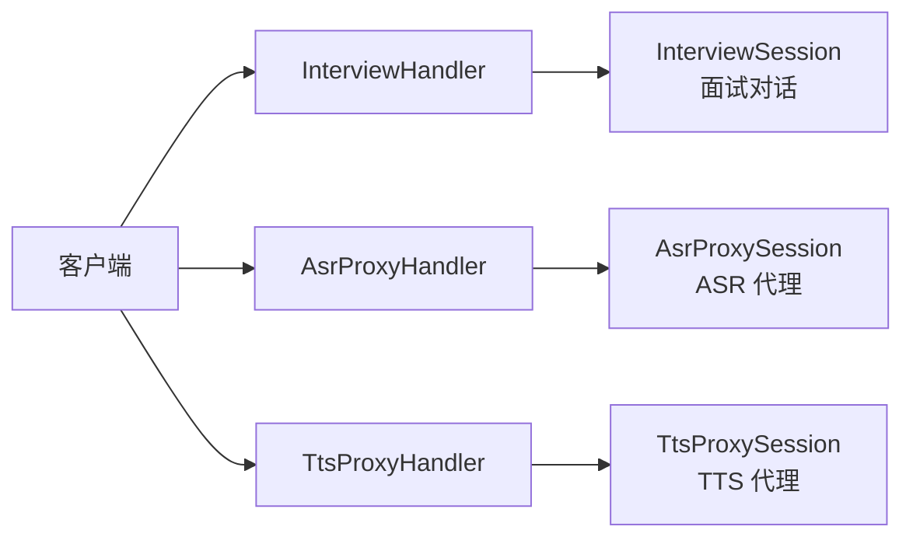
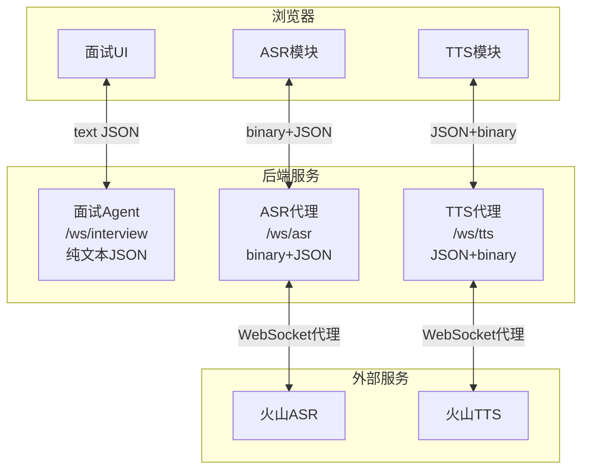
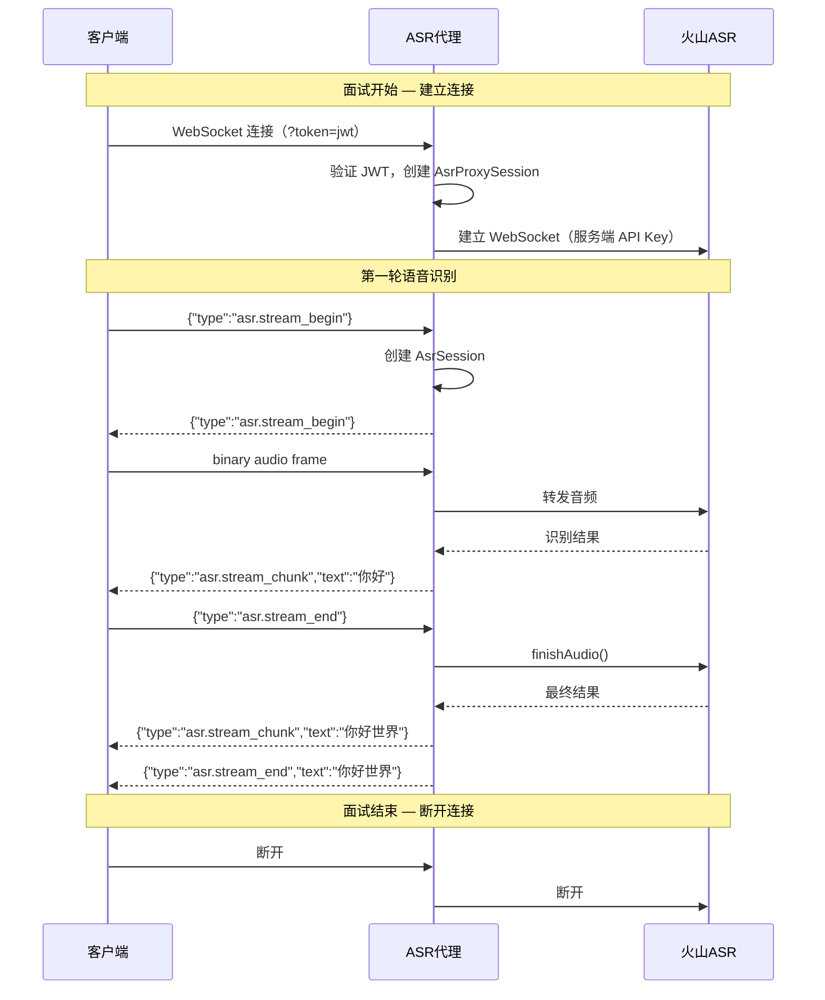
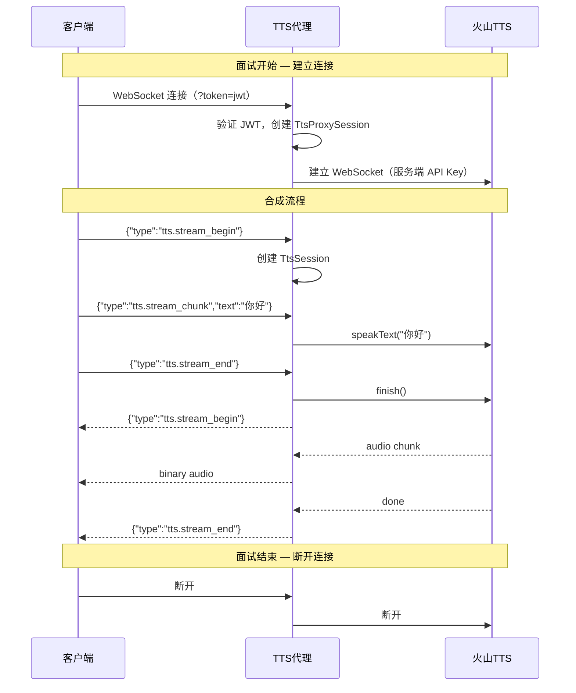
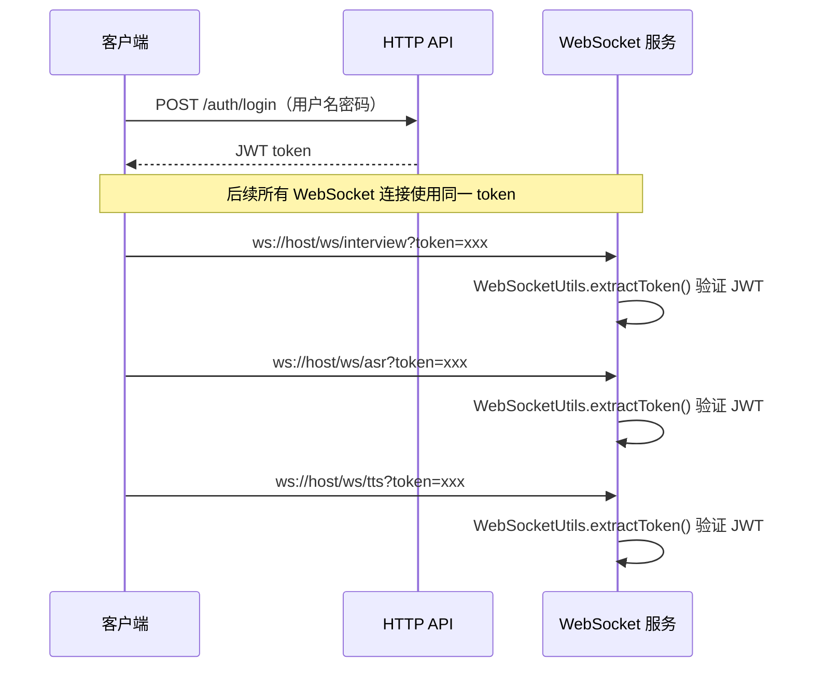
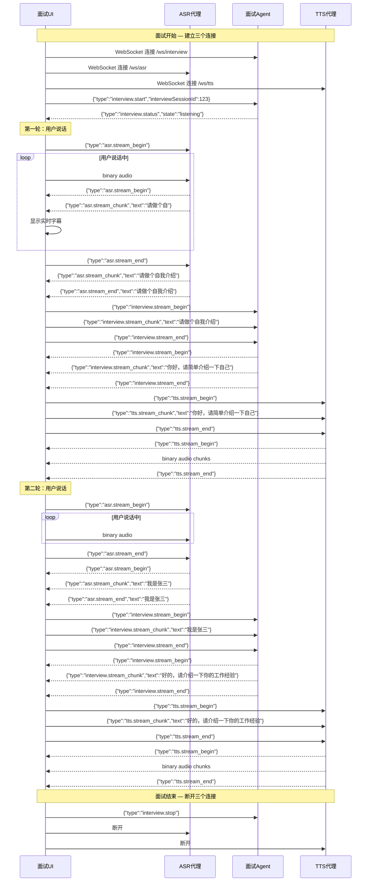

# ASR/TTS 解耦方案

## 1. 背景

### 1.1 现状

当前面试 Agent 和 ASR/TTS 已解耦为独立的 WebSocket 服务：

### 1.2 目标

面试 Agent 简化为纯文本 WebSocket 服务，ASR 和 TTS 作为独立的无状态 WebSocket 代理服务，客户端按需连接编排。

## 2. 架构设计

### 2.1 总览

### 2.2 核心原则

- **面试 Agent 只管文本对话**：不感知 ASR/TTS，纯 JSON 文本输入输出
- **ASR/TTS 是无状态代理**：一个客户端连接对应一个火山连接，一一对应，无状态
- **客户端编排**：浏览器负责协调 ASR、面试 Agent、TTS 的连接和数据流
- **认证统一**：客户端通过 HTTP 获取 JWT，WebSocket 通过 URL query parameter 传 token

### 2.3 核心组件

| 组件 | 职责 |
|------|------|
| `Session` 接口 | 定义会话通用行为：`handleCommand()`、`sendMessage()`、`cleanup()` |
| `SessionFactory` | 工厂类，创建各种会话实例，注入依赖 |
| `SessionManager` | 通用会话管理器，管理所有会话生命周期 |
| `WebSocketUtils` | WebSocket 工具类，提供 token 提取等通用方法 |
| `InterruptResponder` | 中断响应器，处理中断事件和序列号管理 |

## 3. 统一流控制协议

所有服务使用统一的 `type` 字段和流控制消息，类型格式为 `{模块}.{动作}`：

| 消息 | 方向 | 说明 |
|------|------|------|
| `{module}.stream_begin` | 双向 | 流开始 |
| `{module}.stream_chunk` | 双向 | 流数据 |
| `{module}.stream_end` | 双向 | 流结束 |
| `{module}.interrupt` | C→S | 中断当前操作 |

### 3.1 Interview Agent（/ws/interview）

**职责**：纯文本面试对话

**协议**：双向 text JSON，无 binary message

**客户端 → 服务端**：

| 类型 | 字段 | 说明 |
|------|------|------|
| `interview.start` | `interviewSessionId` | 开始面试 |
| `interview.stream_begin` | - | 开始流式文本输入 |
| `interview.stream_chunk` | `text` | 流式文本片段 |
| `interview.stream_end` | - | 流式文本输入完毕 |
| `interview.reconnect` | `interviewSessionId` | 断线重连 |
| `interview.interrupt` | `interruptType` | 打断当前处理 |
| `interview.stop` | - | 停止会话 |

**服务端 → 客户端**：

| 类型 | 字段 | 说明 |
|------|------|------|
| `interview.status` | `state` | 状态变更（connected/listening） |
| `interview.reconnected` | `interviewSessionId`, `historyTurns` | 重连成功 |
| `interview.stream_begin` | - | LLM 开始生成 |
| `interview.stream_chunk` | `text` | LLM 文本片段 |
| `interview.stream_end` | - | LLM 生成完毕 |
| `interview.error` | `message` | 错误信息 |

**InterviewSession 核心方法**：
- `handleStart()` - 处理面试开始，初始化上下文
- `handleStreamBegin()` - 清空输入缓冲区
- `handleStreamChunk()` - 追加文本到缓冲区
- `handleStreamEnd()` - 提交文本处理任务
- `submitProcessing()` - 异步执行 LLM 处理
- `processText()` - 调用 LLM 并流式返回结果
- `handleInterrupt()` - 记录中断事件
- `handleReconnect()` - 恢复面试上下文

### 3.2 ASR 代理（/ws/asr）

**职责**：WebSocket 双向代理，client ↔ Volcengine ASR

**客户端 → 服务端**：

| 类型 | 说明 |
|------|------|
| `asr.stream_begin` | 开始发送音频（用户开始说话） |
| binary | PCM 音频帧 |
| `asr.stream_end` | 音频发送完毕（用户说完） |
| `asr.interrupt` | 中断识别 |

**服务端 → 客户端**：

| 类型 | 字段 | 说明 |
|------|------|------|
| `asr.stream_begin` | - | 开始识别 |
| `asr.stream_chunk` | `text` | 中间识别结果 |
| `asr.stream_end` | `text` | 识别完毕，携带最终文本 |

**AsrProxySession 核心方法**：
- `handleCommand()` - 解析并分发命令
- `handleBinaryData()` - 转发音频数据
- `handleStreamBegin()` - 创建 ASR 会话
- `handleStreamEnd()` - 提交结果收集任务
- `handleInterrupt()` - 记录中断事件，关闭会话
- `collectAndSendResults()` - 收集识别结果并发送

**生命周期**：

连接与面试会话同生命周期。代理内部每轮语音识别自动创建/销毁 AsrSession（对客户端透明）。

### 3.3 TTS 代理（/ws/tts）

**职责**：WebSocket 双向代理，client ↔ Volcengine TTS

**客户端 → 服务端**：

| 类型 | 字段 | 说明 |
|------|------|------|
| `tts.stream_begin` | - | 开始发送文本 |
| `tts.stream_chunk` | `text` | 流式文本片段 |
| `tts.stream_end` | - | 文本发送完毕 |
| `tts.interrupt` | - | 中断当前合成 |

**服务端 → 客户端**：

| 类型 | 说明 |
|------|------|
| `tts.stream_begin` | 开始返回音频 |
| binary | 音频数据块 |
| `tts.stream_end` | 音频返回完毕 |

**TtsProxySession 核心方法**：
- `handleCommand()` - 解析并分发命令
- `handleStreamBegin()` - 创建 TTS 会话
- `handleStreamChunk()` - 发送文本到 TTS
- `handleStreamEnd()` - 提交音频收集任务
- `handleInterrupt()` - 记录中断事件，关闭会话
- `collectAndSendAudio()` - 收集音频数据并发送

**生命周期**：

连接与面试会话同生命周期。代理内部每次合成自动创建/销毁 TtsSession（对客户端透明）。

## 4. 认证设计

- 客户端通过 HTTP 接口获取 JWT
- WebSocket 连接时通过 URL query parameter 传递 token
- 使用 `WebSocketUtils.extractToken()` 提取 token
- 服务端验证 JWT 后，用服务端自己的火山 API Key 建立上游连接
- 火山 API Key 不暴露给客户端

## 5. 客户端编排流程

三个 WebSocket 连接与面试会话同生命周期：面试开始时连接，面试结束时断开，中间可复用。

**生命周期说明**：
- 三个连接在面试开始时建立，面试结束时断开
- 每轮对话中，ASR 代理内部自动创建/销毁识别会话（对客户端透明）
- TTS 代理支持简单模式和流式模式（对客户端透明）
- 连接异常断开时客户端可重连，不影响面试 Agent

## 6. WebSocket 端点汇总

| 端点 | 输入 | 输出 | 说明 |
|------|------|------|------|
| `/ws/interview` | text JSON | text JSON | 面试对话 |
| `/ws/asr` | binary + text JSON | text JSON | 音频→识别结果 |
| `/ws/tts` | text JSON | binary + text JSON | 文本→音频 |

## 7. 涉及文件

### 核心接口和工具

| 文件 | 职责 |
|------|------|
| `victor-web/.../session/Session.java` | 会话接口，定义通用行为 |
| `victor-web/.../session/SessionFactory.java` | 会话工厂，创建各种会话实例 |
| `victor-web/.../session/SessionManager.java` | 通用会话管理器 |
| `victor-web/.../session/InterruptResponder.java` | 中断响应器 |
| `victor-web/.../utils/WebSocketUtils.java` | WebSocket 工具类 |

### 会话实现

| 文件 | 职责 |
|------|------|
| `victor-web/.../session/InterviewSession.java` | 面试会话，处理文本对话 |
| `victor-web/.../session/AsrProxySession.java` | ASR 代理会话，处理音频识别 |
| `victor-web/.../session/TtsProxySession.java` | TTS 代理会话，处理语音合成 |
| `victor-web/.../session/InterviewContextRestorer.java` | 面试上下文恢复器 |

### Handler

| 文件 | 职责 |
|------|------|
| `victor-web/.../handler/InterviewHandler.java` | 面试 WebSocket 处理器 |
| `victor-web/.../handler/AsrProxyHandler.java` | ASR 代理处理器 |
| `victor-web/.../handler/TtsProxyHandler.java` | TTS 代理处理器 |

### 客户端消息（client/）

| 文件 | 类型 |
|------|------|
| `victor-web/.../protocol/client/interview/InterviewClientStartMessage.java` | `interview.start` |
| `victor-web/.../protocol/client/interview/InterviewClientStopMessage.java` | `interview.stop` |
| `victor-web/.../protocol/client/interview/InterviewClientReconnectMessage.java` | `interview.reconnect` |
| `victor-web/.../protocol/client/interview/InterviewClientInterruptMessage.java` | `interview.interrupt` |
| `victor-web/.../protocol/client/interview/InterviewClientStreamBeginMessage.java` | `interview.stream_begin` |
| `victor-web/.../protocol/client/interview/InterviewClientStreamChunkMessage.java` | `interview.stream_chunk` |
| `victor-web/.../protocol/client/interview/InterviewClientStreamEndMessage.java` | `interview.stream_end` |
| `victor-web/.../protocol/client/asr/AsrClientStreamBeginMessage.java` | `asr.stream_begin` |
| `victor-web/.../protocol/client/asr/AsrClientStreamChunkMessage.java` | `asr.stream_chunk` |
| `victor-web/.../protocol/client/asr/AsrClientStreamEndMessage.java` | `asr.stream_end` |
| `victor-web/.../protocol/client/asr/AsrClientInterruptMessage.java` | `asr.interrupt` |
| `victor-web/.../protocol/client/tts/TtsClientStreamBeginMessage.java` | `tts.stream_begin` |
| `victor-web/.../protocol/client/tts/TtsClientStreamChunkMessage.java` | `tts.stream_chunk` |
| `victor-web/.../protocol/client/tts/TtsClientStreamEndMessage.java` | `tts.stream_end` |
| `victor-web/.../protocol/client/tts/TtsClientInterruptMessage.java` | `tts.interrupt` |

### 服务端消息（server/）

| 文件 | 类型 |
|------|------|
| `victor-web/.../protocol/server/interview/InterviewServerStatusMessage.java` | `interview.status` |
| `victor-web/.../protocol/server/interview/InterviewServerReconnectedMessage.java` | `interview.reconnected` |
| `victor-web/.../protocol/server/interview/InterviewServerStreamBeginMessage.java` | `interview.stream_begin` |
| `victor-web/.../protocol/server/interview/InterviewServerStreamChunkMessage.java` | `interview.stream_chunk` |
| `victor-web/.../protocol/server/interview/InterviewServerStreamEndMessage.java` | `interview.stream_end` |
| `victor-web/.../protocol/server/interview/InterviewServerErrorMessage.java` | `interview.error` |
| `victor-web/.../protocol/server/asr/AsrServerStreamBeginMessage.java` | `asr.stream_begin` |
| `victor-web/.../protocol/server/asr/AsrServerStreamChunkMessage.java` | `asr.stream_chunk` |
| `victor-web/.../protocol/server/asr/AsrServerStreamEndMessage.java` | `asr.stream_end` |
| `victor-web/.../protocol/server/tts/TtsServerStreamBeginMessage.java` | `tts.stream_begin` |
| `victor-web/.../protocol/server/tts/TtsServerStreamEndMessage.java` | `tts.stream_end` |

### 协议基础类

| 文件 | 职责 |
|------|------|
| `victor-web/.../protocol/ClientMessage.java` | 客户端消息接口 |
| `victor-web/.../protocol/ServerMessage.java` | 服务端消息接口 |
| `victor-web/.../protocol/BaseClientMessage.java` | 客户端消息基类，Jackson 多态配置 |
| `victor-web/.../protocol/BaseServerMessage.java` | 服务端消息基类，序列化逻辑 |
| `victor-web/.../protocol/UnknownMessage.java` | 未知消息类型 |

## 8. 边界处理

| 场景 | 处理 |
|------|------|
| ASR 连接失败 | 客户端提示 ASR 不可用，可改用文本输入 |
| TTS 连接失败 | 客户端提示 TTS 不可用，文本仍可显示 |
| ASR 连接断开 | 客户端重新连接 ASR，不影响面试 Agent |
| TTS 连接断开 | 客户端重新连接 TTS，不影响面试 Agent |
| 面试 Agent 断线 | 走已有的 reconnect 流程，ASR/TTS 重新连接 |
| ASR 识别会话异常 | 代理销毁当前 session，客户端下次发 stream_begin 时自动新建 |
| TTS 合成会话异常 | 代理销毁当前 session，客户端下次发 stream_begin 时自动新建 |
| 中断处理 | 客户端发 interrupt，InterruptResponder 记录事件，异步任务检测到中断后停止 |
| token 过期 | WebSocket 连接被拒，客户端重新登录获取新 token |

## 9. 验证方式

1. 面试 Agent：发送 `{"type":"interview.stream_begin"}{"type":"interview.stream_chunk","text":"你好"}{"type":"interview.stream_end"}`，确认返回 LLM 回复文本
2. ASR 代理：连接 `/ws/asr`，发 asr.stream_begin + PCM 音频 + asr.stream_end，确认收到 asr.stream_begin/asr.stream_chunk/asr.stream_end
3. TTS 代理：连接 `/ws/tts`，发 tts.stream_begin + tts.stream_chunk + tts.stream_end，确认收到 tts.stream_begin + binary + tts.stream_end
4. 认证：无 token 连接被拒，过期 token 被拒
5. 中断：发送 interrupt 消息，确认异步任务停止
6. 端到端：客户端编排 ASR → 面试 Agent → TTS 完整流程
