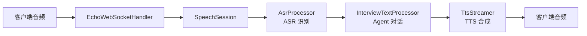
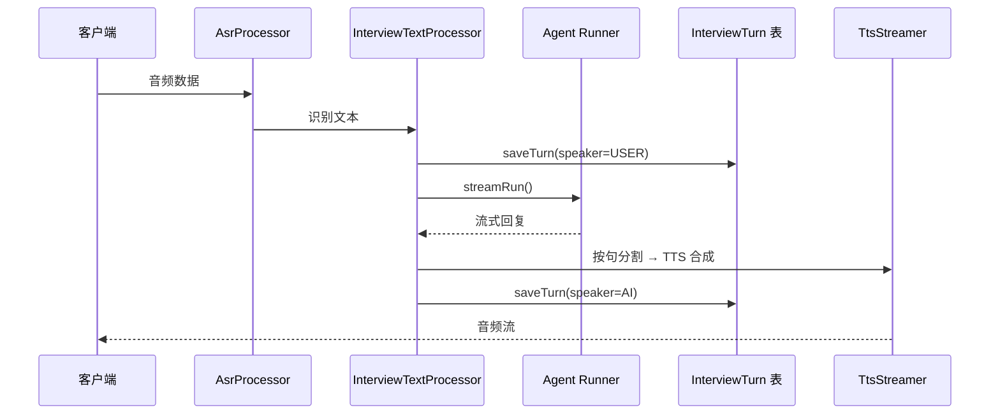
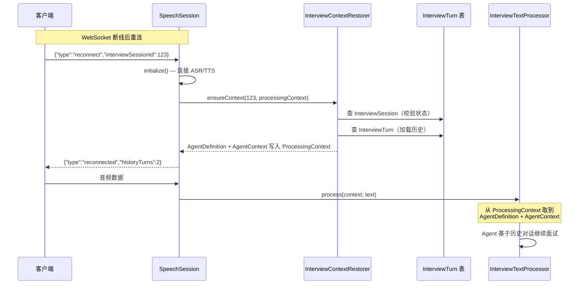
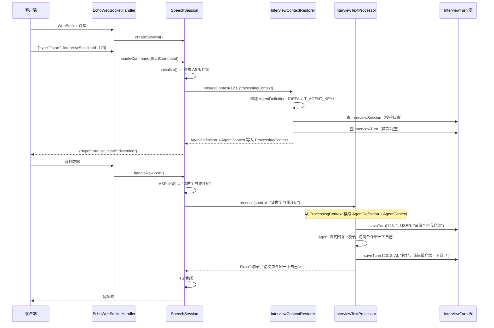
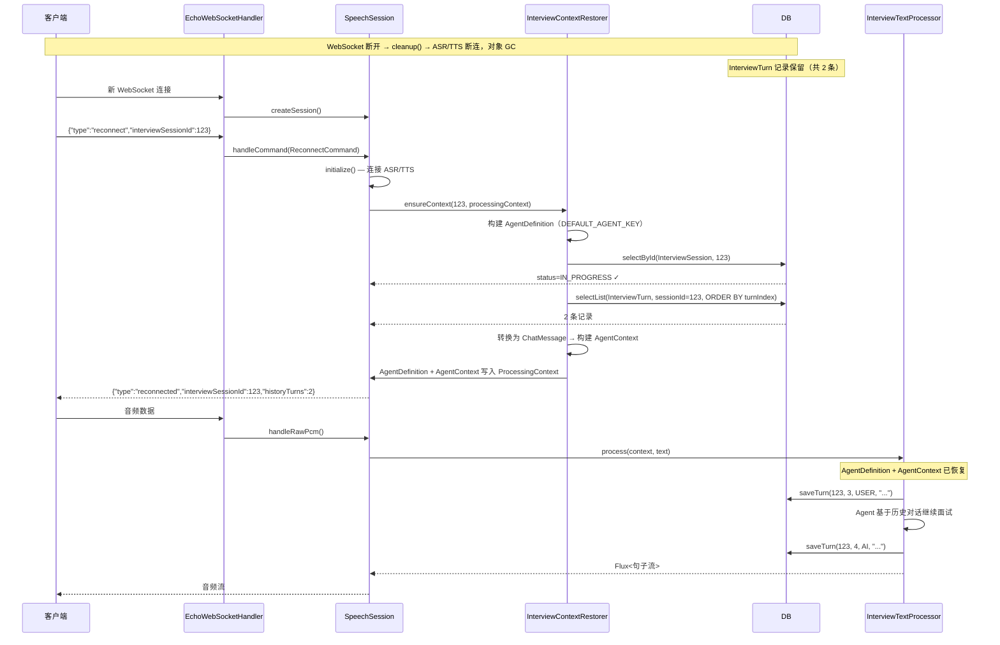
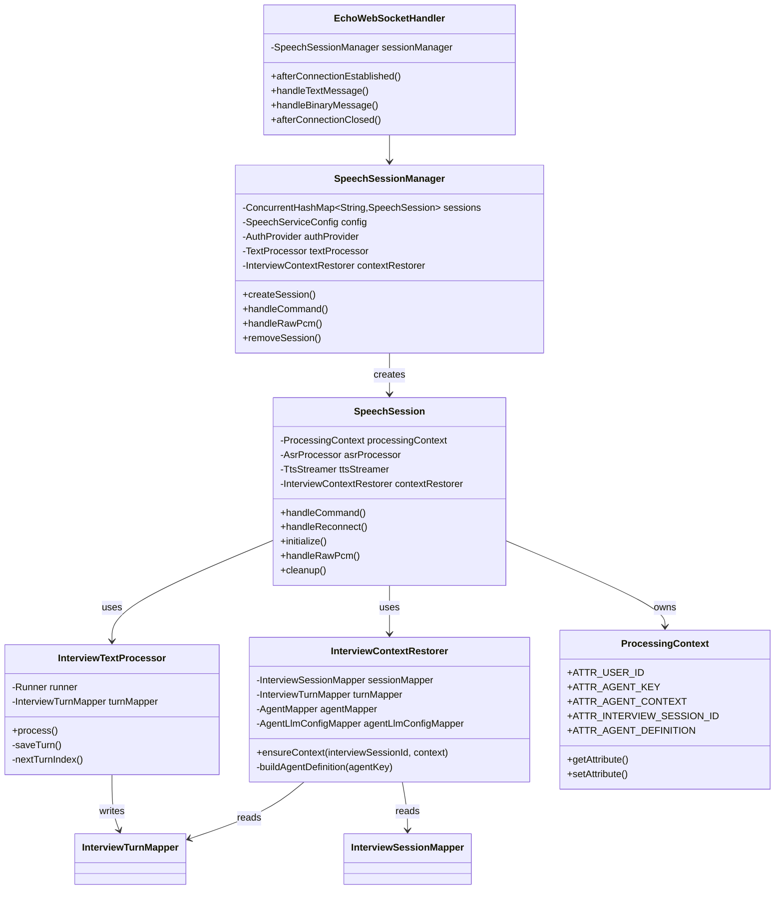

# WebSocket 断线恢复方案

## 1. 背景与问题

### 1.1 现状

语音面试基于 WebSocket 长连接，整个处理链路为：



`SpeechSession` 是一次性的，断线后整个对象链被 GC 回收，包括：
- `ProcessingContext`（会话上下文）
- `AgentContext`（Agent 对话历史 `conversationHistory`）
- ASR/TTS WebSocket 连接

### 1.2 需求

用户断开 WebSocket 后重连，Agent 能接上之前的对话上下文继续面试。

### 1.3 发现的关键问题

调研发现：**当前语音面试流程没有写入 `InterviewTurn` 记录**。`InterviewTurn` 的持久化只在 API 面试流程中实现（`InterviewEngineImpl`），语音面试的 `InterviewTextProcessor` 只把对话存在内存中。

因此本次改动包含两部分：
1. **持久化**：在 `InterviewTextProcessor` 中将每轮对话写入 `InterviewTurn` 表
2. **恢复**：重连时从 `InterviewTurn` 表回填 `AgentContext.conversationHistory`

## 2. 设计决策

### 2.1 interviewSessionId 的来源

`interviewSessionId` 由服务端通过 HTTP API 预先生成（创建 `InterviewSession` 记录），客户端在 `start` 命令中传入。客户端有开启面试的权利，但不生成 ID。

### 2.2 为什么用 InterviewTurn 而不是新建表

`InterviewTurn` 表已经存储了面试对话记录（`sessionId`、`speaker`、`content`、`turnIndex`），与 `AgentContext.ChatMessage`（`role`、`content`）天然映射：

| InterviewTurn | AgentContext.ChatMessage |
|---|---|
| `speaker=USER/CANDIDATE` | `role="user"` |
| `speaker=AI/INTERVIEWER` | `role="assistant"` |
| `content` | `content` |

不需要新建表，复用已有结构。

### 2.3 AgentDefinition 和 AgentContext 的存储位置

`AgentDefinition` 和 `AgentContext` 均存储在 `ProcessingContext.attributes` 中，生命周期跟随 `ProcessingContext`。

- `ATTR_AGENT_DEFINITION`：会话初始化时由 `InterviewContextRestorer.ensureContext()` 构建，`InterviewTextProcessor` 直接读取，不再自行构建
- `ATTR_AGENT_CONTEXT`：会话初始化时由 `InterviewContextRestorer.ensureContext()` 创建（首次为空历史，恢复时加载 DB 记录）

`ProcessingContext` 随 `SpeechSession` 创建，断线后被 GC。恢复时，`InterviewContextRestorer` 重新构建两者并写入新的 `ProcessingContext`。

### 2.4 首次面试和恢复走同一条路径

`interviewSessionId` 在进入语音面试前就已确定（服务端通过 HTTP API 预先生成），`ensureContext()` 不区分首次和恢复——统一查询 `InterviewSession`、加载 `InterviewTurn` 历史。首次时历史为空（`turns=0`），恢复时历史非空。

### 2.5 reconnect 隐含 start 语义

`reconnect` 命令会自动连接 ASR/TTS（同 `initialize()`），客户端不需要先 `start` 再 `reconnect`。

## 3. 架构

### 3.1 正常流程 — 对话持久化



### 3.2 断线恢复流程



## 4. 涉及文件

### 新建（2个）

| 文件 | 职责 |
|------|------|
| `victor-web/.../protocol/command/ReconnectCommand.java` | 重连命令，携带 `interviewSessionId` |
| `victor-web/.../websocket/session/InterviewContextRestorer.java` | 构建 `AgentDefinition` + 从 DB 恢复 `AgentContext`，写入 `ProcessingContext` |

### 修改（7个）

| 文件 | 改动 |
|------|------|
| `victor-web/.../protocol/ClientMessage.java` | `@JsonSubTypes` 注册 `reconnect` 类型 |
| `victor-web/.../protocol/ServerMessage.java` | 新增 `Reconnected` record |
| `victor-web/.../processor/ProcessingContext.java` | 新增 `ATTR_INTERVIEW_SESSION_ID` 常量 |
| `victor-web/.../session/SpeechSession.java` | `handleCommand` 处理 `ReconnectCommand`；构造函数注入 `InterviewContextRestorer` |
| `victor-web/.../session/SpeechSessionManager.java` | 注入 `InterviewContextRestorer` 并传递给 `SpeechSession` |
| `victor-web/.../protocol/command/StartCommand.java` | 新增 `interviewSessionId` 字段 |
| `victor-web/.../processor/InterviewTextProcessor.java` | 注入 `InterviewTurnMapper`；`process()` 中持久化用户消息和 Agent 回复；从 `ProcessingContext` 读取 `AgentDefinition` |

## 5. 详细实现

### 5.1 StartCommand 携带 interviewSessionId

```java
// StartCommand.java
public class StartCommand extends ClientMessage {
    private Long interviewSessionId;
    // getter/setter
}
```

客户端发送：`{"type":"start", "interviewSessionId": 123}`

### 5.2 InterviewTextProcessor 持久化

在 `process()` 方法中：

```java
// 1. 从 ProcessingContext 获取 interviewSessionId
final Long interviewSessionId = context.getAttribute(ProcessingContext.ATTR_INTERVIEW_SESSION_ID);

// 2. 用户消息写入
agentContext.addUserMessage(text);
if (interviewSessionId != null) {
    saveTurn(interviewSessionId, Speaker.USER, text);
}

// 3. Agent 回复完成后写入（doOnComplete）
if (interviewSessionId != null && !fullResponse.isEmpty()) {
    agentContext.addAssistantMessage(fullResponse.toString());
    saveTurn(interviewSessionId, Speaker.AI, fullResponse.toString());
}
```

`saveTurn` 参考 `InterviewEngineImpl.saveTurn()` 模式：

```java
private void saveTurn(Long interviewSessionId, Speaker speaker, String content) {
    InterviewTurn turn = new InterviewTurn();
    turn.setSessionId(interviewSessionId);
    turn.setTurnIndex(nextTurnIndex(interviewSessionId));
    turn.setSpeaker(speaker);
    turn.setContent(content);
    turn.setIsFollowup(false);
    turn.setIsHint(false);
    turnMapper.insert(turn);
}
```

`nextTurnIndex` 查询当前最大 `turnIndex + 1`。

### 5.3 InterviewContextRestorer

```java
@Component
public class InterviewContextRestorer {
    private static final String DEFAULT_AGENT_KEY = "interview-question";
    // 依赖：InterviewSessionMapper, InterviewTurnMapper, AgentMapper, AgentLlmConfigMapper

    /**
     * 确保面试上下文就绪：构建 AgentDefinition + 恢复 AgentContext。
     *
     * 首次面试和断线恢复走同一条路径：查询 InterviewSession、加载 InterviewTurn 历史。
     * 首次时历史为空（turns=0），恢复时历史非空。
     *
     * @param interviewSessionId 面试会话ID（必填，服务端通过 HTTP API 预先生成）
     * @param context            要填充的 ProcessingContext
     * @return 恢复的对话轮数；负数表示错误（-1 不存在，-2 状态不可恢复，-3 Agent 不存在）
     */
    public long ensureContext(Long interviewSessionId, ProcessingContext context) {
        // 1. 构建 AgentDefinition（使用 DEFAULT_AGENT_KEY）
        // 2. 校验 interviewSessionId 非空
        // 3. 查 InterviewSession，校验 status ∈ {IN_PROGRESS, PAUSED}
        // 4. 查 InterviewTurn（ORDER BY turnIndex ASC）→ 构建 AgentContext
        // 5. 写入 ProcessingContext（agentDefinition, agentKey, agentContext, userId, interviewSessionId）
        // 6. PAUSED → 更新为 IN_PROGRESS
        // 返回：对话轮数 / -1(不存在) / -2(状态不可恢复) / -3(Agent不存在)
    }
}
```

### 5.4 SpeechSession 处理 start 和 reconnect

`start` 和 `reconnect` 都会调用 `ensureInterviewContext()`，在会话初始化阶段构建 `AgentDefinition` 并恢复 `AgentContext`。

```java
// handleCommand 分支
if (command instanceof StartCommand start) {
    initialize();
    if (status == Status.RUNNING) {
        ensureInterviewContext(start.getInterviewSessionId());
    }
} else if (command instanceof ReconnectCommand reconnect) {
    handleReconnect(reconnect);
}

private void handleReconnect(ReconnectCommand command) {
    Long interviewSessionId = command.getInterviewSessionId();
    // 1. 校验 interviewSessionId 非空
    // 2. initialize() — 连接 ASR/TTS
    // 3. ensureInterviewContext(interviewSessionId)
    // 4. 根据结果发送 Reconnected 或 Error
}

private long ensureInterviewContext(Long interviewSessionId) {
    long result = contextRestorer.ensureContext(interviewSessionId, processingContext);
    // -1 → "面试会话不存在"
    // -2 → "面试已结束，无法恢复"
    // -3 → "Agent 不存在或配置异常"
    return result;
}
```

### 5.5 InterviewTextProcessor 读取 AgentDefinition 和 AgentContext

`InterviewTextProcessor.process()` 不再自行构建 `AgentDefinition` 和 `AgentContext`，而是从 `ProcessingContext` 读取。如果未初始化则通过 `emitter.error()` 抛出异常。

```java
// 读取 AgentContext
final AgentContext agentContext = context.getAttribute(ProcessingContext.ATTR_AGENT_CONTEXT);
if (agentContext == null) {
    emitter.error(new IllegalStateException("AgentContext 未初始化，请先发送 start 或 reconnect 命令"));
    return;
}

// 读取 AgentDefinition
AgentDefinition agentDef = context.getAttribute(ProcessingContext.ATTR_AGENT_DEFINITION);
if (agentDef == null) {
    emitter.error(new IllegalStateException("AgentDefinition 未初始化，请先发送 start 或 reconnect 命令"));
    return;
}
```

这确保了两者在会话初始化阶段（`start` / `reconnect`）就由 `InterviewContextRestorer.ensureContext()` 构建完成，`process()` 只负责读取和使用。

### 5.6 ProcessingContext 新增常量

```java
public static final String ATTR_INTERVIEW_SESSION_ID = "interviewSessionId";
public static final String ATTR_AGENT_DEFINITION = "agentDefinition";
```

### 5.7 ServerMessage.Reconnected

```java
record Reconnected(Long interviewSessionId, int historyTurns) implements ServerMessage {
    // {"type":"reconnected","interviewSessionId":123,"historyTurns":5}
}
```

## 6. 协议

### 6.1 客户端 → 服务端

| 类型 | 字段 | 说明 |
|------|------|------|
| `start` | `interviewSessionId` (必填) | 开始面试，携带面试会话 ID |
| `reconnect` | `interviewSessionId` (必填) | 断线重连，恢复面试上下文 |
| `interrupt` | `interruptType` | 打断当前处理 |
| `stop` | - | 停止会话 |

### 6.2 服务端 → 客户端

| 类型 | 字段 | 说明 |
|------|------|------|
| `status` | `state` | 状态变更（connected/listening） |
| `reconnected` | `interviewSessionId`, `historyTurns` | 重连成功，返回恢复的轮数 |
| `asr_result` | `text`, `isFinal` | ASR 识别结果 |
| `llm_text` | `text` | LLM 文本流 |
| `error` | `message` | 错误信息 |

## 7. 完整工作流

### 7.1 首次连接



### 7.2 断线重连



## 8. 边界处理

| 场景 | 处理 |
|------|------|
| `interviewSessionId` 为 null | 返回 `error` "面试会话不存在" |
| `interviewSessionId` 不存在 | 返回 `error` "面试会话不存在" |
| 状态为 COMPLETED/ABANDONED | 返回 `error` "面试已结束，无法恢复" |
| Agent 不存在或配置异常 | 返回 `error` "Agent 不存在或配置异常" |
| AgentDefinition/AgentContext 未初始化 | `process()` 抛出 `IllegalStateException` |
| InterviewTurn 为空（首次面试） | 正常，`historyTurns=0` |
| 重复 reconnect | 重新初始化 ASR/TTS，重新加载历史（幂等） |

## 9. 数据库表

### InterviewSession

| 字段 | 类型 | 说明 |
|------|------|------|
| id | Long | 主键 |
| config_id | Long | 配置 ID |
| user_id | Long | 用户 ID |
| status | SessionStatus | IN_PROGRESS / PAUSED / COMPLETED / ABANDONED |
| current_question_id | Long | 当前题目 ID |
| started_at | DateTime | 开始时间 |
| paused_at | DateTime | 暂停时间 |
| completed_at | DateTime | 完成时间 |

### InterviewTurn

| 字段 | 类型 | 说明 |
|------|------|------|
| id | Long | 主键 |
| session_id | Long | 会话 ID（关联 InterviewSession.id） |
| question_id | Long | 题目 ID |
| turn_index | Integer | 对话顺序（递增） |
| attempt_no | Integer | 第几次作答 |
| speaker | Speaker | USER / INTERVIEWER / AI / CANDIDATE |
| is_followup | Boolean | 是否追问 |
| content | String | 文字内容 |
| attachments | JSON | 附件列表 |
| is_hint | Boolean | 是否提示 |

## 10. 类图


