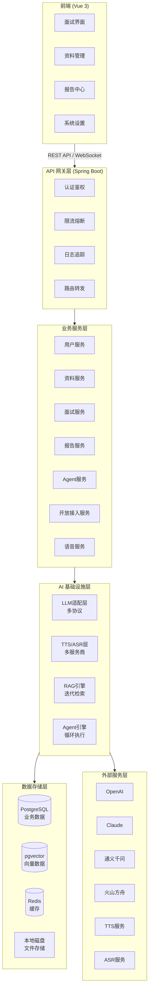
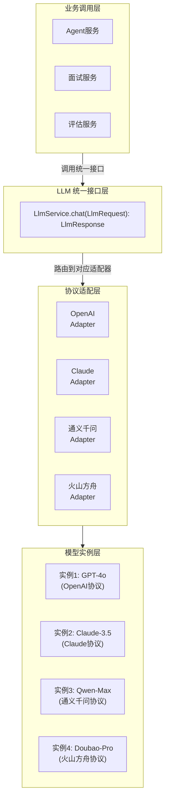
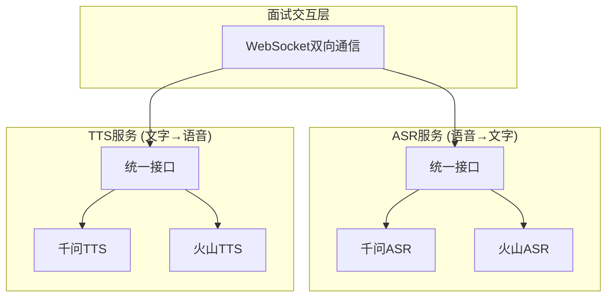
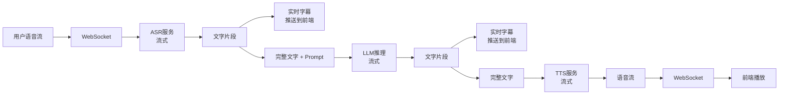
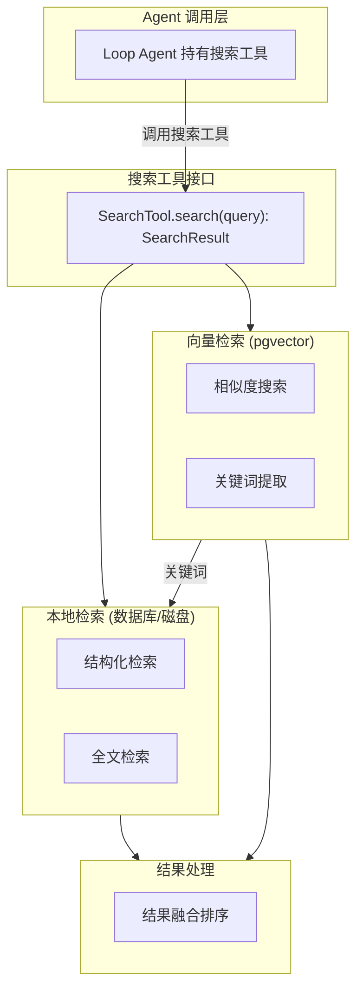
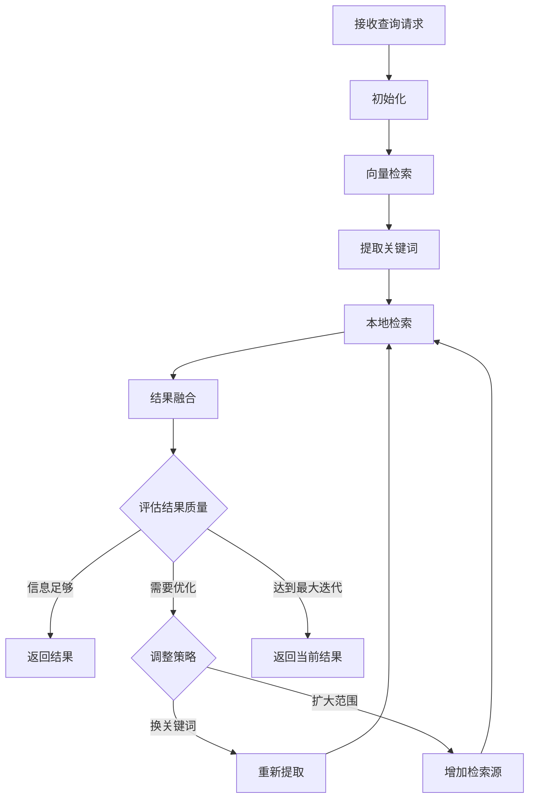
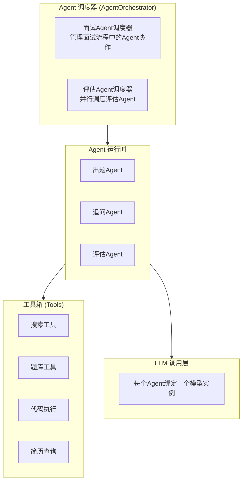
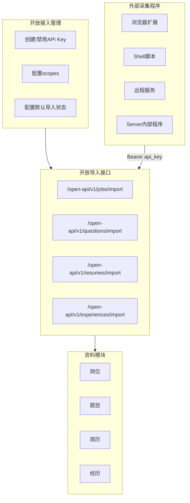
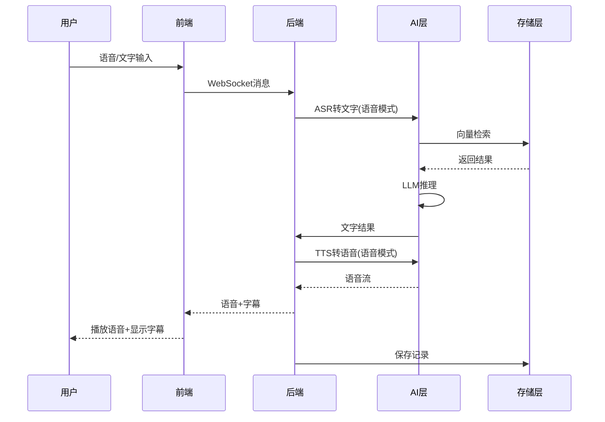

# Victor AI 面试助手 - 系统架构设计

## 1. 系统总体架构

### 1.1 架构概览

### 1.2 架构设计原则

| 原则 | 说明 |
|-----|------|
| 前后端分离 | 前端Vue3 + 后端Spring Boot，通过REST API和WebSocket通信 |
| 开放接入 | 外部采集程序通过开放API Key导入标准资料 |
| 模块解耦 | 各业务模块独立，通过接口通信 |
| 可扩展 | Agent团队、模型实例均可动态扩展 |
| 本地优先 | 支持本地部署，数据存储在本地 |

---

## 2. 核心架构设计

### 2.1 LLM模型适配架构

**设计要点**：
- 统一接口层屏蔽不同LLM协议差异
- 适配层负责协议转换（请求/响应格式映射）
- 模型实例层存储用户配置的连接信息
- Agent通过模型实例名称引用具体模型

### 2.2 语音服务架构

**语音链路流程**：

**设计要点**：
- 全链路流式处理，降低端到端延迟
- WebSocket双向通信，支持实时字幕和语音流
- ASR/TTS独立适配层，支持多服务商切换
- 语音文件本地存储，关联对话记录

### 2.3 RAG检索架构

**Loop Agent检索流程**：

**设计要点**：
- 向量检索仅做关键词纠偏，不直接作为LLM上下文
- Loop Agent自主决策检索策略
- 检索过程可追溯，用于评测
- 支持离线评测：构建测试集，定期跑评测任务

### 2.4 Agent引擎架构

> **核心原则**：系统中所有与 LLM 的交互都必须通过 Agent 进行，Agent 是 LLM 调用的唯一入口。任何业务模块需要 LLM 能力时，必须定义或引用一个 Agent，由 Agent 绑定模型实例并执行 LLM 调用。

**Agent执行模型**：
- **单次执行**：Agent接收输入 → 调用LLM → 返回结果
- **Loop执行**：Agent循环执行，直到满足终止条件（如Loop Agent检索）
- **团队协作**：多个Agent并行或串行执行，调度器协调

**Agent使用规范**：
| 场景 | Agent类型 | 说明 |
|-----|----------|------|
| 面试出题 | INTERVIEW | 出题Agent生成题目，追问Agent根据回答生成追问 |
| 面试评估 | EVALUATION | 技术/行为/领域评估Agent并行评估，综合Agent汇总 |
| 简历解析 | INTERVIEW | 调用Agent解析简历内容 |
| 报告生成 | EVALUATION | 调用Agent生成面试报告 |

### 2.5 开放接入架构

**开放导入数据格式说明：**

外部程序通过开放导入接口提交的数据采用JSON格式，包含items数组。每个item包含：
- externalId：外部系统的唯一标识
- sourceUri：数据来源URL
- rawPayload：原始导入数据（完整JSON对象）
- normalized fields：标准化字段，根据岗位/题目/简历/经历接口分别定义

**设计要点**：
- 核心系统不管理外部采集程序的运行方式，只提供开放导入接口
- 外部程序通过开放API Key鉴权，Key通过scopes限制可调用接口
- 导入资料直接写入资料表，并通过ingest_status区分正式资料和待审核资料
- default_ingest_status决定导入后默认进入ACTIVE或PENDING_REVIEW
- AI召回和面试题生成默认只使用ACTIVE资料

---

## 3. 数据流设计

### 3.1 面试主数据流

---

## 4. 关键技术决策

| 决策点 | 选择 | 理由 |
|-------|------|------|
| 前端框架 | Vue 3 + Composition API | 用户偏好，生态完善 |
| 后端框架 | Spring Boot 3.x + JDK21 | 用户偏好，虚拟线程支持 |
| 数据库 | PostgreSQL + pgvector | 关系型+向量一体化，减少组件 |
| 缓存 | Redis | 会话管理、热数据缓存 |
| 文件存储 | 本地磁盘 | 开源本地部署优先 |
| 代码编辑器 | Monaco Editor | VS Code同款，功能完善 |
| 绘图工具 | Excalidraw | 手绘风格，轻量好用 |
| 实时通信 | WebSocket | 语音流、实时字幕双向通信 |
| 容器化 | Docker + Docker Compose | 部署简便，环境一致 |
