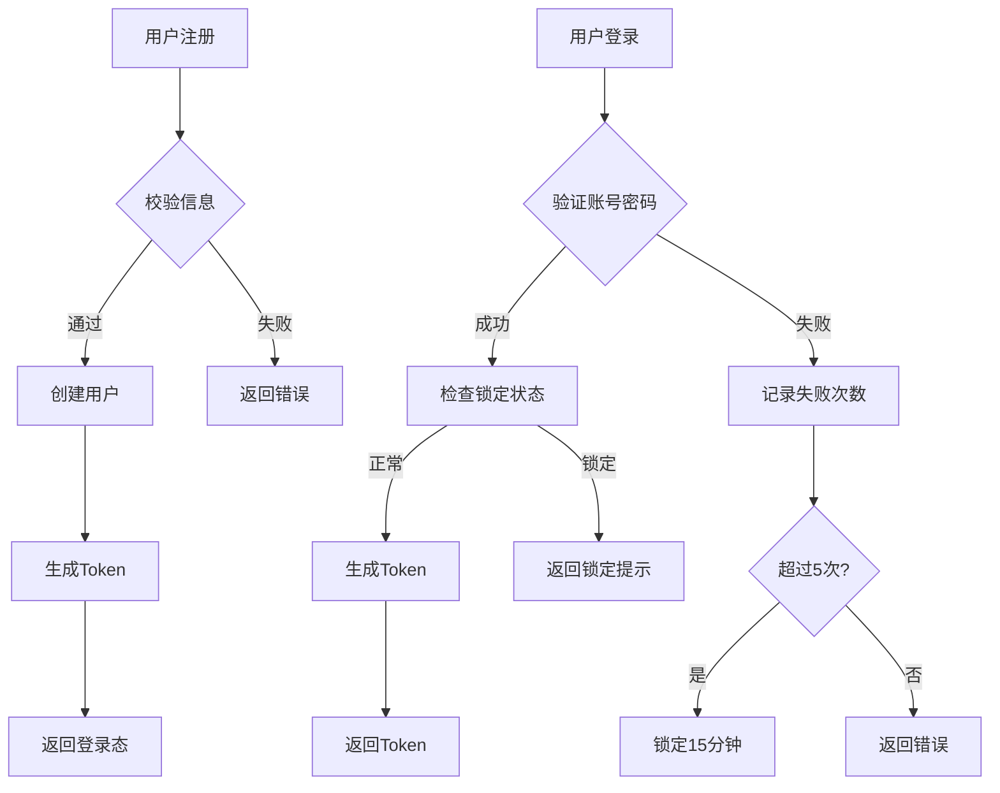
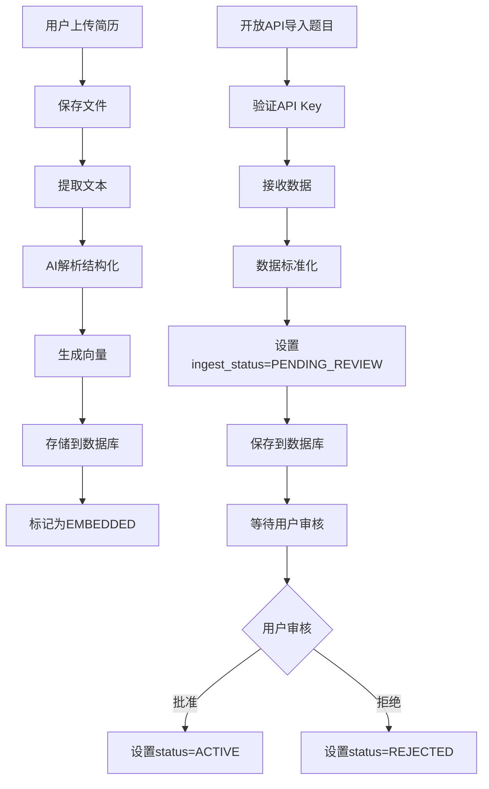
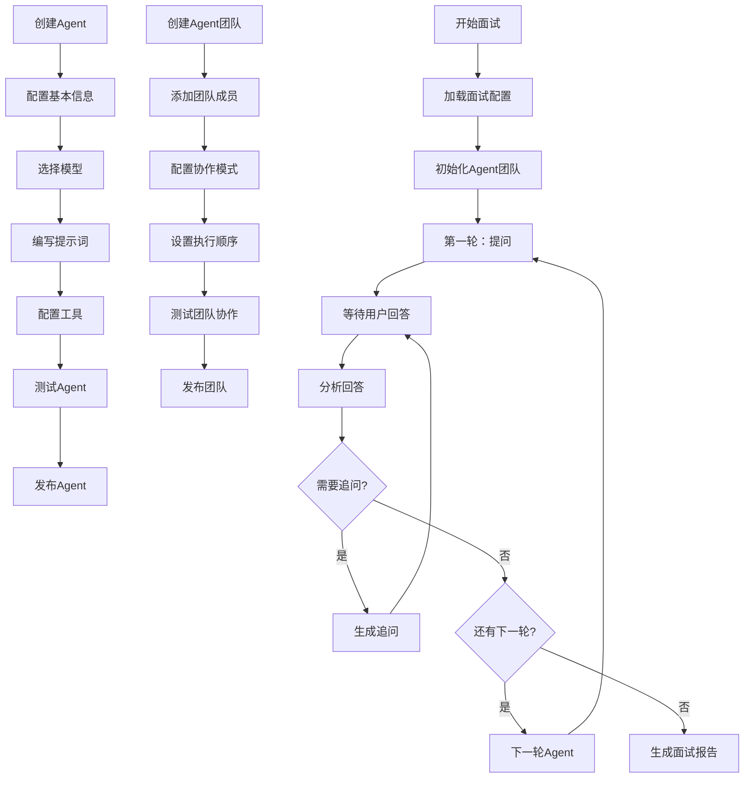
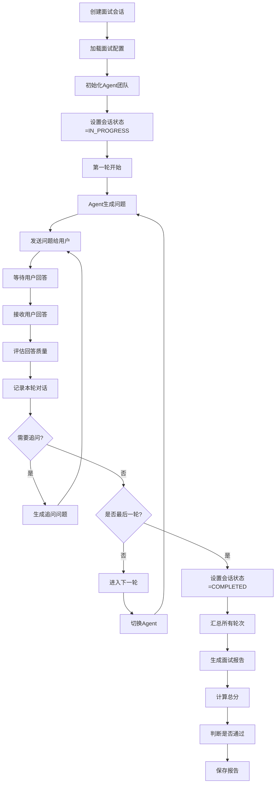
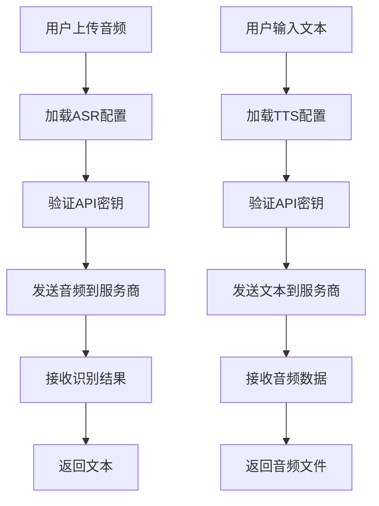
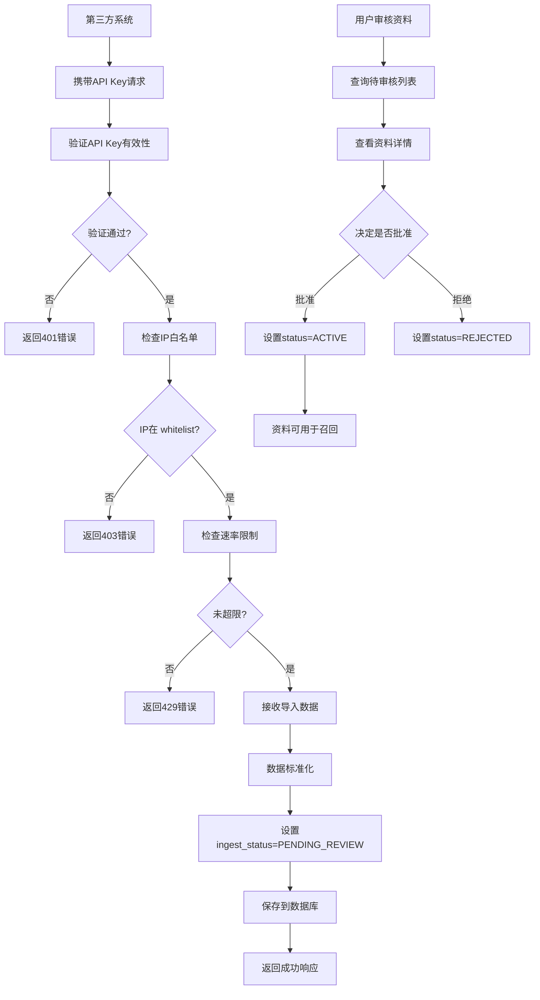
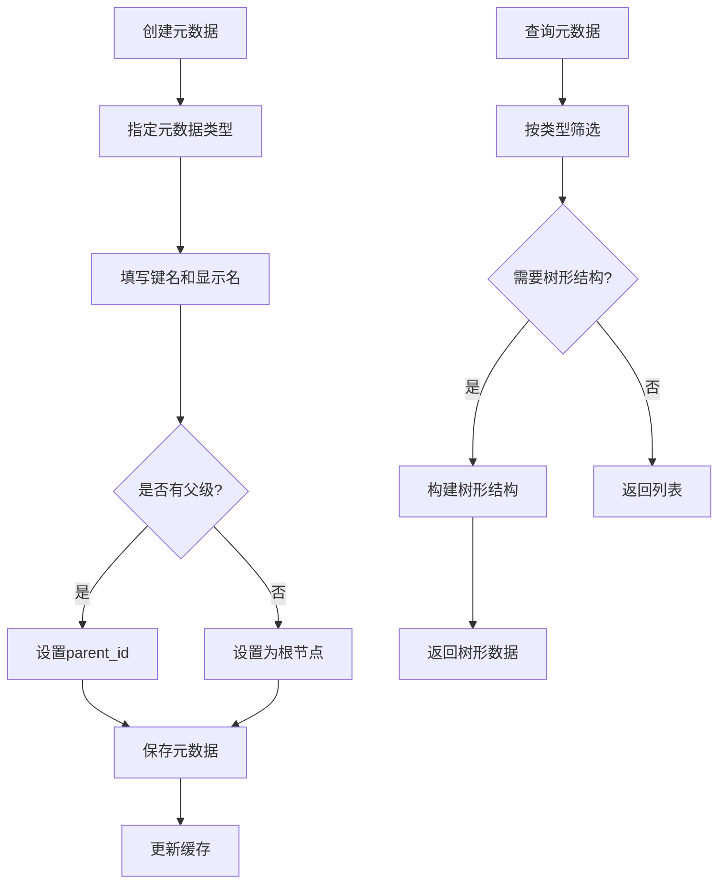

# Victor AI 面试助手 - 模块详细设计

## 1. 用户模块

### 1.1 模块概述
负责用户注册、登录、认证、鉴权和个人信息管理。

### 1.2 核心功能说明

**用户实体包含以下关键信息：**
- 用户ID（主键）
- 用户名（唯一标识）
- 邮箱（唯一，用于登录和通知）
- 密码哈希（加密存储）
- 昵称（显示名称）
- 头像URL
- 用户状态（正常/锁定/已删除）
- 创建时间和更新时间

**用户状态枚举：**
- ACTIVE（正常）：用户可以正常使用系统
- LOCKED（锁定）：由于多次登录失败被临时锁定
- DELETED（已删除）：用户已注销或被管理员删除

**用户服务接口提供以下功能：**
- 用户注册：验证信息并创建新用户
- 用户登录：验证账号密码并生成Token
- 获取用户信息：根据ID查询用户详情
- 更新用户信息：修改昵称、头像等个人信息
- 修改密码：验证旧密码并设置新密码

### 1.3 核心流程

### 1.4 数据表设计

| 字段 | 类型 | 说明 |
|-----|------|-----|
| id | BIGINT | 主键 |
| username | VARCHAR(50) | 用户名，唯一 |
| email | VARCHAR(100) | 邮箱，唯一 |
| password_hash | VARCHAR(255) | 密码哈希 |
| nickname | VARCHAR(50) | 昵称 |
| avatar | VARCHAR(255) | 头像URL |
| status | VARCHAR(20) | 状态 |
| created_at | TIMESTAMP | 创建时间 |
| updated_at | TIMESTAMP | 更新时间 |

---

## 2. 资料模块

### 2.1 模块概述
管理题库、岗位库、简历库、经历库，提供CRUD、开放接口导入、审核和召回数据来源能力。开放接口导入的数据直接写入资料表，通过 `ingest_status` 区分正式资料和待审核资料。

### 2.2 核心功能说明

**资料导入来源基础字段：**
所有资料（题目、岗位、简历、经历）都继承自统一的导入信息来源字段，包括：
- ingest_status（导入状态）：ACTIVE（可用）、PENDING_REVIEW（待审核）、REJECTED（已拒绝）、FAILED（失败）
- source_type（来源类型）：USER（用户创建）、SYSTEM（系统内置）、OPEN_API（开放接口导入）
- source_api_key_id（来源API密钥ID）：标识数据来源的API密钥
- source_uri（来源URI）：数据的原始来源地址
- external_id（外部ID）：第三方系统的唯一标识
- raw_payload（原始载荷）：导入时的原始JSON数据
- import_error（导入错误信息）：记录导入失败的原因

**题目实体：**
- 基本信息：ID、标题、描述
- 分类信息：类型（技术题/行为题）、标签列表、难度等级
- 答案信息：参考答案
- 来源信息：来源（系统/用户/开放API）、创建者ID
- 导入信息：继承自IngestInfo的所有字段
- 时间戳：创建时间、更新时间

**岗位实体：**
- 基本信息：ID、岗位名称、岗位描述（JD原文）
- 要求信息：所需技能列表、工作年限要求、学历要求、薪资范围
- 领域信息：业务领域标签列表
- 归属信息：创建者ID
- 导入信息：继承自IngestInfo的所有字段
- 时间戳：创建时间、更新时间

**简历实体：**
- 基本信息：ID、用户ID、简历名称、文件名、文件路径
- 内容信息：原始文本、解析后的结构化内容、摘要信息
- 处理状态：PENDING（待处理）、PARSED（已解析）、EMBEDDED（已向量化）
- 嵌入信息：向量化完成时间
- 导入信息：继承自IngestInfo的所有字段
- 时间戳：创建时间、更新时间

**经历实体：**
- 基本信息：ID、用户ID、经历类型（项目/工作/教育/其他）、标题
- 时间信息：开始日期、结束日期
- 详细描述：经历描述、相关技能列表、附件列表
- 导入信息：继承自IngestInfo的所有字段
- 时间戳：创建时间、更新时间

**导入状态枚举：**
- ACTIVE：可用于召回和面试
- PENDING_REVIEW：待用户确认，不参与召回
- REJECTED：用户拒绝
- FAILED：导入或标准化失败

**来源类型枚举：**
- USER：用户手动创建
- SYSTEM：系统内置数据
- OPEN_API：通过开放接口导入

**资料服务接口提供以下功能：**

题目管理：
- 创建题目：接收题目请求，创建新题目
- 更新题目：修改已有题目的信息
- 删除题目：逻辑删除题目
- 分页查询题目：根据条件筛选题目列表
- 审核题目：批准或拒绝待审核的题目

岗位管理：
- 创建岗位：接收岗位请求，创建新岗位
- 更新岗位：修改已有岗位的信息
- 删除岗位：逻辑删除岗位
- 分页查询岗位：根据条件筛选岗位列表
- 审核岗位：批准或拒绝待审核的岗位

简历管理：
- 上传简历：接收文件并创建简历记录
- 解析简历：调用AI解析简历内容
- 更新简历：修改简历信息
- 触发向量化：将简历内容转换为向量用于召回
- 审核简历：批准或拒绝待审核的简历

经历管理：
- 创建经历：接收经历请求，创建新经历
- 更新经历：修改已有经历的信息
- 删除经历：逻辑删除经历
- 查询经历列表：按用户和类型查询经历
- 审核经历：批准或拒绝待审核的经历

### 2.3 核心流程

### 2.4 数据表设计

**question（题目表）**

| 字段 | 类型 | 说明 |
|-----|------|-----|
| id | BIGINT | 主键 |
| title | VARCHAR(255) | 题目标题 |
| description | TEXT | 题目描述 |
| type | VARCHAR(20) | 题目类型 |
| tags | JSON | 标签列表 |
| difficulty | VARCHAR(20) | 难度等级 |
| reference_answer | TEXT | 参考答案 |
| source | VARCHAR(20) | 来源 |
| user_id | BIGINT | 创建者ID |
| ingest_status | VARCHAR(20) | 导入状态 |
| source_type | VARCHAR(20) | 来源类型 |
| source_api_key_id | BIGINT | API密钥ID |
| source_uri | VARCHAR(500) | 来源URI |
| external_id | VARCHAR(100) | 外部ID |
| raw_payload | JSON | 原始载荷 |
| import_error | TEXT | 导入错误 |
| created_at | TIMESTAMP | 创建时间 |
| updated_at | TIMESTAMP | 更新时间 |

**job（岗位表）**

| 字段 | 类型 | 说明 |
|-----|------|-----|
| id | BIGINT | 主键 |
| name | VARCHAR(100) | 岗位名称 |
| description | TEXT | 岗位描述 |
| required_skills | JSON | 所需技能列表 |
| experience_years | INT | 工作年限要求 |
| education | VARCHAR(50) | 学历要求 |
| salary_range | VARCHAR(50) | 薪资范围 |
| domains | JSON | 领域标签 |
| user_id | BIGINT | 创建者ID |
| ingest_status | VARCHAR(20) | 导入状态 |
| source_type | VARCHAR(20) | 来源类型 |
| created_at | TIMESTAMP | 创建时间 |
| updated_at | TIMESTAMP | 更新时间 |

**resume（简历表）**

| 字段 | 类型 | 说明 |
|-----|------|-----|
| id | BIGINT | 主键 |
| user_id | BIGINT | 用户ID |
| name | VARCHAR(100) | 简历名称 |
| file_name | VARCHAR(255) | 文件名 |
| file_path | VARCHAR(500) | 文件路径 |
| raw_text | LONGTEXT | 原始文本 |
| parsed_content | JSON | 解析后的内容 |
| summary | JSON | 摘要信息 |
| status | VARCHAR(20) | 处理状态 |
| embedded_at | TIMESTAMP | 向量化时间 |
| ingest_status | VARCHAR(20) | 导入状态 |
| created_at | TIMESTAMP | 创建时间 |
| updated_at | TIMESTAMP | 更新时间 |

**experience（经历表）**

| 字段 | 类型 | 说明 |
|-----|------|-----|
| id | BIGINT | 主键 |
| user_id | BIGINT | 用户ID |
| type | VARCHAR(20) | 经历类型 |
| title | VARCHAR(255) | 标题 |
| start_date | DATE | 开始日期 |
| end_date | DATE | 结束日期 |
| description | TEXT | 描述 |
| skills | JSON | 技能列表 |
| attachments | JSON | 附件列表 |
| ingest_status | VARCHAR(20) | 导入状态 |
| created_at | TIMESTAMP | 创建时间 |
| updated_at | TIMESTAMP | 更新时间 |

---

## 3. Agent模块

### 3.1 模块概述
管理AI面试官Agent的定义、配置和团队组织。每个Agent代表一个具有特定角色和能力的AI面试官。

### 3.2 核心功能说明

**Agent实体：**
- 基本信息：ID、名称、角色（如技术面试官/HR面试官）、描述、头像
- 能力配置：支持的面试模式、专业领域标签、使用的模型类型
- 提示词配置：系统提示词模板、开场白、追问策略
- 工具配置：允许使用的工具列表（如搜索、代码执行等）
- 状态信息：启用状态、创建者ID
- 时间戳：创建时间、更新时间

**Agent团队实体：**
- 基本信息：ID、团队名称、团队描述
- 成员信息：团队成员列表（关联多个Agent）、每个成员的角色定位
- 协作配置：团队执行模式（顺序执行/并行执行/投票决策）
- 状态信息：创建者ID、启用状态
- 时间戳：创建时间、更新时间

**Agent大模型配置实体：**
- 关联信息：Agent ID、配置版本
- 模型配置：使用的模型类型、模型提供商、API协议
- 参数配置：温度、最大token数、top_p等生成参数
- 密钥配置：API密钥引用
- 时间戳：创建时间、更新时间

**面试配置实体：**
- 关联信息：用户ID、岗位ID、使用的Agent团队ID
- 面试参数：面试轮数、每轮时长、问题数量、难度等级
- 评分配置：评分维度、权重配置、及格分数线
- 报告配置：是否生成详细报告、报告模板
- 状态信息：配置状态（草稿/已发布/已归档）
- 时间戳：创建时间、更新时间

**Agent引擎接口：**
- 初始化Agent：加载Agent配置和提示词
- 执行单轮对话：接收用户输入，生成Agent回复
- 执行多轮面试：控制整个面试流程
- 调用工具：根据Agent决策调用相应工具
- 生成面试报告：汇总面试结果

### 3.3 核心流程

### 3.4 数据表设计

**agent（Agent表）**

| 字段 | 类型 | 说明 |
|-----|------|-----|
| id | BIGINT | 主键 |
| name | VARCHAR(100) | Agent名称 |
| role | VARCHAR(50) | 角色 |
| description | TEXT | 描述 |
| avatar | VARCHAR(255) | 头像URL |
| modes | JSON | 支持的面试模式 |
| domains | JSON | 专业领域 |
| model_type | VARCHAR(50) | 模型类型 |
| system_prompt | TEXT | 系统提示词 |
| opening_words | TEXT | 开场白 |
| follow_up_strategy | VARCHAR(50) | 追问策略 |
| allowed_tools | JSON | 允许的工具列表 |
| enabled | BOOLEAN | 是否启用 |
| user_id | BIGINT | 创建者ID |
| created_at | TIMESTAMP | 创建时间 |
| updated_at | TIMESTAMP | 更新时间 |

**agent_team（Agent团队表）**

| 字段 | 类型 | 说明 |
|-----|------|-----|
| id | BIGINT | 主键 |
| name | VARCHAR(100) | 团队名称 |
| description | TEXT | 团队描述 |
| members | JSON | 团队成员配置 |
| execution_mode | VARCHAR(20) | 执行模式 |
| user_id | BIGINT | 创建者ID |
| enabled | BOOLEAN | 是否启用 |
| created_at | TIMESTAMP | 创建时间 |
| updated_at | TIMESTAMP | 更新时间 |

**agent_llm_config（Agent大模型配置表）**

| 字段 | 类型 | 说明 |
|-----|------|-----|
| id | BIGINT | 主键 |
| agent_id | BIGINT | Agent ID |
| version | INT | 配置版本 |
| model_type | VARCHAR(50) | 模型类型 |
| provider | VARCHAR(50) | 提供商 |
| protocol | VARCHAR(20) | API协议 |
| temperature | DECIMAL | 温度参数 |
| max_tokens | INT | 最大token数 |
| top_p | DECIMAL | top_p参数 |
| api_key_id | BIGINT | API密钥ID |
| created_at | TIMESTAMP | 创建时间 |

**interview_config（面试配置表）**

| 字段 | 类型 | 说明 |
|-----|------|-----|
| id | BIGINT | 主键 |
| user_id | BIGINT | 用户ID |
| job_id | BIGINT | 岗位ID |
| team_id | BIGINT | Agent团队ID |
| rounds | INT | 面试轮数 |
| duration_per_round | INT | 每轮时长（分钟） |
| questions_per_round | INT | 每轮问题数 |
| difficulty | VARCHAR(20) | 难度等级 |
| scoring_dimensions | JSON | 评分维度 |
| passing_score | DECIMAL | 及格分数 |
| generate_report | BOOLEAN | 是否生成报告 |
| status | VARCHAR(20) | 配置状态 |
| created_at | TIMESTAMP | 创建时间 |
| updated_at | TIMESTAMP | 更新时间 |

---

## 4. 面试会话模块

### 4.1 模块概述
管理面试会话的生命周期，包括会话创建、进行中的对话、轮次记录和结果报告。

### 4.2 核心功能说明

**面试会话实体：**
- 基本信息：ID、用户ID、面试配置ID、使用的Agent团队ID
- 会话状态：WAITING（等待开始）、IN_PROGRESS（进行中）、COMPLETED（已完成）、CANCELLED（已取消）
- 进度信息：当前轮次、总轮数、开始时间、结束时间
- 结果信息：最终得分、是否通过、总体评价
- 时间戳：创建时间、更新时间

**面试轮次实体：**
- 关联信息：会话ID、轮次序号、负责的Agent ID
- 对话内容：Agent提问、用户回答、追问记录列表
- 评估信息：本轮评分、评语、关键亮点、待改进点
- 时间信息：开始时间、结束时间、耗时（秒）
- 时间戳：创建时间、更新时间

**面试问题实体：**
- 关联信息：会话ID、轮次ID、问题来源ID
- 问题内容：问题文本、问题类型、难度等级
- 回答内容：用户回答、回答时长
- 评估内容：得分、评语、匹配的技能标签
- 元数据：生成方式（从题库/LLM生成）、上下文信息
- 时间戳：创建时间

**面试报告实体：**
- 关联信息：会话ID、用户ID、岗位ID
- 总体评估：总分、是否通过、推荐等级
- 详细评分：各维度得分（技术能力/沟通能力/问题解决能力等）
- 总结内容：优势总结、劣势分析、建议
- 报告状态：GENERATING（生成中）、COMPLETED（已完成）、FAILED（生成失败）
- 时间戳：生成时间、完成时间

**面试引擎接口：**
- 创建会话：根据面试配置初始化会话
- 开始面试：启动第一轮面试
- 提交回答：接收用户回答并触发下一轮
- 生成问题：根据上下文生成下一个问题
- 评估回答：对用户的回答进行评分和点评
- 结束会话：完成所有轮次并生成报告
- 获取会话详情：查询会话状态和历史记录

### 4.3 核心流程

### 4.4 数据表设计

**interview_session（面试会话表）**

| 字段 | 类型 | 说明 |
|-----|------|-----|
| id | BIGINT | 主键 |
| user_id | BIGINT | 用户ID |
| config_id | BIGINT | 面试配置ID |
| team_id | BIGINT | Agent团队ID |
| status | VARCHAR(20) | 会话状态 |
| current_round | INT | 当前轮次 |
| total_rounds | INT | 总轮数 |
| final_score | DECIMAL | 最终得分 |
| passed | BOOLEAN | 是否通过 |
| overall_comment | TEXT | 总体评价 |
| started_at | TIMESTAMP | 开始时间 |
| ended_at | TIMESTAMP | 结束时间 |
| created_at | TIMESTAMP | 创建时间 |
| updated_at | TIMESTAMP | 更新时间 |

**interview_turn（面试轮次表）**

| 字段 | 类型 | 说明 |
|-----|------|-----|
| id | BIGINT | 主键 |
| session_id | BIGINT | 会话ID |
| round_number | INT | 轮次序号 |
| agent_id | BIGINT | 负责Agent ID |
| question | TEXT | Agent提问 |
| answer | TEXT | 用户回答 |
| follow_ups | JSON | 追问记录列表 |
| score | DECIMAL | 本轮评分 |
| comment | TEXT | 评语 |
| highlights | JSON | 关键亮点 |
| improvements | JSON | 待改进点 |
| started_at | TIMESTAMP | 开始时间 |
| ended_at | TIMESTAMP | 结束时间 |
| duration_seconds | INT | 耗时（秒） |
| created_at | TIMESTAMP | 创建时间 |

**interview_question（面试问题表）**

| 字段 | 类型 | 说明 |
|-----|------|-----|
| id | BIGINT | 主键 |
| session_id | BIGINT | 会话ID |
| turn_id | BIGINT | 轮次ID |
| source_question_id | BIGINT | 来源问题ID |
| question_text | TEXT | 问题文本 |
| question_type | VARCHAR(20) | 问题类型 |
| difficulty | VARCHAR(20) | 难度等级 |
| user_answer | TEXT | 用户回答 |
| answer_duration | INT | 回答时长（秒） |
| score | DECIMAL | 得分 |
| comment | TEXT | 评语 |
| matched_skills | JSON | 匹配的技能标签 |
| generation_method | VARCHAR(20) | 生成方式 |
| context | JSON | 上下文信息 |
| created_at | TIMESTAMP | 创建时间 |

**interview_report（面试报告表）**

| 字段 | 类型 | 说明 |
|-----|------|-----|
| id | BIGINT | 主键 |
| session_id | BIGINT | 会话ID |
| user_id | BIGINT | 用户ID |
| job_id | BIGINT | 岗位ID |
| total_score | DECIMAL | 总分 |
| passed | BOOLEAN | 是否通过 |
| recommendation_level | VARCHAR(20) | 推荐等级 |
| dimension_scores | JSON | 各维度得分 |
| strengths | TEXT | 优势总结 |
| weaknesses | TEXT | 劣势分析 |
| suggestions | TEXT | 建议 |
| status | VARCHAR(20) | 报告状态 |
| generated_at | TIMESTAMP | 生成时间 |
| completed_at | TIMESTAMP | 完成时间 |

---

## 5. 语音模块

### 5.1 模块概述
提供语音转文字（ASR）和文字转语音（TTS）能力，支持多种语音服务提供商。

### 5.2 核心功能说明

**语音ASR配置实体：**
- 基本信息：ID、用户ID、配置名称
- 服务商信息：语音服务提供商（阿里云/腾讯云/讯飞等）、区域
- API配置：API密钥、API secret、端点URL
- 识别参数：语言模型、采样率、音频格式
- 默认标识：是否为默认配置
- 时间戳：创建时间、更新时间

**语音TTS配置实体：**
- 基本信息：ID、用户ID、配置名称
- 服务商信息：语音服务提供商、区域
- API配置：API密钥、API secret、端点URL
- 合成参数：音色、语速、语调、音量
- 默认标识：是否为默认配置
- 时间戳：创建时间、更新时间

**语音服务提供商枚举：**
- ALIYUN：阿里云语音服务
- TENCENT：腾讯云语音服务
- IFTEK：讯飞语音服务
- BAIDU：百度语音服务

**语音服务接口：**
- ASR功能：
  - 语音转文字：接收音频文件，返回识别文本
  - 实时语音识别：流式识别音频流
  - 获取识别结果：查询异步识别任务结果
  
- TTS功能：
  - 文字转语音：接收文本，返回音频文件
  - 流式语音合成：实时生成音频流
  - 选择音色：根据配置选择不同的发音人

### 5.3 核心流程

### 5.4 数据表设计

**voice_asr_config（语音识别配置表）**

| 字段 | 类型 | 说明 |
|-----|------|-----|
| id | BIGINT | 主键 |
| user_id | BIGINT | 用户ID |
| name | VARCHAR(100) | 配置名称 |
| provider | VARCHAR(20) | 服务提供商 |
| region | VARCHAR(20) | 区域 |
| api_key | VARCHAR(255) | API密钥 |
| api_secret | VARCHAR(255) | API Secret |
| endpoint | VARCHAR(255) | 端点URL |
| language | VARCHAR(10) | 语言模型 |
| sample_rate | INT | 采样率 |
| audio_format | VARCHAR(10) | 音频格式 |
| is_default | BOOLEAN | 是否默认配置 |
| created_at | TIMESTAMP | 创建时间 |
| updated_at | TIMESTAMP | 更新时间 |

**voice_tts_config（语音合成配置表）**

| 字段 | 类型 | 说明 |
|-----|------|-----|
| id | BIGINT | 主键 |
| user_id | BIGINT | 用户ID |
| name | VARCHAR(100) | 配置名称 |
| provider | VARCHAR(20) | 服务提供商 |
| region | VARCHAR(20) | 区域 |
| api_key | VARCHAR(255) | API密钥 |
| api_secret | VARCHAR(255) | API Secret |
| endpoint | VARCHAR(255) | 端点URL |
| voice | VARCHAR(50) | 音色 |
| speed | DECIMAL | 语速 |
| pitch | DECIMAL | 语调 |
| volume | DECIMAL | 音量 |
| is_default | BOOLEAN | 是否默认配置 |
| created_at | TIMESTAMP | 创建时间 |
| updated_at | TIMESTAMP | 更新时间 |

---

## 6. 开放API模块

### 6.1 模块概述
提供开放API接口，允许第三方系统导入题目、岗位、简历、经历等资料，并进行管理和审核。

### 6.2 核心功能说明

**开放API密钥实体：**
- 基本信息：ID、用户ID、密钥名称、API Key（加密存储）
- 权限配置：允许的IP白名单、速率限制（每分钟请求数）
- 使用统计：总请求次数、今日请求次数、最后使用时间
- 状态信息：密钥状态（启用/禁用/已删除）
- 时间戳：创建时间、更新时间、过期时间

**API密钥状态枚举：**
- ACTIVE：启用状态，可以正常使用
- DISABLED：禁用状态，暂时不能使用
- DELETED：已删除，永久失效

**开放API服务接口：**
- 密钥管理：
  - 创建API密钥：生成新的API密钥
  - 查询密钥列表：获取用户的所有密钥
  - 更新密钥配置：修改密钥的权限和限制
  - 禁用/启用密钥：临时停用或恢复密钥
  - 删除密钥：永久删除密钥
  
- 数据导入：
  - 导入题目：接收题目数据并创建记录
  - 导入岗位：接收岗位数据并创建记录
  - 导入简历：接收简历数据并创建记录
  - 导入经历：接收经历数据并创建记录
  - 批量导入：支持一次性导入多条记录
  
- 数据审核：
  - 查询待审核列表：获取所有待审核的资料
  - 批准资料：将资料状态改为ACTIVE
  - 拒绝资料：将资料状态改为REJECTED
  - 批量审核：一次性审核多条记录

### 6.3 核心流程

### 6.4 数据表设计

**open_api_key（开放API密钥表）**

| 字段 | 类型 | 说明 |
|-----|------|-----|
| id | BIGINT | 主键 |
| user_id | BIGINT | 用户ID |
| name | VARCHAR(100) | 密钥名称 |
| api_key_hash | VARCHAR(255) | API密钥哈希 |
| ip_whitelist | JSON | IP白名单列表 |
| rate_limit | INT | 速率限制（次/分钟） |
| total_requests | BIGINT | 总请求次数 |
| today_requests | INT | 今日请求次数 |
| last_used_at | TIMESTAMP | 最后使用时间 |
| status | VARCHAR(20) | 密钥状态 |
| expires_at | TIMESTAMP | 过期时间 |
| created_at | TIMESTAMP | 创建时间 |
| updated_at | TIMESTAMP | 更新时间 |

---

## 7. 元数据模块

### 7.1 模块概述
管理系统中的元数据，如题目分类、技能标签、行业领域等，为其他模块提供标准化的数据字典。

### 7.2 核心功能说明

**元数据实体：**
- 基本信息：ID、元数据类型、键名、显示名称
- 层级关系：父级ID（支持树形结构）、层级深度、排序号
- 属性信息：值类型（字符串/数字/布尔）、可选值列表、默认值
- 扩展信息：描述、图标、颜色标签、是否启用
- 时间戳：创建时间、更新时间

**元数据类型：**
- QUESTION_CATEGORY：题目分类
- SKILL_TAG：技能标签
- INDUSTRY：行业领域
- EDUCATION_LEVEL：学历等级
- DIFFICULTY：难度等级
- INTERVIEW_MODE：面试模式

**元数据服务接口：**
- 创建元数据：添加新的元数据项
- 更新元数据：修改元数据属性
- 删除元数据：逻辑删除元数据项
- 查询元数据：按类型或条件查询
- 获取树形结构：获取有层级关系的元数据树
- 批量导入：从配置文件导入元数据

### 7.3 核心流程

### 7.4 数据表设计

**metadata（元数据表）**

| 字段 | 类型 | 说明 |
|-----|------|-----|
| id | BIGINT | 主键 |
| type | VARCHAR(50) | 元数据类型 |
| key | VARCHAR(100) | 键名 |
| display_name | VARCHAR(100) | 显示名称 |
| parent_id | BIGINT | 父级ID |
| level | INT | 层级深度 |
| sort_order | INT | 排序号 |
| value_type | VARCHAR(20) | 值类型 |
| allowed_values | JSON | 可选值列表 |
| default_value | VARCHAR(255) | 默认值 |
| description | TEXT | 描述 |
| icon | VARCHAR(50) | 图标 |
| color | VARCHAR(20) | 颜色标签 |
| enabled | BOOLEAN | 是否启用 |
| created_at | TIMESTAMP | 创建时间 |
| updated_at | TIMESTAMP | 更新时间 |
