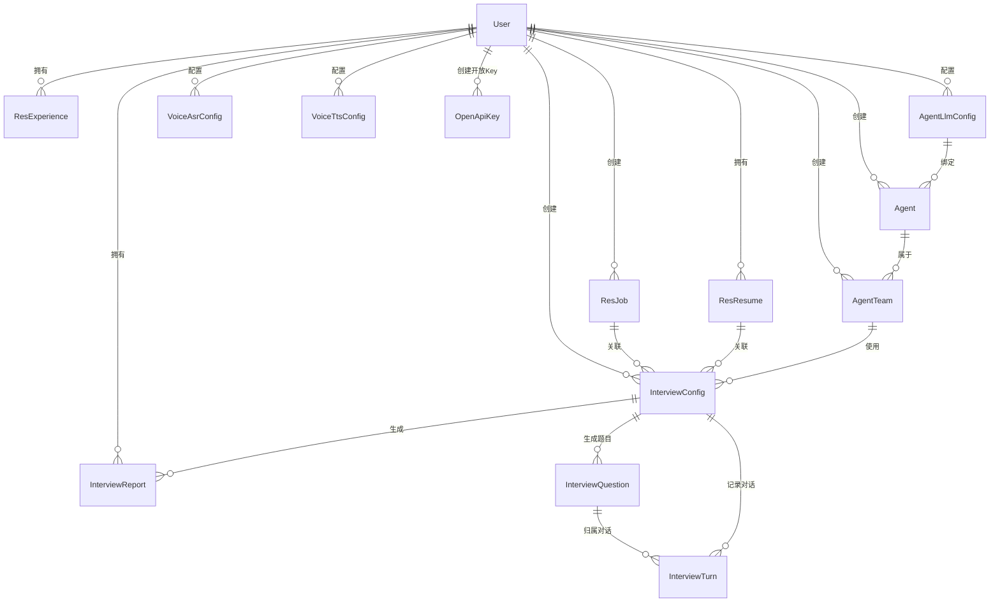
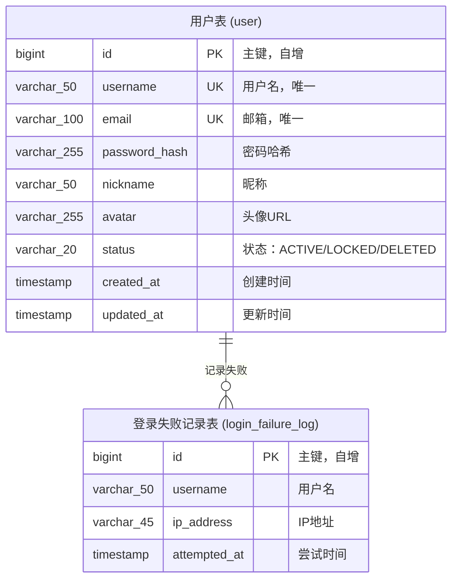
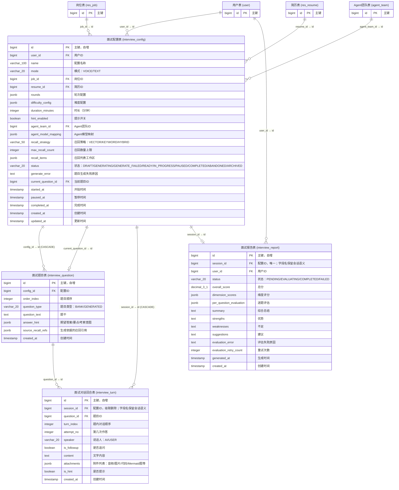
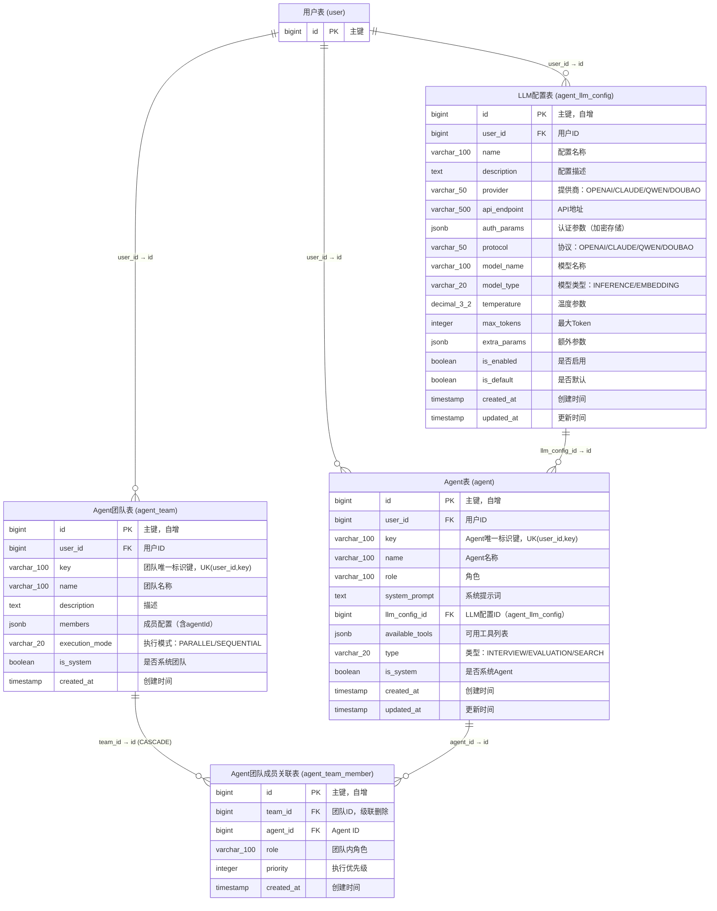
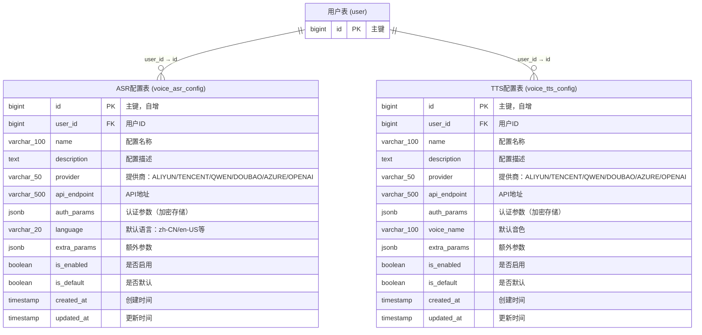
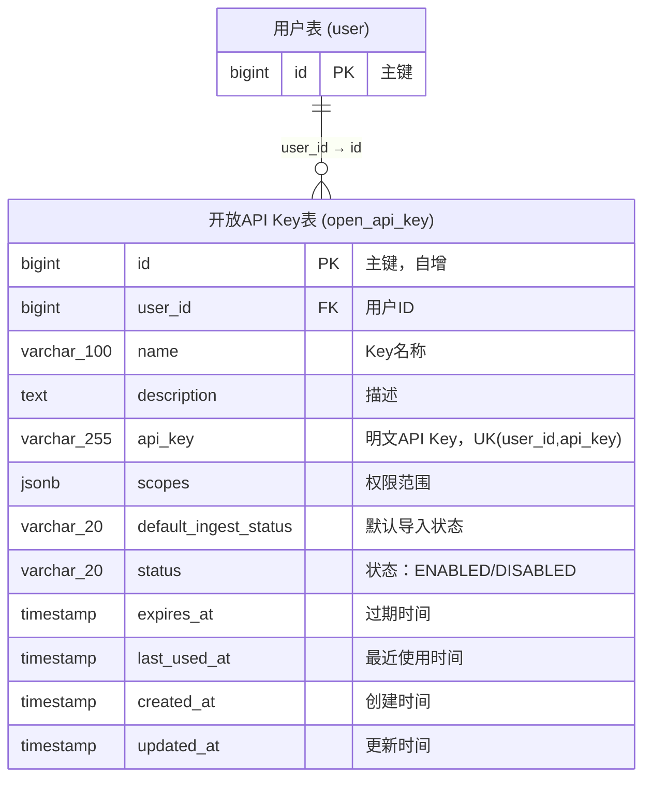
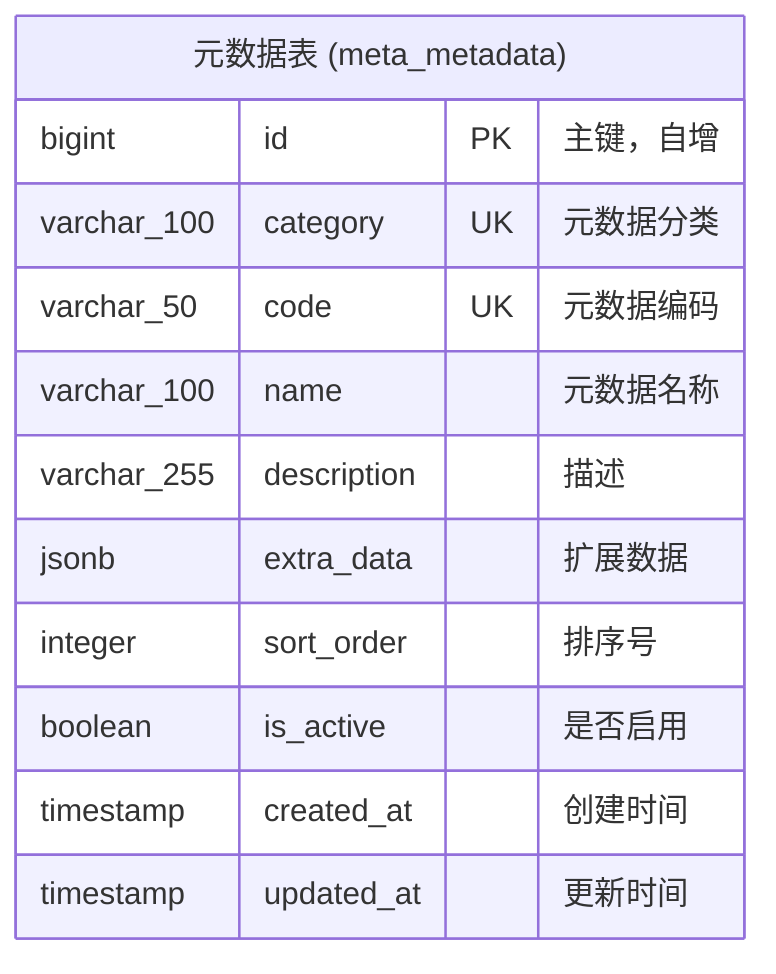
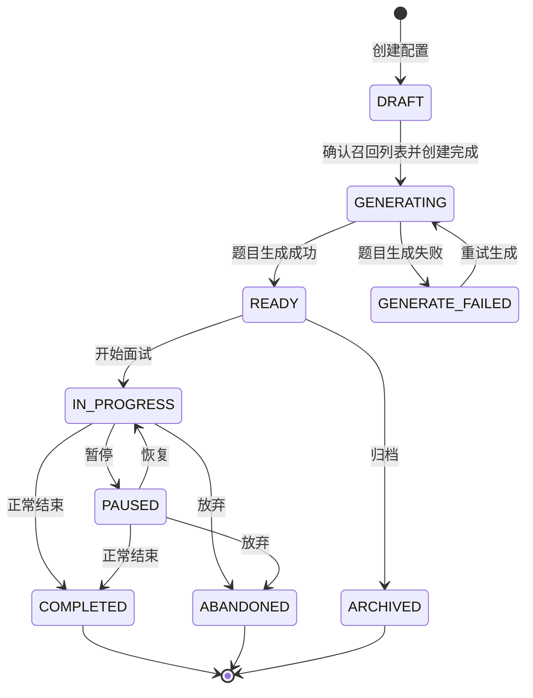

# Victor AI 面试助手 - 数据库设计

## 1. 数据库概述

- **数据库类型**：PostgreSQL（含pgvector扩展）
- **字符集**：UTF-8
- **命名规范**：蛇形命名法（snake_case）
- **主键策略**：自增BIGINT
- **软删除**：采用status字段标记，不物理删除

---

## 2. ER关系图

### 2.1 简要关系图



### 2.2 详细ER图（含字段、主键、唯一键、外键关联）

#### 2.2.1 用户模块



#### 2.2.2 资料模块

```mermaid
erDiagram
    USER["用户表 (user)"] {
        bigint id PK "主键"
    }

    RES_QUESTION["题目表 (res_question)"] {
        bigint id PK "主键，自增"
        varchar_255 title "题目标题"
        text description "题目描述"
        varchar_20 type "类型：TECHNICAL/BEHAVIORAL"
        jsonb tags "标签列表"
        varchar_20 difficulty "难度：EASY/MEDIUM/HARD"
        text reference_answer "参考答案"
        varchar_20 source "来源：SYSTEM/USER/OPEN_API"
        varchar_20 ingest_status "采集状态：ACTIVE/PENDING_REVIEW/REJECTED/FAILED"
        varchar_20 source_type "来源类型：USER/SYSTEM/OPEN_API"
        bigint source_api_key_id FK "开放API Key ID"
        varchar_1000 source_uri "来源URL"
        varchar_255 external_id "外部ID"
        jsonb raw_payload "原始导入数据"
        text import_error "导入错误"
        bigint user_id FK "用户ID"
        timestamp created_at "创建时间"
        timestamp updated_at "更新时间"
    }

    RES_JOB["岗位表 (res_job)"] {
        bigint id PK "主键，自增"
        varchar_100 name "岗位名称"
        text description "JD原文"
        jsonb required_skills "技能要求"
        integer experience_years "经验年限"
        varchar_50 education "学历要求"
        varchar_50 salary_range "薪资范围"
        jsonb domains "领域列表"
        varchar_20 ingest_status "采集状态：ACTIVE/PENDING_REVIEW/REJECTED/FAILED"
        varchar_20 source_type "来源类型：USER/SYSTEM/OPEN_API"
        bigint source_api_key_id FK "开放API Key ID"
        varchar_1000 source_uri "来源URL"
        varchar_255 external_id "外部ID"
        jsonb raw_payload "原始导入数据"
        text import_error "导入错误"
        bigint user_id FK "用户ID"
        timestamp created_at "创建时间"
        timestamp updated_at "更新时间"
    }

    RES_RESUME["简历表 (res_resume)"] {
        bigint id PK "主键，自增"
        bigint user_id FK "用户ID"
        varchar_100 name "简历名称"
        varchar_255 file_name "文件名"
        varchar_500 file_path "文件路径"
        text raw_text "简历原文"
        jsonb parsed_content "解析后的结构化内容"
        jsonb summary "简历摘要"
        varchar_20 status "状态：PENDING/PARSED/EMBEDDED"
        varchar_20 ingest_status "采集状态：ACTIVE/PENDING_REVIEW/REJECTED/FAILED"
        varchar_20 source_type "来源类型：USER/SYSTEM/OPEN_API"
        bigint source_api_key_id FK "开放API Key ID"
        varchar_1000 source_uri "来源URL"
        varchar_255 external_id "外部ID"
        jsonb raw_payload "原始导入数据"
        text import_error "导入错误"
        timestamp embedded_at "嵌入时间"
        timestamp created_at "创建时间"
        timestamp updated_at "更新时间"
    }

    RES_EXPERIENCE["经历表 (res_experience)"] {
        bigint id PK "主键，自增"
        bigint user_id FK "用户ID"
        varchar_20 type "类型：PROJECT/WORK/EDUCATION/OTHER"
        varchar_255 title "标题"
        date start_date "开始日期"
        date end_date "结束日期"
        text description "描述"
        jsonb skills "技能列表"
        jsonb attachments "附件列表"
        varchar_20 ingest_status "采集状态：ACTIVE/PENDING_REVIEW/REJECTED/FAILED"
        varchar_20 source_type "来源类型：USER/SYSTEM/OPEN_API"
        bigint source_api_key_id FK "开放API Key ID"
        varchar_1000 source_uri "来源URL"
        varchar_255 external_id "外部ID"
        jsonb raw_payload "原始导入数据"
        text import_error "导入错误"
        timestamp created_at "创建时间"
        timestamp updated_at "更新时间"
    }

    USER ||--o{ RES_QUESTION : "user_id → id"
    USER ||--o{ RES_JOB : "user_id → id"
    USER ||--o{ RES_RESUME : "user_id → id"
    USER ||--o{ RES_EXPERIENCE : "user_id → id"
```



#### 2.2.3 面试模块



#### 2.2.4 Agent模块



#### 2.2.6 语音模块



#### 2.2.7 开放接入模块



#### 2.2.8 元数据模块



### 2.3 外键约束说明

| 子表 | 外键字段 | 父表 | 父表字段 | 约束类型 | 说明 |
|-----|---------|------|---------|---------|------|
| res_question | user_id | user | id | RESTRICT | 用户删除时，需先删除题目 |
| res_question | source_api_key_id | open_api_key | id | RESTRICT | 题目来源开放Key |
| res_job | user_id | user | id | RESTRICT | 用户删除时，需先删除岗位 |
| res_job | source_api_key_id | open_api_key | id | RESTRICT | 岗位来源开放Key |
| res_resume | user_id | user | id | RESTRICT | 用户删除时，需先删除简历 |
| res_resume | source_api_key_id | open_api_key | id | RESTRICT | 简历来源开放Key |
| res_experience | user_id | user | id | RESTRICT | 用户删除时，需先删除经历 |
| res_experience | source_api_key_id | open_api_key | id | RESTRICT | 经历来源开放Key |
| interview_config | user_id | user | id | RESTRICT | 配置关联用户 |
| interview_config | job_id | res_job | id | RESTRICT | 配置关联岗位 |
| interview_config | resume_id | res_resume | id | RESTRICT | 配置关联简历 |
| interview_config | agent_team_id | agent_team | id | RESTRICT | 配置使用团队 |
| interview_question | config_id | interview_config | id | CASCADE | 面试题目关联配置 |
| interview_config | current_question_id | interview_question | id | RESTRICT | 当前题目指针 |
| interview_turn | session_id | interview_config | id | CASCADE | 配置删除时，级联删除对话；字段名保留会话语义 |
| interview_turn | question_id | interview_question | id | RESTRICT | 对话归属题目 |
| agent_llm_config | user_id | user | id | RESTRICT | LLM配置关联用户 |
| agent | user_id | user | id | RESTRICT | Agent关联用户 |
| agent | llm_config_id | agent_llm_config | id | RESTRICT | Agent绑定LLM配置 |
| agent_team | user_id | user | id | RESTRICT | 团队关联用户 |
| agent_team_member | team_id | agent_team | id | CASCADE | 团队删除时，级联删除成员关联 |
| agent_team_member | agent_id | agent | id | RESTRICT | 成员关联Agent |
| voice_asr_config | user_id | user | id | RESTRICT | ASR配置关联用户 |
| voice_tts_config | user_id | user | id | RESTRICT | TTS配置关联用户 |
| interview_report | session_id | interview_config | id | RESTRICT | 报告关联配置；字段名保留会话语义 |
| interview_report | user_id | user | id | RESTRICT | 报告关联用户 |
| open_api_key | user_id | user | id | RESTRICT | 开放Key关联用户 |

### 2.4 唯一约束说明

| 表名 | 唯一约束字段 | 说明 |
|-----|------------|------|
| user | username | 用户名唯一 |
| user | email | 邮箱唯一 |
| open_api_key | (user_id, api_key) | 同一用户下开放Key唯一；无用户上下文校验时若命中多条视为无效 |
| agent | (user_id, key) | 同一用户下Agent唯一标识键唯一，系统Agent固定使用 `user_id=0` |
| agent_team | (user_id, key) | 同一用户下Agent团队唯一标识键唯一，系统团队固定使用 `user_id=0` |
| meta_metadata | (category, code) | 同一分类下编码唯一 |

---

## 3. 初始化脚本说明

### 3.1 脚本结构

初始化脚本分为两部分：
- **DDL脚本**：定义表结构、索引、约束等
- **DML脚本**：插入系统默认数据（系统Agent、系统Agent团队）

### 3.2 脚本限制条件

| 限制项 | 说明 |
|-------|------|
| 幂等性 | DDL使用 `CREATE TABLE IF NOT EXISTS`，DML使用 `INSERT ... ON CONFLICT DO NOTHING` |
| DDL/DML分离 | 表结构定义与初始数据分离，便于升级迁移 |
| 系统Agent不可删除 | 系统Agent（is_system=TRUE）用户可修改prompt/model/tools，但不能删除 |
| 系统团队不可删除 | 系统Agent团队（is_system=TRUE）用户可修改成员配置，但不能删除 |
| key字段唯一 | Agent和Agent团队的key字段按 `user_id` 隔离唯一；所有按key查询必须带用户ID，系统默认数据使用 `user_id=0` |
| key字段不可修改 | 系统预置的Agent和团队的key字段不允许用户修改 |

### 3.3 系统默认Agent列表

| key | 名称 | 类型 | 说明 |
|-----|------|------|------|
| interview-question | 出题Agent | INTERVIEW | 负责生成面试题目 |
| interview-followup | 追问Agent | INTERVIEW | 负责根据回答生成追问 |
| evaluation-technical | 技术评估Agent | EVALUATION | 评估技术能力和代码质量 |
| evaluation-behavioral | 行为评估Agent | EVALUATION | 评估沟通能力和软技能 |
| evaluation-domain | 领域评估Agent | EVALUATION | 评估特定领域知识深度 |
| evaluation-comprehensive | 综合评估Agent | EVALUATION | 汇总各维度评分 |

### 3.4 系统默认Agent团队列表

| key | 名称 | 执行模式 | 成员 |
|-----|------|---------|------|
| team-interview | 面试团队 | SEQUENTIAL | interview-question, interview-followup |
| team-evaluation | 评估团队 | PARALLEL | evaluation-technical, evaluation-behavioral, evaluation-domain, evaluation-comprehensive |

---

## 3. 完整建表语句

### 3.1 用户模块

```sql
-- 用户表
CREATE TABLE "user" (
    id BIGSERIAL PRIMARY KEY,
    username VARCHAR(50) NOT NULL UNIQUE,
    email VARCHAR(100) NOT NULL UNIQUE,
    password_hash VARCHAR(255) NOT NULL,
    nickname VARCHAR(50),
    avatar VARCHAR(255),
    status VARCHAR(20) NOT NULL DEFAULT 'ACTIVE',
    created_at TIMESTAMP NOT NULL DEFAULT CURRENT_TIMESTAMP,
    updated_at TIMESTAMP NOT NULL DEFAULT CURRENT_TIMESTAMP
);

CREATE INDEX idx_user_username ON "user" (username);
CREATE INDEX idx_user_email ON "user" (email);
CREATE INDEX idx_user_status ON "user" (status);

-- 登录失败记录表
CREATE TABLE login_failure_log (
    id BIGSERIAL PRIMARY KEY,
    username VARCHAR(50) NOT NULL,
    ip_address VARCHAR(45),
    attempted_at TIMESTAMP NOT NULL DEFAULT CURRENT_TIMESTAMP
);

CREATE INDEX idx_login_failure_username ON login_failure_log (username);
```

### 3.2 资料模块

```sql
-- 题目表
CREATE TABLE res_question (
    id BIGSERIAL PRIMARY KEY,
    title VARCHAR(255) NOT NULL,
    description TEXT,
    type VARCHAR(20) NOT NULL,
    tags JSONB DEFAULT '[]',
    difficulty VARCHAR(20) NOT NULL DEFAULT 'MEDIUM',
    reference_answer TEXT,
    source VARCHAR(20) NOT NULL DEFAULT 'USER',
    ingest_status VARCHAR(20) NOT NULL DEFAULT 'ACTIVE',
    source_type VARCHAR(20) NOT NULL DEFAULT 'USER',
    source_api_key_id BIGINT,
    source_uri VARCHAR(1000),
    external_id VARCHAR(255),
    raw_payload JSONB DEFAULT '{}',
    import_error TEXT,
    user_id BIGINT NOT NULL REFERENCES "user"(id),
    created_at TIMESTAMP NOT NULL DEFAULT CURRENT_TIMESTAMP,
    updated_at TIMESTAMP NOT NULL DEFAULT CURRENT_TIMESTAMP
);

CREATE INDEX idx_res_question_user_id ON res_question (user_id);
CREATE INDEX idx_res_question_type ON res_question (type);
CREATE INDEX idx_res_question_difficulty ON res_question (difficulty);
CREATE INDEX idx_res_question_tags ON res_question USING GIN (tags);
CREATE INDEX idx_res_question_ingest_status ON res_question (ingest_status);
CREATE INDEX idx_res_question_source_api_key_id ON res_question (source_api_key_id);

-- 岗位表
CREATE TABLE res_job (
    id BIGSERIAL PRIMARY KEY,
    name VARCHAR(100) NOT NULL,
    description TEXT,
    required_skills JSONB DEFAULT '[]',
    experience_years INTEGER,
    education VARCHAR(50),
    salary_range VARCHAR(50),
    domains JSONB DEFAULT '[]',
    ingest_status VARCHAR(20) NOT NULL DEFAULT 'ACTIVE',
    source_type VARCHAR(20) NOT NULL DEFAULT 'USER',
    source_api_key_id BIGINT,
    source_uri VARCHAR(1000),
    external_id VARCHAR(255),
    raw_payload JSONB DEFAULT '{}',
    import_error TEXT,
    user_id BIGINT NOT NULL REFERENCES "user"(id),
    created_at TIMESTAMP NOT NULL DEFAULT CURRENT_TIMESTAMP,
    updated_at TIMESTAMP NOT NULL DEFAULT CURRENT_TIMESTAMP
);

CREATE INDEX idx_res_job_user_id ON res_job (user_id);
CREATE INDEX idx_res_job_name ON res_job (name);
CREATE INDEX idx_res_job_skills ON res_job USING GIN (required_skills);
CREATE INDEX idx_res_job_ingest_status ON res_job (ingest_status);
CREATE INDEX idx_res_job_source_api_key_id ON res_job (source_api_key_id);

-- 简历表
CREATE TABLE res_resume (
    id BIGSERIAL PRIMARY KEY,
    user_id BIGINT NOT NULL REFERENCES "user"(id),
    name VARCHAR(100) NOT NULL,
    file_name VARCHAR(255),
    file_path VARCHAR(500),
    raw_text TEXT,
    parsed_content JSONB DEFAULT '{}',
    summary JSONB DEFAULT '{}',
    status VARCHAR(20) NOT NULL DEFAULT 'PENDING',
    ingest_status VARCHAR(20) NOT NULL DEFAULT 'ACTIVE',
    source_type VARCHAR(20) NOT NULL DEFAULT 'USER',
    source_api_key_id BIGINT,
    source_uri VARCHAR(1000),
    external_id VARCHAR(255),
    raw_payload JSONB DEFAULT '{}',
    import_error TEXT,
    embedded_at TIMESTAMP,
    created_at TIMESTAMP NOT NULL DEFAULT CURRENT_TIMESTAMP,
    updated_at TIMESTAMP NOT NULL DEFAULT CURRENT_TIMESTAMP
);

CREATE INDEX idx_res_resume_user_id ON res_resume (user_id);
CREATE INDEX idx_res_resume_status ON res_resume (status);
CREATE INDEX idx_res_resume_ingest_status ON res_resume (ingest_status);
CREATE INDEX idx_res_resume_source_api_key_id ON res_resume (source_api_key_id);

-- 经历表
CREATE TABLE res_experience (
    id BIGSERIAL PRIMARY KEY,
    user_id BIGINT NOT NULL REFERENCES "user"(id),
    type VARCHAR(20) NOT NULL,
    title VARCHAR(255) NOT NULL,
    start_date DATE,
    end_date DATE,
    description TEXT,
    skills JSONB DEFAULT '[]',
    attachments JSONB DEFAULT '[]',
    ingest_status VARCHAR(20) NOT NULL DEFAULT 'ACTIVE',
    source_type VARCHAR(20) NOT NULL DEFAULT 'USER',
    source_api_key_id BIGINT,
    source_uri VARCHAR(1000),
    external_id VARCHAR(255),
    raw_payload JSONB DEFAULT '{}',
    import_error TEXT,
    created_at TIMESTAMP NOT NULL DEFAULT CURRENT_TIMESTAMP,
    updated_at TIMESTAMP NOT NULL DEFAULT CURRENT_TIMESTAMP
);

CREATE INDEX idx_res_experience_user_id ON res_experience (user_id);
CREATE INDEX idx_res_experience_type ON res_experience (type);
CREATE INDEX idx_res_experience_ingest_status ON res_experience (ingest_status);
CREATE INDEX idx_res_experience_source_api_key_id ON res_experience (source_api_key_id);
```

### 3.3 面试模块

```sql
-- 面试配置表
CREATE TABLE interview_config (
    id BIGSERIAL PRIMARY KEY,
    user_id BIGINT NOT NULL REFERENCES "user"(id),
    name VARCHAR(100) NOT NULL,
    mode VARCHAR(20) NOT NULL,
    job_id BIGINT REFERENCES res_job(id),
    resume_id BIGINT REFERENCES res_resume(id),
    rounds JSONB DEFAULT '[]',
    difficulty_config JSONB DEFAULT '{}',
    duration_minutes INTEGER,
    hint_enabled BOOLEAN DEFAULT FALSE,
    agent_team_id BIGINT REFERENCES agent_team(id),
    agent_model_mapping JSONB DEFAULT '{}',
    recall_strategy VARCHAR(50) DEFAULT 'HYBRID',
    max_recall_count INTEGER DEFAULT 50,
    recall_items JSONB DEFAULT '[]',
    status VARCHAR(20) NOT NULL DEFAULT 'DRAFT',
    generate_error TEXT,
    current_question_id BIGINT,
    started_at TIMESTAMP,
    paused_at TIMESTAMP,
    completed_at TIMESTAMP,
    created_at TIMESTAMP NOT NULL DEFAULT CURRENT_TIMESTAMP,
    updated_at TIMESTAMP NOT NULL DEFAULT CURRENT_TIMESTAMP
);

COMMENT ON COLUMN interview_config.status IS '状态: DRAFT-草稿, GENERATING-题目生成中, GENERATE_FAILED-题目生成失败, READY-题目就绪, IN_PROGRESS-进行中, PAUSED-已暂停, COMPLETED-已完成, ABANDONED-已放弃, ARCHIVED-已归档';
COMMENT ON COLUMN interview_config.recall_items IS '召回列表工作区，元素包含source_type、source_id、fragments、recall_method、recall_score、sort_order等；fragments支持WHOLE/RANGE/FIELD等引用片段';

CREATE INDEX idx_config_user_id ON interview_config (user_id);
CREATE INDEX idx_config_status ON interview_config (status);

-- 面试题目表
CREATE TABLE interview_question (
    id BIGSERIAL PRIMARY KEY,
    config_id BIGINT NOT NULL REFERENCES interview_config(id) ON DELETE CASCADE,
    order_index INTEGER NOT NULL,
    question_type VARCHAR(20) NOT NULL DEFAULT 'GENERATED',
    question_text TEXT NOT NULL,
    answer_hint JSONB DEFAULT '{}',
    source_recall_refs JSONB DEFAULT '[]',
    created_at TIMESTAMP NOT NULL DEFAULT CURRENT_TIMESTAMP,
    UNIQUE(config_id, order_index)
);

COMMENT ON COLUMN interview_question.answer_hint IS '期望答案结构，包含type、content、points、intent等字段；题库题可存标准答案，生成题可存考察意图和期望要点';
COMMENT ON COLUMN interview_question.source_recall_refs IS '本题生成依据的召回引用快照，元素包含source_type、source_id、fragments等，fragments用于解引用原资料范围';

CREATE INDEX idx_interview_question_config_id ON interview_question (config_id);
CREATE INDEX idx_interview_question_type ON interview_question (question_type);

ALTER TABLE interview_config ADD CONSTRAINT fk_interview_config_current_question FOREIGN KEY (current_question_id) REFERENCES interview_question(id);

-- 面试对话回合表
CREATE TABLE interview_turn (
    id BIGSERIAL PRIMARY KEY,
    session_id BIGINT NOT NULL REFERENCES interview_config(id) ON DELETE CASCADE,
    question_id BIGINT NOT NULL REFERENCES interview_question(id),
    turn_index INTEGER NOT NULL,
    attempt_no INTEGER NOT NULL DEFAULT 1,
    speaker VARCHAR(20) NOT NULL,
    is_followup BOOLEAN DEFAULT FALSE,
    content TEXT,
    attachments JSONB DEFAULT '[]',
    is_hint BOOLEAN DEFAULT FALSE,
    created_at TIMESTAMP NOT NULL DEFAULT CURRENT_TIMESTAMP,
    UNIQUE(session_id, question_id, attempt_no, turn_index)
);

COMMENT ON COLUMN interview_turn.attachments IS '附件数组，支持AUDIO、IMAGE、CODE、MERMAID等类型；AI输出代码或Mermaid文本绘图时也写入该字段，必要时content保留渲染前文本';

CREATE INDEX idx_turn_session_id ON interview_turn (session_id);
CREATE INDEX idx_turn_question_id ON interview_turn (question_id);

-- 面试报告表
CREATE TABLE interview_report (
    id BIGSERIAL PRIMARY KEY,
    session_id BIGINT NOT NULL UNIQUE REFERENCES interview_config(id),
    user_id BIGINT NOT NULL REFERENCES "user"(id),
    status VARCHAR(20) NOT NULL DEFAULT 'PENDING',
    overall_score DECIMAL(3,1),
    dimension_scores JSONB DEFAULT '{}',
    per_question_evaluation JSONB DEFAULT '[]',
    summary TEXT,
    strengths TEXT,
    weaknesses TEXT,
    suggestions TEXT,
    evaluation_error TEXT,
    evaluation_retry_count INTEGER NOT NULL DEFAULT 0,
    generated_at TIMESTAMP,
    created_at TIMESTAMP NOT NULL DEFAULT CURRENT_TIMESTAMP
);

COMMENT ON COLUMN interview_report.status IS '状态: PENDING-待评估, EVALUATING-评估中, COMPLETED-评估完成, FAILED-评估失败';
COMMENT ON COLUMN interview_report.per_question_evaluation IS '逐题评估数组，元素包含question_id、score、dimension_scores、comment、suggestions等';

CREATE INDEX idx_report_session_id ON interview_report (session_id);
CREATE INDEX idx_report_user_id ON interview_report (user_id);
CREATE INDEX idx_report_status ON interview_report (status);
```

#### 3.3.1 面试JSON字段约定

`interview_config.recall_items` 用作创建阶段的召回列表工作区，列表规模控制在 30～50 项以内。用户在当前创建流程中可编辑该列表；如果创建流程中断，后续从面试记录入口看到的 `DRAFT` 记录只允许删除，不支持继续编辑或开始面试。推荐结构如下：

```json
[
  {
    "source_type": "RESUME",
    "source_id": 1001,
    "recall_method": "AUTO",
    "recall_score": 0.8721,
    "sort_order": 1,
    "fragments": [
      {"type": "FIELD", "path": "projects[0].description"},
      {"type": "RANGE", "start": 12, "end": 28}
    ]
  }
]
```

`interview_turn.attachments` 统一承载对话中的非纯文本内容，包括用户输入和 AI 输出。AI 可能输出代码片段或 Mermaid 文本绘图，这类内容也需要明确记录，便于后续渲染、回放和评估。

```json
[
  {"type": "AUDIO", "storage_type": "LOCAL", "storage_key": "/data/interview/1/a.mp3", "duration_ms": 12000},
  {"type": "IMAGE", "storage_type": "LOCAL", "storage_key": "/data/interview/1/diagram.png"},
  {"type": "CODE", "language": "java", "content": "public class Demo { }"},
  {"type": "MERMAID", "diagram_type": "flowchart", "content": "flowchart LR\nA-->B"}
]
```

附件约定：

1. `AUDIO`、`IMAGE` 等二进制资源使用 `storage_type` + `storage_key` 定位，初期可使用本地文件，未来可切换对象存储。
2. `CODE` 附件必须记录 `language` 和 `content`，用于代码高亮、评估和回放。
3. `MERMAID` 附件必须记录 `content`，可选记录 `diagram_type`，前端按 Mermaid 文本渲染图形。
4. 当 AI 回复主体就是代码或 Mermaid 图时，`content` 可保留摘要或原始文本，`attachments` 保存结构化内容。

召回引用约定：

1. `recall_items` 和 `source_recall_refs` 均采用引用方式，不冗余保存原始资料全文。
2. `source_type` 支持 `QUESTION`、`JOB`、`DOCUMENT`、`EXPERIENCE`、`RESUME` 等来源。
3. 原始资料被历史面试引用时，删除或修改前需要提示用户影响范围；用户确认后允许操作。
4. 原始资料删除后通过软删除隐藏，历史面试回看时如果无法正常解引用，需要展示资料已删除或已变更的提示。

### 3.4 Agent模块

```sql
-- LLM配置表
CREATE TABLE agent_llm_config (
    id BIGSERIAL PRIMARY KEY,
    user_id BIGINT NOT NULL REFERENCES "user"(id),
    name VARCHAR(100) NOT NULL,
    description TEXT,
    provider VARCHAR(50) NOT NULL,
    api_endpoint VARCHAR(500) NOT NULL,
    auth_params JSONB NOT NULL,
    protocol VARCHAR(50) NOT NULL,
    model_name VARCHAR(100) NOT NULL,
    model_type VARCHAR(20) NOT NULL DEFAULT 'INFERENCE',
    temperature DECIMAL(3,2) DEFAULT 0.70,
    max_tokens INTEGER DEFAULT 4096,
    extra_params JSONB DEFAULT '{}',
    is_enabled BOOLEAN NOT NULL DEFAULT TRUE,
    is_default BOOLEAN NOT NULL DEFAULT FALSE,
    created_at TIMESTAMP NOT NULL DEFAULT CURRENT_TIMESTAMP,
    updated_at TIMESTAMP NOT NULL DEFAULT CURRENT_TIMESTAMP
);

CREATE INDEX idx_agent_llm_config_user_id ON agent_llm_config (user_id);
CREATE INDEX idx_agent_llm_config_provider ON agent_llm_config (provider);
CREATE INDEX idx_agent_llm_config_model_type ON agent_llm_config (model_type);

-- Agent表
CREATE TABLE agent (
    id BIGSERIAL PRIMARY KEY,
    user_id BIGINT NOT NULL REFERENCES "user"(id),
    key VARCHAR(100) NOT NULL,
    name VARCHAR(100) NOT NULL,
    role VARCHAR(100) NOT NULL,
    system_prompt TEXT NOT NULL,
    llm_config_id BIGINT REFERENCES agent_llm_config(id),
    available_tools JSONB DEFAULT '[]',
    type VARCHAR(20) NOT NULL,
    is_system BOOLEAN NOT NULL DEFAULT FALSE,
    created_at TIMESTAMP NOT NULL DEFAULT CURRENT_TIMESTAMP,
    updated_at TIMESTAMP NOT NULL DEFAULT CURRENT_TIMESTAMP,
    UNIQUE(user_id, key)
);

CREATE INDEX idx_agent_user_id ON agent (user_id);
CREATE INDEX idx_agent_type ON agent (type);
CREATE INDEX idx_agent_user_key ON agent (user_id, key);

-- Agent团队表
CREATE TABLE agent_team (
    id BIGSERIAL PRIMARY KEY,
    user_id BIGINT NOT NULL REFERENCES "user"(id),
    key VARCHAR(100) NOT NULL,
    name VARCHAR(100) NOT NULL,
    description TEXT,
    members JSONB NOT NULL,
    execution_mode VARCHAR(20) NOT NULL DEFAULT 'PARALLEL',
    is_system BOOLEAN NOT NULL DEFAULT FALSE,
    created_at TIMESTAMP NOT NULL DEFAULT CURRENT_TIMESTAMP,
    UNIQUE(user_id, key)
);

CREATE INDEX idx_team_user_id ON agent_team (user_id);
CREATE INDEX idx_team_user_key ON agent_team (user_id, key);

-- Agent团队成员关联表
CREATE TABLE agent_team_member (
    id BIGSERIAL PRIMARY KEY,
    team_id BIGINT NOT NULL REFERENCES agent_team(id) ON DELETE CASCADE,
    agent_id BIGINT NOT NULL REFERENCES agent(id),
    role VARCHAR(100),
    priority INTEGER DEFAULT 0,
    created_at TIMESTAMP NOT NULL DEFAULT CURRENT_TIMESTAMP,
    UNIQUE(team_id, agent_id)
);

CREATE INDEX idx_team_member_team_id ON agent_team_member (team_id);
CREATE INDEX idx_team_member_agent_id ON agent_team_member (agent_id);
```

### 3.5 语音模块

```sql
-- ASR配置表
CREATE TABLE voice_asr_config (
    id BIGSERIAL PRIMARY KEY,
    user_id BIGINT NOT NULL REFERENCES "user"(id),
    name VARCHAR(100) NOT NULL,
    description TEXT,
    provider VARCHAR(50) NOT NULL,
    api_endpoint VARCHAR(500) NOT NULL,
    auth_params JSONB NOT NULL,
    language VARCHAR(20) DEFAULT 'zh-CN',
    extra_params JSONB DEFAULT '{}',
    is_enabled BOOLEAN NOT NULL DEFAULT TRUE,
    is_default BOOLEAN NOT NULL DEFAULT FALSE,
    created_at TIMESTAMP NOT NULL DEFAULT CURRENT_TIMESTAMP,
    updated_at TIMESTAMP NOT NULL DEFAULT CURRENT_TIMESTAMP
);

CREATE INDEX idx_voice_asr_config_user_id ON voice_asr_config (user_id);
CREATE INDEX idx_voice_asr_config_provider ON voice_asr_config (provider);

-- TTS配置表
CREATE TABLE voice_tts_config (
    id BIGSERIAL PRIMARY KEY,
    user_id BIGINT NOT NULL REFERENCES "user"(id),
    name VARCHAR(100) NOT NULL,
    description TEXT,
    provider VARCHAR(50) NOT NULL,
    api_endpoint VARCHAR(500) NOT NULL,
    auth_params JSONB NOT NULL,
    voice_name VARCHAR(100),
    extra_params JSONB DEFAULT '{}',
    is_enabled BOOLEAN NOT NULL DEFAULT TRUE,
    is_default BOOLEAN NOT NULL DEFAULT FALSE,
    created_at TIMESTAMP NOT NULL DEFAULT CURRENT_TIMESTAMP,
    updated_at TIMESTAMP NOT NULL DEFAULT CURRENT_TIMESTAMP
);

CREATE INDEX idx_voice_tts_config_user_id ON voice_tts_config (user_id);
CREATE INDEX idx_voice_tts_config_provider ON voice_tts_config (provider);
```

### 3.6 开放接入模块

```sql
-- 开放API Key表
CREATE TABLE open_api_key (
    id BIGSERIAL PRIMARY KEY,
    user_id BIGINT NOT NULL REFERENCES "user"(id),
    name VARCHAR(100) NOT NULL,
    description TEXT,
    api_key VARCHAR(255) NOT NULL,
    scopes JSONB NOT NULL DEFAULT '[]',
    default_ingest_status VARCHAR(20) NOT NULL DEFAULT 'PENDING_REVIEW',
    status VARCHAR(20) NOT NULL DEFAULT 'ENABLED',
    expires_at TIMESTAMP,
    last_used_at TIMESTAMP,
    created_at TIMESTAMP NOT NULL DEFAULT CURRENT_TIMESTAMP,
    updated_at TIMESTAMP NOT NULL DEFAULT CURRENT_TIMESTAMP,
    UNIQUE(user_id, api_key)
);

COMMENT ON COLUMN open_api_key.scopes IS '开放接口权限范围，如IMPORT_JOB、IMPORT_QUESTION、IMPORT_RESUME、IMPORT_EXPERIENCE';
COMMENT ON COLUMN open_api_key.default_ingest_status IS '通过该Key导入资料后的默认采集状态，仅允许ACTIVE或PENDING_REVIEW';
COMMENT ON COLUMN open_api_key.status IS '状态: ENABLED-启用, DISABLED-禁用';

CREATE INDEX idx_open_api_key_user_id ON open_api_key (user_id);
CREATE INDEX idx_open_api_key_api_key ON open_api_key (api_key);
CREATE INDEX idx_open_api_key_status ON open_api_key (status);

-- 资料来源开放Key外键（资料表先创建，开放Key表创建后补充约束）
ALTER TABLE res_question ADD CONSTRAINT fk_res_question_source_api_key FOREIGN KEY (source_api_key_id) REFERENCES open_api_key(id);
ALTER TABLE res_job ADD CONSTRAINT fk_res_job_source_api_key FOREIGN KEY (source_api_key_id) REFERENCES open_api_key(id);
ALTER TABLE res_resume ADD CONSTRAINT fk_res_resume_source_api_key FOREIGN KEY (source_api_key_id) REFERENCES open_api_key(id);
ALTER TABLE res_experience ADD CONSTRAINT fk_res_experience_source_api_key FOREIGN KEY (source_api_key_id) REFERENCES open_api_key(id);
```

### 3.7 元数据模块

```sql
-- 元数据表（用于管理各类枚举值、字典数据）
CREATE TABLE IF NOT EXISTS meta_metadata (
    id BIGSERIAL PRIMARY KEY,
    category VARCHAR(100) NOT NULL,
    code VARCHAR(50) NOT NULL,
    name VARCHAR(100) NOT NULL,
    description VARCHAR(255),
    extra_data JSONB DEFAULT '{}',
    sort_order INTEGER DEFAULT 0,
    is_active BOOLEAN NOT NULL DEFAULT TRUE,
    created_at TIMESTAMP NOT NULL DEFAULT CURRENT_TIMESTAMP,
    updated_at TIMESTAMP NOT NULL DEFAULT CURRENT_TIMESTAMP,
    UNIQUE(category, code)
);

CREATE INDEX IF NOT EXISTS idx_meta_metadata_category ON meta_metadata (category);
CREATE INDEX IF NOT EXISTS idx_meta_metadata_is_active ON meta_metadata (is_active);
```

---

## 4. 数据字典

### 4.1 元数据分类说明

系统使用 `meta_metadata` 表管理各类枚举值和字典数据，通过 `category` 字段区分不同的元数据类型。前端通过 API 查询对应分类的元数据列表。

| 分类 (category) | 说明 | 用途 |
|----------------|------|------|
| QUESTION_TYPE | 题目类型 | 题目类型选择 |
| DIFFICULTY | 难度等级 | 难度选择 |
| QUESTION_SOURCE | 题目来源 | 来源标记 |
| RESUME_STATUS | 简历状态 | 简历处理流程 |
| EXPERIENCE_TYPE | 经历类型 | 经历分类 |
| INTERVIEW_MODE | 面试模式 | 面试形式 |
| INTERVIEW_CONFIG_STATUS | 面试配置状态 | 创建、生成题目、就绪和面试运行流程 |
| INTERVIEW_REPORT_STATUS | 面试报告状态 | 异步评估流程 |
| INTERVIEW_ATTACHMENT_TYPE | 面试附件类型 | 对话中的音频、图片、代码和Mermaid图等附件 |
| SPEAKER | 发言者 | 对话记录发言方 |
| AGENT_TYPE | Agent类型 | Agent分类 |
| TEAM_EXECUTION_MODE | 团队执行模式 | Agent团队执行方式 |
| INGEST_STATUS | 采集状态 | 资料导入审核状态 |
| SOURCE_TYPE | 来源类型 | 资料来源标记 |
| OPEN_API_SCOPE | 开放接口权限 | API Key授权范围 |
| OPEN_API_KEY_STATUS | 开放Key状态 | 开放Key启停状态 |
| ASR_PROVIDER | ASR提供商 | 语音识别服务商 |
| TTS_PROVIDER | TTS提供商 | 语音合成服务商 |
| LLM_PROVIDER | LLM提供商 | 大模型服务商 |
| MODEL_TYPE | 模型类型 | 模型用途分类 |
| USER_STATUS | 用户状态 | 用户账号状态 |

### 4.2 枚举值定义（已迁移至元数据表）

以下枚举值已迁移至 `meta_metadata` 表管理，系统启动时自动初始化：

| 分类 | 编码 | 名称 | 描述 |
|-----|------|------|------|
| QUESTION_TYPE | TECHNICAL | 技术题 | 技术相关题目 |
| QUESTION_TYPE | BEHAVIORAL | 行为题 | 行为面试题目 |
| QUESTION_TYPE | SHORT_ANSWER | 简答题 | 简答题型 |
| QUESTION_TYPE | MULTIPLE_CHOICE | 选择题 | 选择题型 |
| QUESTION_TYPE | CODING | 编程题 | 编程题型 |
| DIFFICULTY | EASY | 初级 | 基础难度 |
| DIFFICULTY | MEDIUM | 中级 | 中等难度 |
| DIFFICULTY | HARD | 高级 | 较高难度 |
| QUESTION_SOURCE | SYSTEM | 系统 | 系统预设题目 |
| QUESTION_SOURCE | USER | 用户创建 | 用户手动创建 |
| QUESTION_SOURCE | OPEN_API | 开放接口导入 | 从开放导入接口导入 |
| USER_STATUS | ACTIVE | 正常 | 正常状态 |
| USER_STATUS | LOCKED | 锁定 | 账号锁定 |
| USER_STATUS | DELETED | 已删除 | 已删除账号 |
| LLM_PROVIDER | OPENAI | OpenAI | OpenAI兼容接口 |
| LLM_PROVIDER | CLAUDE | Claude | Anthropic Claude |
| LLM_PROVIDER | QWEN | 通义千问 | 阿里通义千问 |
| LLM_PROVIDER | DOUBAO | 豆包 | 字节豆包 |
| MODEL_TYPE | INFERENCE | 推理模型 | 对话/推理用途 |
| MODEL_TYPE | EMBEDDING | 嵌入模型 | 向量嵌入用途 |
| ASR_PROVIDER | ALIYUN | 阿里云 | 阿里云ASR |
| ASR_PROVIDER | TENCENT | 腾讯云 | 腾讯云ASR |
| ASR_PROVIDER | AZURE | Azure | 微软Azure ASR |
| ASR_PROVIDER | OPENAI | OpenAI | OpenAI Whisper |
| TTS_PROVIDER | ALIYUN | 阿里云 | 阿里云TTS |
| TTS_PROVIDER | TENCENT | 腾讯云 | 腾讯云TTS |
| TTS_PROVIDER | AZURE | Azure | 微软Azure TTS |
| TTS_PROVIDER | OPENAI | OpenAI | OpenAI TTS |

> 注：完整枚举值通过 API `/api/v1/metadata?category={category}` 查询获取。

---

## 5. 状态机设计

### 5.1 面试配置状态机

面试配置负责承载创建流程、召回工作区和生成后的题目集合。配置在题目生成前允许系统写入中间数据，但用户视角下 `DRAFT` 状态只能删除，避免支持复杂的中断恢复和继续编辑。

#### 5.1.1 状态定义

| 状态 | 说明 | 触发条件 |
|-----|------|---------|
| DRAFT | 草稿/创建中 | 用户创建面试配置，系统可写入召回列表，用户只能删除 |
| GENERATING | 题目生成中 | 用户确认召回列表并点击创建完成，AI开始异步生成题目 |
| GENERATE_FAILED | 题目生成失败 | AI生成题目失败，记录失败原因，用户可重试或删除 |
| READY | 题目就绪 | AI生成题目成功，题目写入 `interview_question` 并冻结 |
| IN_PROGRESS | 面试进行中 | 用户开始面试，同一条配置记录进入运行态 |
| PAUSED | 已暂停 | 用户暂停面试 |
| COMPLETED | 已完成 | 用户正常结束面试，触发异步评估 |
| ABANDONED | 已放弃 | 用户放弃面试，不触发评估 |
| ARCHIVED | 已归档 | 用户手动归档未开始的就绪配置 |

#### 5.1.2 状态流转图



#### 5.1.3 状态转换规则

| 当前状态 | 目标状态 | 触发动作 | 前置条件 |
|---------|---------|---------|---------|
| DRAFT | GENERATING | 创建完成 | 基础配置完整，召回列表已由用户确认 |
| GENERATING | READY | 生成成功 | `interview_question` 写入成功 |
| GENERATING | GENERATE_FAILED | 生成失败 | 记录 `generate_error` |
| GENERATE_FAILED | GENERATING | 重试生成 | 用户触发重试 |
| READY | IN_PROGRESS | 开始面试 | 题目已写入 `interview_question`，运行态写入 `interview_config` |
| IN_PROGRESS | PAUSED | 暂停 | 用户触发暂停 |
| PAUSED | IN_PROGRESS | 恢复 | 用户触发恢复 |
| IN_PROGRESS/PAUSED | COMPLETED | 结束 | 面试正常完成 |
| IN_PROGRESS/PAUSED | ABANDONED | 放弃 | 用户放弃面试 |
| READY | ARCHIVED | 归档 | 用户手动归档 |

#### 5.1.4 READY状态可修改字段

`READY` 状态只允许修改不会影响题目快照的字段：`name`、`duration_minutes`、`hint_enabled`、`agent_model_mapping`。`mode`、`job_id`、`resume_id`、`rounds`、`difficulty_config`、`agent_team_id`、`recall_items` 等会影响题目生成结果的字段不可修改。

### 5.2 面试运行态合并说明

面试运行态已合并到 `interview_config.status`，不再单独维护 `interview_session` 表或 `INTERVIEW_SESSION_STATUS` 元数据分类。`READY` 表示题目已生成且尚未开始，开始面试后同一条 `interview_config` 记录进入 `IN_PROGRESS`，暂停、完成和放弃分别流转到 `PAUSED`、`COMPLETED`、`ABANDONED`。

`interview_config` 直接保存运行态字段：`current_question_id`、`started_at`、`paused_at`、`completed_at`。`interview_turn.session_id` 和 `interview_report.session_id` 字段名保留会话语义，实际外键指向 `interview_config(id)`。

### 5.3 面试报告状态机

报告在面试正常完成后异步生成。`ABANDONED` 会话不生成报告。

| 状态 | 说明 |
|-----|------|
| PENDING | 待评估，面试完成后创建 |
| EVALUATING | 评估中 |
| COMPLETED | 评估完成 |
| FAILED | 评估失败，可记录错误并重试 |
