# Agent 运行时设计文档

## 1. 概述

### 1.1 背景

Victor 项目需要一套通用的 Agent 运行时，用于支撑面试、评估、检索等多种 Agent 场景。当前 `victor-service` 中的 Agent 引擎功能简单，缺少多 Agent 协作（Handoff）、安全校验（Guardrail）、可观测性（Tracing）等核心能力。

### 1.2 目标

参考 OpenAI Agents SDK 的架构设计，在 `victor-infra` 模块中实现一套通用的 Agent 运行时，基于 Spring AI，具备以下能力：

- **Agent 定义**：声明式定义 Agent 的指令、模型、工具
- **Tool Calling**：支持 LLM 调用外部工具
- **Handoff**：多 Agent 间控制转移
- **Input Filter**：Handoff 时控制下一个 Agent 能看到的对话历史
- **Agent-as-Tool**：将 Agent 包装为 Tool，调用方保持控制权
- **Lifecycle Hooks**：Agent 生命周期事件的观察回调
- **Guardrail**：输入/输出安全校验
- **Streaming**：流式输出
- **Tracing**：执行过程可观测

### 1.3 参考

- [OpenAI Agents SDK](https://github.com/openai/openai-agents-python)
- [Spring AI](https://docs.spring.io/spring-ai/reference/)

---

## 2. 架构设计

### 2.1 整体架构

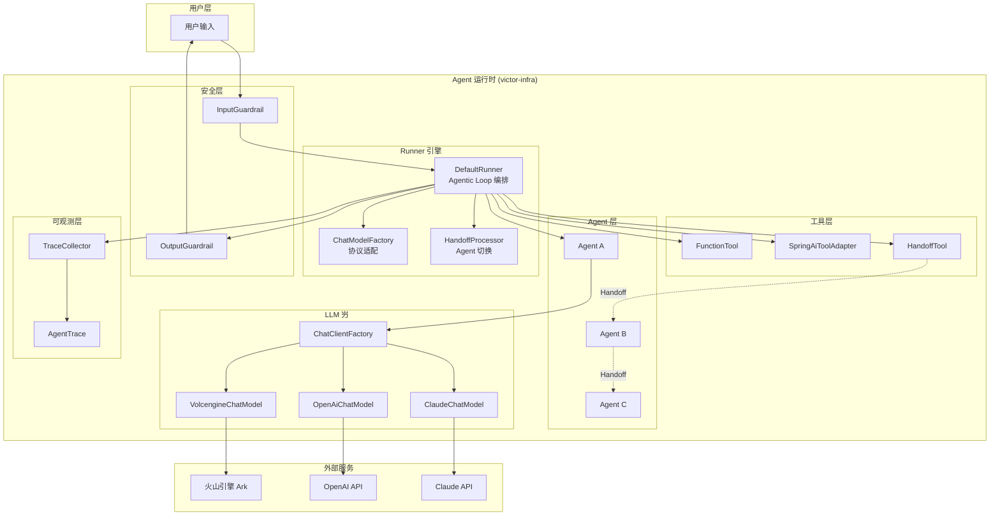

### 2.2 Agentic Loop 流程

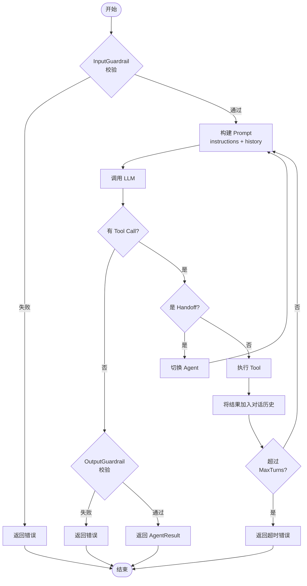

---

## 3. 核心组件

### 3.1 组件关系图

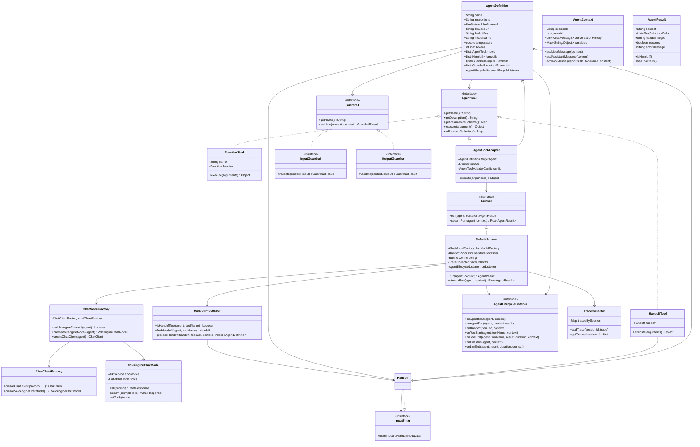

### 3.2 Agent 定义 (AgentDefinition)

Agent 是运行时的核心抽象，采用 Builder 模式构建：

```java
AgentDefinition agent = AgentDefinition.builder()
    .name("天气助手")
    .instructions("你是一个天气助手，当用户询问天气时使用工具查询。")
    .llmProtocol(LlmProtocol.DOUBAO)
    .llmBaseUrl("https://ark.cn-beijing.volces.com/api/v3")
    .llmApiKey("your-api-key")
    .modelName("ark-code-latest")
    .temperature(0.7)
    .maxTokens(4096)
    .tools(List.of(weatherTool))
    .handoffs(List.of(techSupportHandoff))
    .inputGuardrails(List.of(sensitiveFilter))
    .outputGuardrails(List.of(contentFilter))
    .build();
```

### 3.3 LLM 协议枚举 (LlmProtocol)

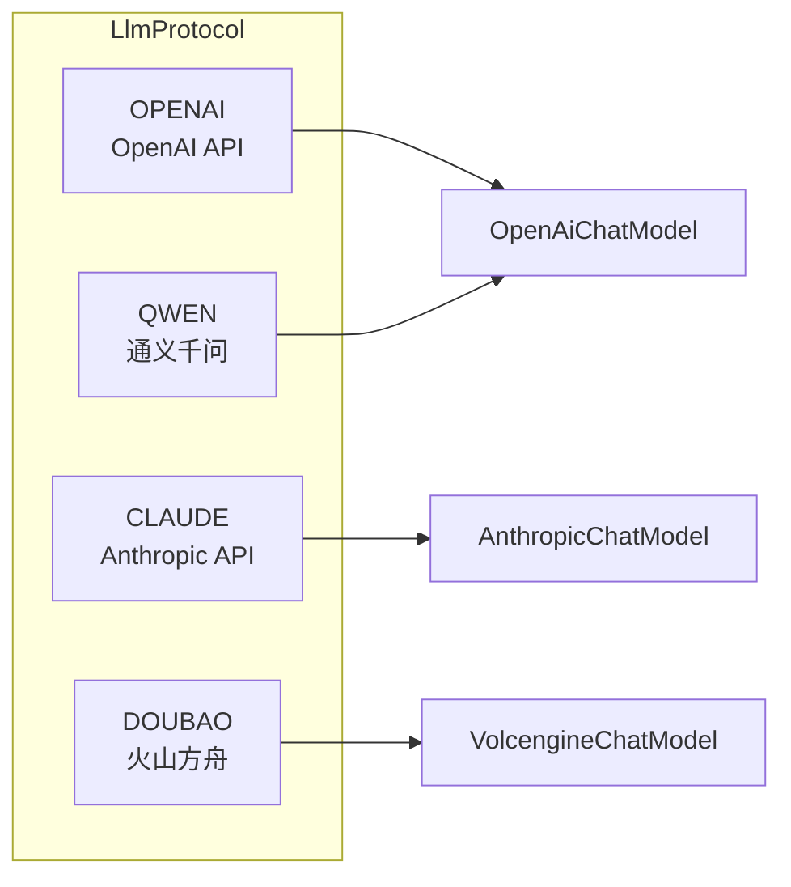

| 枚举值 | 说明 | 默认 BaseURL | ChatModel |
|--------|------|-------------|-----------|
| OPENAI | OpenAI | https://api.openai.com/v1 | OpenAiChatModel |
| CLAUDE | Claude | https://api.anthropic.com | AnthropicChatModel |
| QWEN | 通义千问 | https://dashscope.aliyuncs.com/compatible-mode/v1 | OpenAiChatModel |
| DOUBAO | 火山方舟 | https://ark.cn-beijing.volces.com/api/v3 | VolcengineChatModel |

---

## 4. Tool 体系

### 4.1 Tool 类型

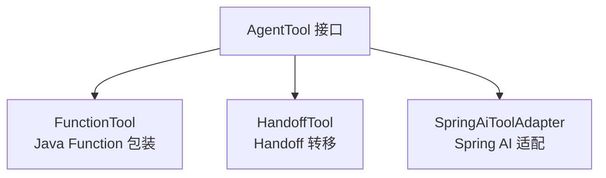

### 4.2 FunctionTool

基于 `java.util.function.Function` 的简单工具：

```java
AgentTool weatherTool = new FunctionTool(
    "get_weather",
    "查询城市天气",
    Map.of(
        "type", "object",
        "properties", Map.of(
            "city", Map.of("type", "string", "description", "城市名称")
        ),
        "required", List.of("city")
    ),
    args -> {
        String city = (String) args.get("city");
        return city + "：晴天，25°C";
    }
);
```

### 4.3 Tool Calling 时序

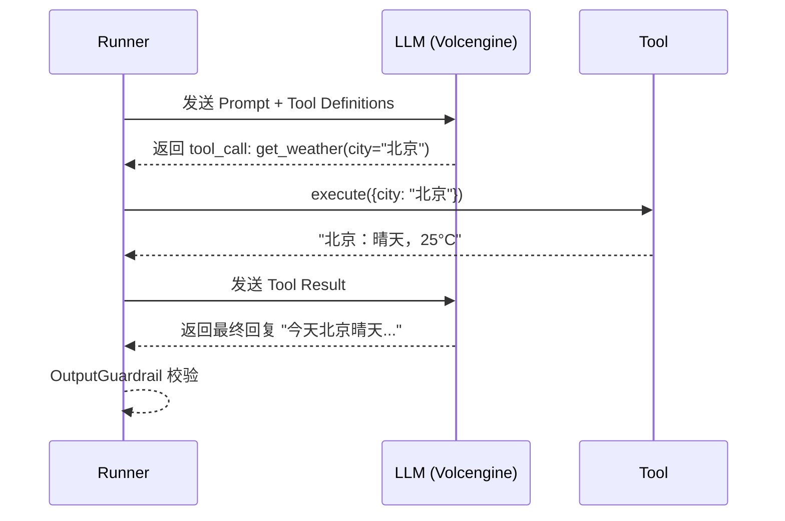

### 4.4 Agent-as-Tool（Agent 作为工具）

将一个 Agent 包装为普通 Tool，调用方 Agent **保持控制权**，子 Agent 执行后返回结果。与 Handoff 的区别：

| 维度 | Handoff | Agent-as-Tool |
|------|---------|---------------|
| 控制权 | 转移给目标 Agent | 调用方保持控制权 |
| 输入 | 完整对话历史 | 结构化参数（tool_call 的 arguments） |
| 上下文 | 共享 | 默认独立（可配置） |
| 返回值 | Agent 接管对话 | 字符串结果返回给调用方 |

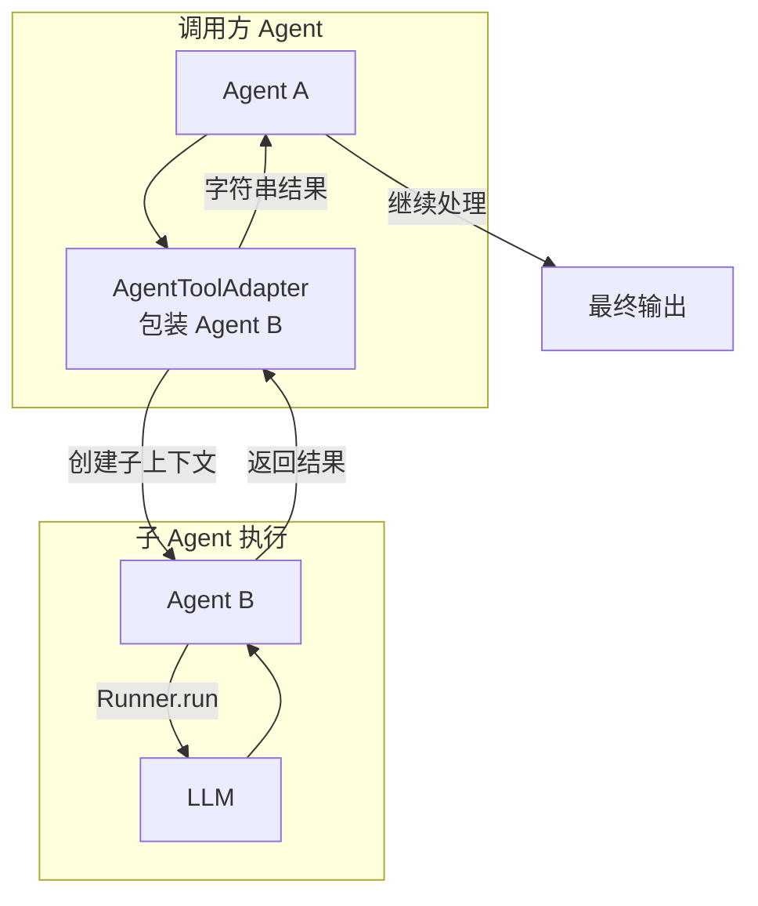

**核心类**：

```java
// Agent-as-Tool 适配器
public class AgentToolAdapter implements AgentTool {
    private final AgentDefinition targetAgent;  // 目标 Agent
    private final Runner runner;                // Runner 实例
    private final AgentToolAdapterConfig config; // 配置

    @Override
    public Object execute(Map<String, Object> arguments) {
        // 1. 从 arguments 提取输入消息
        // 2. 创建子 AgentContext（独立上下文）
        // 3. runner.run(targetAgent, subContext)
        // 4. 用 outputExtractor 提取结果
        // 5. 返回字符串
    }
}

// 配置
@Data @Builder
public class AgentToolAdapterConfig {
    private String toolName;                              // 工具名称
    private String toolDescription;                       // 工具描述
    private Map<String, Object> inputSchema;             // 输入参数 Schema
    private Function<AgentResult, String> outputExtractor; // 输出提取器
    @Builder.Default
    private boolean createNewContext = true;              // 是否创建新上下文
}
```

**使用示例**：

```java
// 定义专家 Agent
AgentDefinition expert = AgentDefinition.builder()
    .name("Java专家")
    .instructions("你是 Java 专家，回答 Java 相关问题。")
    .llmProtocol(LlmProtocol.DOUBAO)
    .llmBaseUrl(baseUrl).llmApiKey(apiKey).modelName(model)
    .build();

// 包装为 Tool
AgentToolAdapter expertTool = new AgentToolAdapter(
    expert, runner,
    AgentToolAdapterConfig.builder()
        .toolName("ask_java_expert")
        .toolDescription("询问 Java 专家关于 Java 的问题")
        .build()
);

// 主 Agent 使用该工具
AgentDefinition mainAgent = AgentDefinition.builder()
    .name("助手")
    .instructions("你是助手。Java 问题请使用 ask_java_expert 工具。")
    .tools(List.of(expertTool))
    .build();

AgentResult result = runner.run(mainAgent, context);
```

---

## 5. Handoff 机制

### 5.1 设计原理

Handoff 被设计为一种特殊的 Tool。LLM 通过 `tool_call` 触发 Handoff，Runner 检测到 Handoff 后切换 AgentDefinition，重新进入 Agentic Loop。

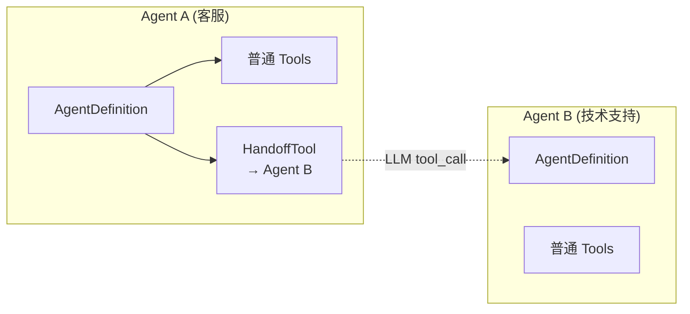

### 5.2 Handoff 时序

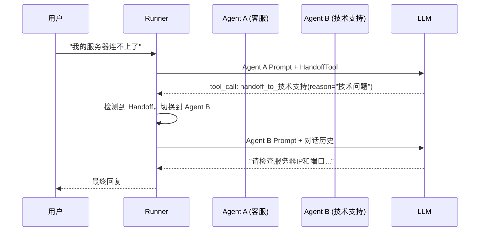

### 5.3 代码示例

```java
// 定义技术支持 Agent
AgentDefinition techSupport = AgentDefinition.builder()
    .name("技术支持")
    .instructions("你是技术支持专员，回答技术问题。")
    .llmProtocol(LlmProtocol.DOUBAO)
    // ... 其他配置
    .build();

// 定义客服 Agent（可 Handoff 到技术支持）
AgentDefinition customerService = AgentDefinition.builder()
    .name("客服")
    .instructions("你是客服。技术问题请使用 handoff_to_技术支持 工具转移。")
    .handoffs(List.of(
        Handoff.builder()
            .targetAgent(techSupport)
            .description("当用户询问技术问题时转移")
            .build()
    ))
    .build();
```

### 5.4 Input Filter（输入过滤器）

Handoff 时，下一个 Agent 默认能看到完整的对话历史。Input Filter 允许在 Handoff 时过滤、压缩或转换历史，控制下一个 Agent 的可见范围。

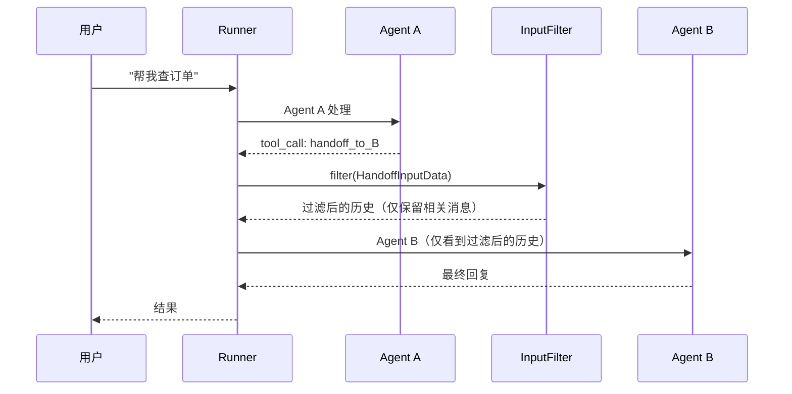

**核心接口**：

```java
// 输入过滤器（函数式接口）
@FunctionalInterface
public interface InputFilter {
    HandoffInputData filter(HandoffInputData input);
}

// 输入数据封装
@Data
@AllArgsConstructor
public class HandoffInputData {
    private List<AgentContext.ChatMessage> inputHistory;      // 当前完整历史
    private List<AgentContext.ChatMessage> preHandoffItems;   // handoff 前的消息
    private List<AgentContext.ChatMessage> newItems;          // handoff 后的新消息
    private AgentContext runContext;                           // 运行上下文
}
```

**使用示例**：

```java
// 示例1：只保留 user 消息
InputFilter userOnly = input -> {
    List<ChatMessage> filtered = input.getInputHistory().stream()
            .filter(msg -> "user".equals(msg.getRole()))
            .toList();
    return new HandoffInputData(filtered, input.getPreHandoffItems(),
            input.getNewItems(), input.getRunContext());
};

// 示例2：只保留最后 N 条消息（减少 token 消耗）
InputFilter keepLast5 = input -> {
    List<ChatMessage> history = input.getInputHistory();
    int keep = Math.min(5, history.size());
    List<ChatMessage> compressed = new ArrayList<>(
            history.subList(history.size() - keep, history.size()));
    return new HandoffInputData(compressed, input.getPreHandoffItems(),
            input.getNewItems(), input.getRunContext());
};

// 在 Handoff 中使用
Handoff handoff = Handoff.builder()
        .targetAgent(techSupport)
        .description("技术问题转移")
        .inputFilter(userOnly)  // 设置过滤器
        .build();
```

---

## 6. Guardrail 机制

### 6.1 Guardrail 流程

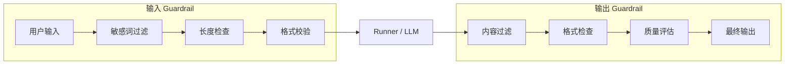

### 6.2 代码示例

```java
// 敏感词过滤
InputGuardrail sensitiveFilter = new InputGuardrail() {
    @Override
    public String getName() { return "sensitive-filter"; }

    @Override
    public GuardrailResult validate(AgentContext ctx, String input) {
        if (input.contains("黑客")) {
            return GuardrailResult.fail("输入包含不允许的内容");
        }
        return GuardrailResult.pass();
    }
};

// 输出内容过滤
OutputGuardrail contentFilter = new OutputGuardrail() {
    @Override
    public String getName() { return "content-filter"; }

    @Override
    public GuardrailResult validate(AgentContext ctx, String output) {
        if (output.contains("密码")) {
            return GuardrailResult.fail("输出包含敏感信息");
        }
        return GuardrailResult.pass();
    }
};
```

### 6.3 GuardrailResult

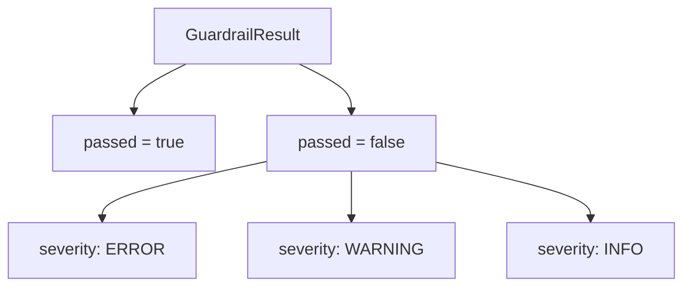

---

## 7. 流式输出

### 7.1 VolcengineChatModel 流式架构

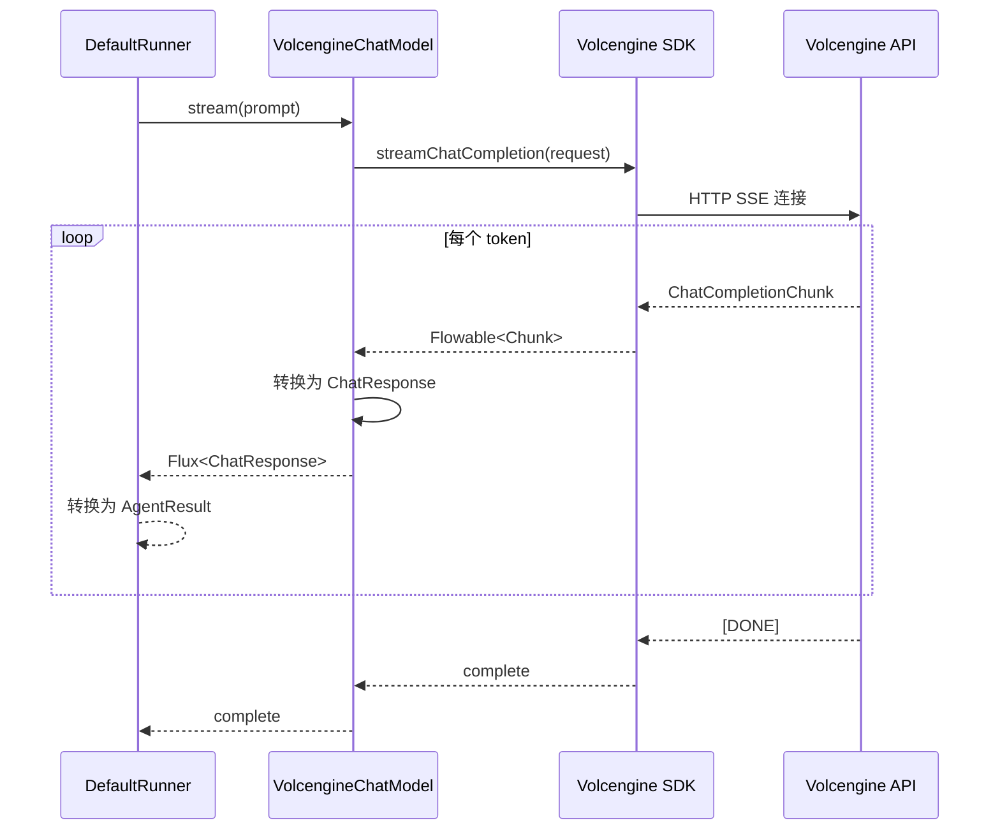

### 7.2 桥接实现

火山引擎 SDK 使用 RxJava 的 `Flowable`，而 Spring 生态使用 Reactor 的 `Flux`。通过 `Flux.create()` 桥接：

```java
public Flux<ChatResponse> stream(Prompt prompt) {
    Flowable<ChatCompletionChunk> flowable = arkService.streamChatCompletion(request);

    return Flux.create(sink -> {
        flowable.subscribe(
            chunk -> sink.next(convertChunk(chunk)),
            error -> sink.error(error),
            () -> sink.complete()
        );
    });
}
```

---

## 8. Tracing 可观测性

### 8.1 Trace 记录类型

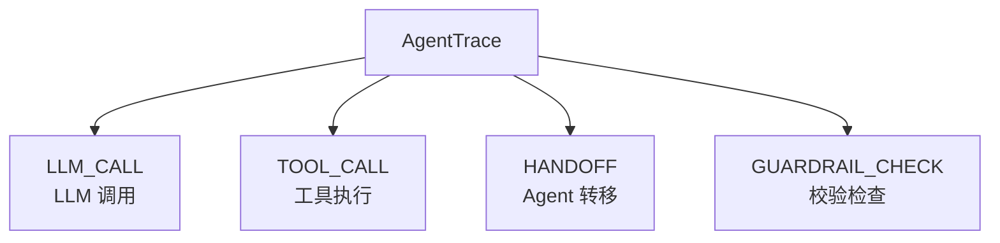

### 8.2 Trace 数据

| 字段 | 说明 |
|------|------|
| traceId | 追踪 ID |
| timestamp | 时间戳 |
| agentName | Agent 名称 |
| action | 动作类型 |
| input | 输入内容 |
| output | 输出内容 |
| durationMs | 耗时(毫秒) |
| status | 状态(SUCCESS/FAILED) |

### 8.3 输出示例

```
[LLM_CALL]       天气助手 → (tool_call)                   (2656ms)
[TOOL_CALL]       天气助手 → 北京：晴天，气温25°C，湿度40% (0ms)
[LLM_CALL]        天气助手 → 今天北京的天气很不错哦！...   (5926ms)
[GUARDRAIL_CHECK] 安全助手 → PASSED                        (1ms)
[HANDOFF]         客服    → 技术支持                        (0ms)
```

---

## 9. Lifecycle Hooks（生命周期钩子）

### 9.1 设计原理

Lifecycle Hooks 提供 Agent 执行过程中的观察回调，参考 OpenAI Agents SDK 的 `RunHooks` / `AgentHooks` 设计。

**两级监听**：
- **Run 级**：通过 `DefaultRunner` 构造函数传入，监听整个 Run 的所有事件
- **Agent 级**：通过 `AgentDefinition.lifecycleListener` 设置，仅监听该 Agent 的事件

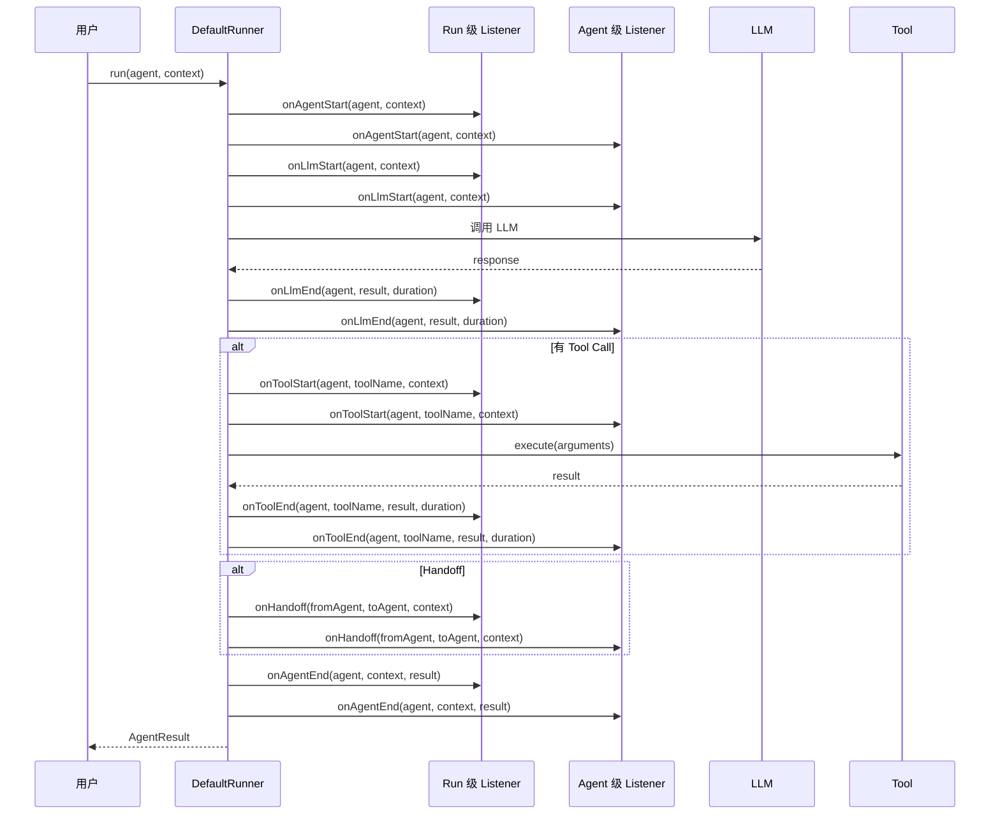

### 9.2 核心接口

```java
public interface AgentLifecycleListener {
    default void onAgentStart(AgentDefinition agent, AgentContext context) {}
    default void onAgentEnd(AgentDefinition agent, AgentContext context, AgentResult result) {}
    default void onHandoff(AgentDefinition fromAgent, AgentDefinition toAgent, AgentContext context) {}
    default void onToolStart(AgentDefinition agent, String toolName, AgentContext context) {}
    default void onToolEnd(AgentDefinition agent, String toolName, Object result, long durationMs, AgentContext context) {}
    default void onLlmStart(AgentDefinition agent, AgentContext context) {}
    default void onLlmEnd(AgentDefinition agent, AgentResult result, long durationMs, AgentContext context) {}
}
```

### 9.3 LifecycleEvent 数据

```java
@Data @Builder
public class LifecycleEvent {
    private String agentName;
    private String sessionId;
    private Instant timestamp;
    private EventType eventType;  // AGENT_START, AGENT_END, HANDOFF, TOOL_START, TOOL_END, LLM_START, LLM_END
    private Map<String, Object> data;
}
```

### 9.4 使用示例

```java
// 日志监听器
AgentLifecycleListener logger = new AgentLifecycleListener() {
    @Override
    public void onAgentStart(AgentDefinition agent, AgentContext context) {
        log.info("[Lifecycle] Agent 开始: {}", agent.getName());
    }

    @Override
    public void onToolStart(AgentDefinition agent, String toolName, AgentContext context) {
        log.info("[Lifecycle] 工具调用: {} → {}", agent.getName(), toolName);
    }

    @Override
    public void onHandoff(AgentDefinition from, AgentDefinition to, AgentContext context) {
        log.info("[Lifecycle] Handoff: {} → {}", from.getName(), to.getName());
    }

    @Override
    public void onAgentEnd(AgentDefinition agent, AgentContext context, AgentResult result) {
        log.info("[Lifecycle] Agent 结束: {}, success={}", agent.getName(), result.isSuccess());
    }
};

// Run 级：监听所有 Agent 的事件
DefaultRunner runner = new DefaultRunner(chatClientFactory, config, traceCollector, logger);

// Agent 级：仅监听特定 Agent 的事件
AgentDefinition agent = AgentDefinition.builder()
    .name("助手")
    .instructions("你是助手")
    .lifecycleListener(logger)
    .build();
```

---

## 10. 目录结构

```
victor-infra/src/main/java/me/codeleep/victor/agent/
├── core/
│   ├── AgentDefinition.java      # Agent 定义
│   ├── AgentContext.java         # 执行上下文
│   ├── AgentResult.java          # 执行结果
│   └── LlmProtocol.java          # LLM 协议枚举
├── runner/
│   ├── Runner.java               # Runner 接口
│   ├── DefaultRunner.java        # 默认实现（Agentic Loop 编排）
│   ├── ChatModelFactory.java     # ChatModel 工厂（协议适配）
│   ├── HandoffProcessor.java     # Handoff 处理器（Agent 切换）
│   └── RunnerConfig.java         # 配置
├── tool/
│   ├── AgentTool.java            # 工具接口
│   ├── FunctionTool.java         # Function 工具
│   ├── SpringAiToolAdapter.java  # Spring AI 适配
│   ├── AgentToolAdapter.java     # Agent-as-Tool 适配器
│   ├── AgentToolAdapterConfig.java # 适配器配置
│   └── ToolRegistry.java         # 工具注册表
├── handoff/
│   ├── Handoff.java              # Handoff 定义
│   ├── HandoffTool.java          # Handoff 工具
│   ├── InputFilter.java          # 输入过滤器接口
│   └── HandoffInputData.java     # 过滤器输入数据
├── guardrail/
│   ├── Guardrail.java            # Guardrail 接口
│   ├── InputGuardrail.java       # 输入校验
│   ├── OutputGuardrail.java      # 输出校验
│   └── GuardrailResult.java      # 校验结果
├── lifecycle/
│   ├── AgentLifecycleListener.java # 生命周期监听器接口
│   └── LifecycleEvent.java        # 生命周期事件数据
├── llm/
│   ├── ChatClientFactory.java    # ChatClient 工厂
│   └── volcengine/
│       └── VolcengineChatModel.java  # 火山引擎适配
└── tracing/
    ├── AgentTrace.java           # 追踪记录
    └── TraceCollector.java       # 追踪收集器
```

---

## 11. 使用示例

### 11.1 最简用法

```java
// 1. 定义 Agent
AgentDefinition agent = AgentDefinition.builder()
    .name("助手")
    .instructions("你是一个简洁的AI助手。")
    .llmProtocol(LlmProtocol.DOUBAO)
    .llmBaseUrl(baseUrl)
    .llmApiKey(apiKey)
    .modelName("ark-code-latest")
    .build();

// 2. 创建上下文
AgentContext context = new AgentContext("session-001", 1L);
context.addUserMessage("什么是多态？");

// 3. 执行
DefaultRunner runner = new DefaultRunner(chatClientFactory);
AgentResult result = runner.run(agent, context);

System.out.println(result.getContent());
```

### 11.2 带工具调用

```java
AgentTool searchTool = new FunctionTool("search", "搜索题库", schema, args -> {
    // 查询数据库...
    return results;
});

AgentDefinition agent = AgentDefinition.builder()
    .name("面试官")
    .instructions("你是面试官，使用 search 工具查询题库。")
    .tools(List.of(searchTool))
    // ... 其他配置
    .build();
```

### 11.3 多 Agent 协作

```java
AgentDefinition specialist = AgentDefinition.builder()
    .name("专家")
    .instructions("你是技术专家。")
    .build();

AgentDefinition router = AgentDefinition.builder()
    .name("路由器")
    .instructions("根据问题类型分配给专家。")
    .handoffs(List.of(
        Handoff.builder().targetAgent(specialist).description("技术问题").build()
    ))
    .build();
```

---

## 12. 测试覆盖

| 测试类 | 数量 | 类型 | 说明 |
|--------|------|------|------|
| ToolRegistryTest | 8 | 单元 | 工具注册、查询、执行 |
| GuardrailTest | 4 | 单元 | 输入/输出校验 |
| HandoffTest | 4 | 单元 | Handoff 定义和执行 |
| RunnerTest | 8 | 单元 | 核心组件 |
| InputFilterTest | 4 | 单元 | 输入过滤器 |
| LifecycleHooksTest | 6 | 单元 | 生命周期钩子 |
| AgentToolAdapterTest | 7 | 单元 | Agent-as-Tool |
| EndToEndRunnerTest | 7 | 端到端 | 真实 LLM 调用 |

**端到端场景**：简单对话、Tool Call、多轮对话、Input Guardrail 拦截、Output Guardrail 拦截、Handoff、流式输出。
